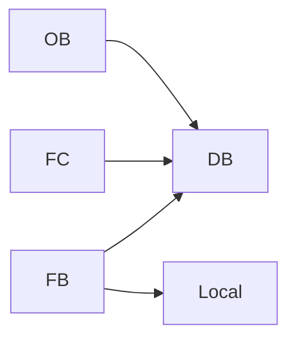
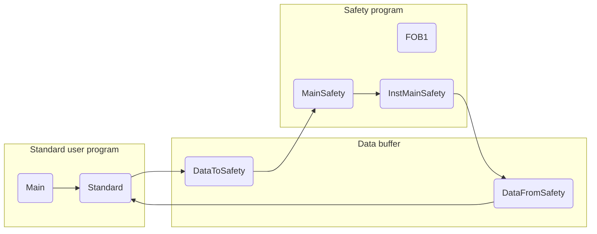

# Programming Guideline for S7-1200/1500

TIA Portal

[Siemens logo]  
Ingenuity for life

----

**Industry Online Support**  
24/7

[Siemens Industry Online Support QR code]

https://support.industry.siemens.com/cs/ww/en/view/81318674


---


# Legal information

## Use of application examples
Application examples illustrate the solution of automation tasks through an interaction of several components in the form of text, graphics and/or software modules. The application examples are a free service by Siemens AG and/or a subsidiary of Siemens AG (“Siemens”). They are non-binding and make no claim to completeness or functionality regarding configuration and equipment. The application examples merely offer help with typical tasks; they do not constitute customer-specific solutions. You yourself are responsible for the proper and safe operation of the products in accordance with applicable regulations and must also check the function of the respective application example and customize it for your system.  
Siemens grants you the non-exclusive, non-sublicensable and non-transferable right to have the application examples used by technically trained personnel. Any change to the application examples is your responsibility. Sharing the application examples with third parties or copying the application examples or excerpts thereof is permitted only in combination with your own products.  
The application examples are not required to undergo the customary tests and quality inspections of a chargeable product; they may have functional and performance defects as well as errors. It is your responsibility to use them in such a manner that any malfunctions that may occur do not result in property damage or injury to persons.

## Disclaimer of liability
Siemens shall not assume any liability, for any legal reason whatsoever, including, without limitation, liability for the usability, availability, completeness and freedom from defects of the application examples as well as for related information, configuration and performance data and any damage caused thereby. This shall not apply in cases of mandatory liability, for example under the German Product Liability Act, or in cases of intent, gross negligence, or culpable loss of life, bodily injury or damage to health, non-compliance with a guarantee, fraudulent non-disclosure of a defect, or culpable breach of material contractual obligations. Claims for damages arising from a breach of material contractual obligations shall however be limited to the foreseeable damage typical of the type of agreement, unless liability arises from intent or gross negligence or is based on loss of life, bodily injury or damage to health. The foregoing provisions do not imply any change in the burden of proof to your detriment. You shall indemnify Siemens against existing or future claims of third parties in this connection except where Siemens is mandatorily liable.  
By using the application examples you acknowledge that Siemens cannot be held liable for any damage beyond the liability provisions described.

## Other information
Siemens reserves the right to make changes to the application examples at any time without notice. In case of discrepancies between the suggestions in the application examples and other Siemens publications such as catalogs, the content of the other documentation shall have precedence.  
The Siemens terms of use (https://support.industry.siemens.com) shall also apply.

## Security information
Siemens provides products and solutions with industrial security functions that support the secure operation of plants, systems, machines and networks.  
In order to protect plants, systems, machines and networks against cyber threats, it is necessary to implement – and continuously maintain – a holistic, state-of-the-art industrial security concept. Siemens’ products and solutions constitute one element of such a concept.  
Customers are responsible for preventing unauthorized access to their plants, systems, machines and networks. Such systems, machines and components should only be connected to an enterprise network or the Internet if and to the extent such a connection is necessary and only when appropriate security measures (e.g. firewalls and/or network segmentation) are in place.  
For additional information on industrial security measures that may be implemented, please visit [https://www.siemens.com/industrialsecurity])(https://www.siemens.com/industrialsecurity).  
Siemens’ products and solutions undergo continuous development to make them more secure. Siemens strongly recommends that product updates are applied as soon as they are available and that the latest product versions are used. Use of product versions that are no longer supported, and failure to apply the latest updates may increase customer’s exposure to cyber threats.  
To stay informed about product updates, subscribe to the Siemens Industrial Security RSS Feed at: [https://www.siemens.com/industrialsecurity])(https://www.siemens.com/industrialsecurity).


---


# Table of Contents

## Legal information .................................................................................................................. 2

## 1 Preface .......................................................................................................................... 6

## 2 S7-1200/S7-1500 innovations ........................................................................................... 8
* 2.1 Introduction ............................................................................................................... 8
* 2.2 Terms ....................................................................................................................... 8
* 2.3 Programming languages .......................................................................................... 11
* 2.4 Optimized machine code .......................................................................................... 11
* 2.5 Block creation .......................................................................................................... 12
* 2.6 Optimized blocks ...................................................................................................... 13
  - 2.6.1 S7-1200: Structure of optimized blocks ................................................... 13
  - 2.6.2 S7-1500: Structure of optimized blocks ................................................... 14
  - 2.6.3 Processor-optimized data storage for S7-1500 ..................................... 15
  - 2.6.4 Conversion between optimized and non-optimized tags .................... 18
  - 2.6.5 Parameter transfer between blocks with optimized and non-optimized access .................................................................................. 19
  - 2.6.6 Communication with optimized data .................................................... 20
* 2.7 Block properties ...................................................................................................... 21
  - 2.7.1 Block sizes .................................................................................................... 21
  - 2.7.2 Number of organization blocks (OB) ..................................................... 21
  - 2.7.3 Block interface – hide block parameters (V14 or higher) .................... 22
* 2.8 New data types for S7-1200/1500 ........................................................................ 23
  - 2.8.1 Elementary data types ................................................................................ 23
  - 2.8.2 Data type Date_Time_Long ........................................................................ 24
  - 2.8.3 Other time data types ................................................................................ 24
  - 2.8.4 Unicode data types ..................................................................................... 25
  - 2.8.5 Data type VARIANT (S7-1500 and S7-1200 from FW4.1) .................... 26
* 2.9 Instructions ............................................................................................................... 29
  - 2.9.1 MOVE instructions ..................................................................................... 29
  - 2.9.2 VARIANT instructions (S7-1500 and S7-1200 FW4.1 and higher) ........ 31
  - 2.9.3 RUNTIME ..................................................................................................... 32
  - 2.9.4 Comparison of tags from PLC data types (V14 or higher) .................. 33
  - 2.9.5 Multiple assignment (V14 or higher) ..................................................... 34
* 2.10 Symbolic and comments ..................................................................................... 35
  - 2.10.1 Programming editor ................................................................................ 35
  - 2.10.2 Comment lines in watch tables ............................................................ 36
* 2.11 System constants .................................................................................................. 37
* 2.12 User constants ...................................................................................................... 38
* 2.13 Internal reference ID for controller and HMI tags ....................................... 39
* 2.14 STOP mode in the event of errors .................................................................... 41

## 3 General programming .................................................................................................... 42
* 3.1 Operating system and user program ................................................................... 42
* 3.2 Program blocks ....................................................................................................... 42
  - 3.2.1 Organization blocks (OB) ........................................................................... 43
  - 3.2.2 Functions (FC) ............................................................................................ 45
  - 3.2.3 Function blocks (FB) .................................................................................. 47
  - 3.2.4 Instances ...................................................................................................... 48
  - 3.2.5 Multi-instances ........................................................................................... 49
  - 3.2.6 Transferring instance as parameters (V14) ............................................ 51
  - 3.2.7 Global data blocks (DB) ............................................................................ 52
  - 3.2.8 Downloading without reinitialisation ..................................................... 53
  - 3.2.9 Reusability of blocks .................................................................................. 57
  - 3.2.10 Auto numbering of blocks ...................................................................... 58


---


# Table of Contents

### 3.3 Block interface types ........................................................................ 59  
- 3.3.1 Call-by-value .................................................................................... 59  
- 3.3.2 Call-by-reference .............................................................................. 59  
- 3.3.3 Overview for transfer of parameters .................................................. 60  

### 3.4 Memory concept .................................................................................. 60  
- 3.4.1 Block interfaces as data exchange .................................................... 60  
- 3.4.2 Global memory ................................................................................... 61  
- 3.4.3 Local memory .................................................................................... 62  
- 3.4.4 Access speed of memory areas .......................................................... 63  

### 3.5 Retentivity .......................................................................................... 64  

### 3.6 Symbolic addressing ............................................................................ 67  
- 3.6.1 Symbolic instead of absolute addressing ............................................ 67  
- 3.6.2 ARRAY data type and indirect field accesses .................................... 69  
- 3.6.3 Formal parameter Array [*] (V14 or higher) ........................................ 71  
- 3.6.4 STRUCT data type and PLC data types ............................................... 72  
- 3.6.5 Access to I/O areas with PLC data types ............................................ 75  
- 3.6.6 Slice access ....................................................................................... 76  
- 3.6.7 SCL networks in LAD and FBD (V14 and higher) ................................ 77  

### 3.7 Libraries ............................................................................................ 78  
- 3.7.1 Types of libraries and library elements ............................................. 79  
- 3.7.2 Type concept ..................................................................................... 80  
- 3.7.3 Differences between the typifiable objects for CPU and HMI ............ 81  
- 3.7.4 Versioning of a block ......................................................................... 81  

### 3.8 Increased performance for hardware interrupts .................................. 86  

### 3.9 Additional performance recommendations .......................................... 88  

### 3.10 SCL programming language: Tips and Tricks ..................................... 89  
- 3.10.1 Using call templates ........................................................................ 89  
- 3.10.2 What instruction parameters are mandatory? ................................... 90  
- 3.10.3 Drag-and-drop with entire tag names .............................................. 90  
- 3.10.4 Structuring with the keyword REGION (V14 or higher) ..................... 91  
- 3.10.5 Correct use of FOR, REPEAT and WHILE loops ................................ 92  
- 3.10.6 Using CASE instruction efficiently .................................................. 93  
- 3.10.7 No manipulation of loop counters for FOR loop ............................... 93  
- 3.10.8 FOR loop backwards ........................................................................ 94  
- 3.10.9 Easy creation of instances for calls .................................................. 94  
- 3.10.10 Handling of time tags ....................................................................... 94  
- 3.10.11 Unnecessary IF instruction ............................................................. 96  

## 4 Hardware-independent programming ....................................................... 97  
- 4.1 Data types of S7-300/400 and S7-1200/1500 ........................................ 97  
- 4.2 No bit memory but global data blocks .................................................. 99  
- 4.3 Programming of "Cycle bits" ................................................................ 99  

## 5 STEP 7 Safety in the TIA Portal ................................................................. 100  
- 5.1 Introduction ......................................................................................... 100  
- 5.2 Terms .................................................................................................. 101  
- 5.3 Components of the safety program ..................................................... 102  
- 5.4 F-runtime group ................................................................................... 103  
- 5.5 F signature .......................................................................................... 103  
- 5.6 Assigning the PROFIsafe address at the F-I/O .................................... 105  
- 5.7 Evaluation of F-I/O ............................................................................. 105  
- 5.8 Value status (S7-1200F/1500F) .......................................................... 106  
- 5.9 Data types .......................................................................................... 107  
  - 5.9.1 Overview ....................................................................................... 107  
  - 5.9.2 Implicit conversion ....................................................................... 107  
- 5.10 F-conform PLC data type ................................................................... 109  
- 5.11 TRUE / FALSE .................................................................................... 111  
- 5.12 Optimizing the compilation and program runtime ............................. 112  


---


# Table of Contents

5.12.1  Avoiding of time-processing blocks: TP, TON, TOF ........................ 113  
5.12.2  Avoiding deep call hierarchies ......................................................... 113  
5.12.3  Avoiding JMP/Label structures ......................................................... 113  
5.13    Data exchange between standard program and F program ............ 114  
5.14    Testing the safety program ............................................................... 115  
5.15    STOP mode in the event of F errors ................................................ 116  
5.16    Migration of safety programs ............................................................ 116  
5.17    General recommendations for safety ............................................... 116  

6  **Automatically generate visualization using the user program** ................. 117  
6.1     Introduction ....................................................................................... 117  
6.2     How automatic generation works ..................................................... 118  
6.3     Controlling the HMI generator .......................................................... 119  
6.3.1   Using network comments for control ................................................ 119  
6.3.2   Using SiVArc variables for control .................................................... 120  
6.4     Additional recommendations ............................................................ 121  

7  **The most important recommendations** ....................................................... 122  

8  **Appendix** ........................................................................................................ 123  
8.1     Service and support ......................................................................... 123  
8.2     Links and literature ........................................................................... 124  
8.3     Change documentation .................................................................... 125  


---


# Preface

## Objective for the development of the new SIMATIC controller generation
* An engineering framework for all automation components (controller, HMI, drives, etc.)
* Uniform programming
* Increased performance
* Complete set of command for every language
* Fully symbolic program generation
* Data handling also without pointer
* Reusability of created blocks

## Objective of the guideline
The new controller generation SIMATIC S7-1200 and S7-1500 has an up-to-date system architecture, and together with the TIA Portal offers new and efficient options of programming and configuration. It is no longer the resources of the controller (e.g. data storage in the memory) that are paramount but the actual automation solution itself.  
This document gives you many recommendations and notes on optimal programming of S7-1200/1500 controllers. Some differences in the system architecture of the S7-300/400, as well as the thus connected new programming options are explained in an easy to understand way. This helps you to create standardized and optimal programming of your automation solutions.  
The examples described can be universally used for the controllers S7-1200 and S7-1500.

## Core contents of this programming guideline
The following key issues on the TIA Portal are dealt with in this document:  
* S7-1200/1500 innovations  
  - Programming languages  
  - Optimized blocks  
  - Data types and instructions  
* Recommendations on general programming  
  - Operating system and user program  
  - Memory concept  
  - Symbolic addressing  
  - Libraries  
* Recommendations on hardware-independent programming  
* Recommendations on STEP 7 Safety in TIA Portal  
* Overview of the most important recommendations


---


# Preface

## Advantages and benefits
Numerous advantages result from applying these recommendations and tips:  
* Powerful user program  
* Clear program structures  
* Intuitive and effective programming solutions  

## Further information
When programming SIMATIC controllers, the task of the programmer is to create as clear and readable a user program as possible. Each user uses their own strategy, for example, how to name tags or blocks or the way of commenting. The different philosophies of the programmers create very different user programs that can only be interpreted by the respective programmer.  
The programming style guide offers you coordinated set of rules for consistent programming. These specifications for example describe a uniform assignment of tags and block names right up to clear programming in SCL.  
You can use these rules and recommendations freely; they serve as a suggestion (not a standard in programming) for consistent programming.

> **Note**  
> The programming style guide for S7-1200 and S7-1500 can be found at the following link:  
> https://support.industry.siemens.com/cs/ww/en/view/81318674


---


# 2 S7-1200/S7-1500 innovations

## 2.1 Introduction

In general, the programming of the SIMATIC controllers from S7-300/400 to S7-1500 has stayed the same. There are the known programming languages such as LAD, FBD, STL, SCL or graph and blocks such as organization blocks (OBs), function blocks (FBs), functions (FCs) or data blocks (DBs). S7-300/400 programs created can be easily implemented on S7-1500 and existing LAD, FBD and SCL programs can be easily implemented on S7-1200 controllers.  
In addition, there are many innovations that facilitate programming for you and enables powerful and memory-saving code.  
For programs that are implemented for S7-1200/1500 controllers, we recommend not to implement them one-to-one, but also to check new options and if possible, to use them. The extra effort is often limited and you will receive a program code that is, for example,  
* optimal for memory and runtime for the new CPUs,  
* easier to understand,  
* and easier to maintain.

> **Note**  
> Information for the migration of S7-300/S7-400 to S7-1500 can be found in the following entry:  
> https://support.industry.siemens.com/cs/ww/en/view/109478811

## 2.2 Terms

### General terms in the TIA Portal

Some terms have change to enable easier handling with the TIA Portal.

Figure 2-1: New terms in the TIA Portal

<table>
  <thead>
    <tr>
      <th>STEP 7 V5.x</th>
      <th>STEP 7 (TIA Portal)</th>
    </tr>
  </thead>
  <tbody>
    <tr>
      <td>Symbol table</td>
      <td>PLC tags</td>
    </tr>
<tr>
      <td>UDT</td>
      <td>PLC data types</td>
    </tr>
<tr>
      <td>Tag table</td>
      <td>Watch table</td>
    </tr>
  </tbody>
</table>


---


# 2 S7-1200/S7-1500 innovations  
## 2.2 Terms

### Terms for tags and parameters  
When dealing with tags, functions, and function blocks, many terms are repeatedly used differently or even incorrectly. The following figure clarifies these terms.

Figure 2-2: Terms for tags and parameters

<table>
  <thead>
    <tr>
      <th colspan="2">Globaler DB</th>
      <th colspan="2">FC / FB</th>
    </tr>
  </thead>
  <tbody>
    <tr>
      <td>1</td>
      <td>
        MainOBGlobal<br>
        Name<br>
        Static<br>
        statMoveVariantEnable<br>
        statInputInt<br>
        statOutputInt<br>
        statInputReal<br>
        statOutputReal<br>
        statInputMyType<br>
        statOutputMyType<br>
        statInputBool<br>
        statError
      </td>
      <td>2</td>
      <td>
        "MoveVariant"<br>
        EN<br>
        ENO<br>
        inVariant<br>
        Ret_Val<br>
        outMyType<br>
        outInteger<br>
        outReal
      </td>
    </tr>
<tr>
      <td></td>
      <td>
        Data type<br>
        Start value<br>
        int 0<br>
        int 15<br>
        int 0<br>
        Real 17.3<br>
        Real 0.0<br>
        "MyType"<br>
        "MyType"<br>
        Bool false<br>
        int 0
      </td>
      <td>3</td>
      <td>
        "MainOBGlobal".statInputInt<br>
        "MainOBGlobal".statOutputInt<br>
        "MainOBGlobal".statOutputReal
      </td>
    </tr>
  </tbody>
</table>

<table>
  <thead>
    <tr>
      <th>Term</th>
      <th>Description</th>
    </tr>
  </thead>
  <tbody>
    <tr>
      <td>1.</td>
      <td>Tags</td>
      <td>
        Tags are labeled by a name/identifier and use an address in the memory of the controller. Tags are always defined with a certain data type (Bool, Integer, etc.):  
        * PLC tags  
        * Individual tags in data blocks  
        * Complete data blocks
      </td>
    </tr>
<tr>
      <td>2.</td>
      <td>Tag value</td>
      <td>Tag values are values stored in a tag (for example, 15 as value of an integer tag).</td>
    </tr>
<tr>
      <td>3.</td>
      <td>Actual parameter</td>
      <td>Actual parameters are tags interconnected at the interfaces of instructions, functions, and function blocks.</td>
    </tr>
<tr>
      <td>4.</td>
      <td>Formal parameters (transfer parameter, block parameter)</td>
      <td>Formal parameters are the interface parameters of instructions, functions, and function blocks (Input, Output, InOut, and Ret_Val).</td>
    </tr>
  </tbody>
</table>


---


## 2 S7-1200/S7-1500 innovations  
### 2.2 Terms

> **Note**  
> More information can be found in the following entries:  
>  
> What entries are available on the internet for the migration to STEP 7 (TIA Portal) and WinCC (TIA Portal)?  
> https://support.industry.siemens.com/cs/ww/en/view/56314851  
>  
> What system requirements have to be fulfilled to migrate a STEP 7 V5.x project in STEP 7 Professional (TIA Portal)?  
> https://support.industry.siemens.com/cs/ww/en/view/62100731  
>  
> PLC migration to S7-1500 with STEP 7 (TIA Portal)  
> https://support.industry.siemens.com/cs/ww/en/view/67858106  
>  
> How can you program efficiently and performant in STEP 7 (TIA Portal) for S7-1200/S7-1500?  
> https://support.industry.siemens.com/cs/ww/en/view/67582299  
>  
> Why is it not possible to mix register passing and explicit parameter transfer with the S7-1500 in STEP 7 (TIA Portal)?  
> Among other topics, the migration of STL programs to S7-1500 is described in this entry.  
> https://support.industry.siemens.com/cs/ww/en/view/67655405


---


## 2.3 Programming languages

Different programming languages are available for the programming of a user program. Each language has its own advantages that can be used flexibly depending on application. Thus, each block in the user program can be created in any programming language.  
Table 2-2: Programming languages

<table>
  <thead>
    <tr>
      <th>Programming language</th>
      <th>S7-1200</th>
      <th>S7-1500</th>
    </tr>
  </thead>
  <tbody>
    <tr>
      <td>Ladder diagram (LAD)</td>
      <td>yes</td>
      <td>yes</td>
    </tr>
<tr>
      <td>Function block diagram (FBD)</td>
      <td>yes</td>
      <td>yes</td>
    </tr>
<tr>
      <td>Structured Control Language (SCL)</td>
      <td>yes</td>
      <td>yes</td>
    </tr>
<tr>
      <td>Graph</td>
      <td>no</td>
      <td>yes</td>
    </tr>
<tr>
      <td>Statement list (STL)</td>
      <td>no</td>
      <td>yes</td>
    </tr>
  </tbody>
</table>

> **Note**  
> More information can be found in the following entries:  
> SIMATIC S7-1200 / S7-1500 Comparison List for Programming Languages Based on the International Mnemonics  
> https://support.industry.siemens.com/cs/ww/en/view/86630375  
>  
> What should you watch out for when migrating an S7-SCL program in STEP 7 (TIA Portal)?  
> https://support.industry.siemens.com/cs/ww/en/view/59784005  
>  
> Which instructions can you not use in an SCL program in STEP 7 (TIA Portal)?  
> https://support.industry.siemens.com/cs/ww/en/view/58002709  
>  
> How do you define the constants in an S7-SCL program in STEP 7 (TIA Portal)?  
> https://support.industry.siemens.com/cs/ww/en/view/52258437  

## 2.4 Optimized machine code

TIA Portal and S7-1200/1500 enable an optimized runtime performance in every programming language. All languages are compiled directly in machine code in the same way.

**Advantages**  
* All programming languages have the same level of performance (for the same access types)  
* No reduction of performance through additional compilation with interim step via STL  

**Properties**  
In the following figure, the difference in the compilation of S7-programs in machine code is displayed.


---


# 2 S7-1200/S7-1500 innovations  
## 2.5 Block creation

### Figure 2-3: Machine code creation with S7-300/400/WinAC and S7-1200/1500

<table>
<thead>
<tr>
  <th colspan="3">S7-300/400/WinAC</th>
  <th colspan="4">S7-1200/1500</th>
</tr>
</thead>
<tbody>
<tr>
  <td>SCL</td>
  <td>LAD</td>
  <td>FBD</td>
  <td>SCL</td>
  <td>LAD</td>
  <td>FBD</td>
  <td>STL<br>(only S7-1500)</td>
</tr>
<tr>
  <td colspan="3" rowspan="2" style="text-align:center;">
    <br/>
    <br/>
    STL
  </td>
  <td rowspan="2" style="text-align:center;">
    
  </td>
  <td rowspan="2" style="text-align:center;">
    
  </td>
  <td rowspan="2" style="text-align:center;">
    FBD
  </td>
  <td rowspan="2" style="text-align:center;">
    STL
  </td>
</tr>
<tr></tr>
<tr>
  <td colspan="3" style="text-align:center; background:#c0d0db;">
    Maschine code<br/>
    S7-300/400/WinAC
  </td>
  <td colspan="4" style="text-align:center; background:#c0d0db;">
    Maschine code<br/>
    S7-1200/1500
  </td>
</tr>
</tbody>
</table>

* For S7-300/400/WinAC controllers, LAD and FBD programs are first compiled in STL before machine code is created.  
* For S7-1200/1500 controllers, all programming languages are directly compiled in machine code.

----

## 2.5 Block creation

All blocks such as OBs, FBs and FCs can be directly programmed in the desired programming language. Therefore no source has to be created for SCL programming. Only select the block and SCL as programming language. You can then program the block directly.

### Figure 2-4: Dialog "Add new Block"

<table>
<thead>
<tr>
  <th colspan="2">Add new block</th>
</tr>
</thead>
<tbody>
<tr>
  <td>Name:</td>
  <td>Block_1</td>
</tr>
<tr>
  <td>Language:</td>
  <td>
    <select>
      <option>SCL</option>
      <option>LAD</option>
      <option>FBD</option>
      <option>STL</option>
      <option>GRAPH</option>
    </select>
  </td>
</tr>
<tr>
  <td>Number:</td>
  <td></td>
</tr>
<tr>
  <td>Description:</td>
  <td>
    Function blocks are code blocks that store their values permanently in instance data blocks, so that they remain available after the block has been executed.
  </td>
</tr>
<tr>
  <td colspan="2" style="text-align:center;">
    <button>OK</button> <button>Cancel</button>
  </td>
</tr>
</tbody>
</table>

* Organisation block (OB)  
* Function block (FB)  
* Function (FC)  
* Data block (DB)  

[ ] Add new and open


---


# 2 S7-1200/S7-1500 innovations  
## 2.6 Optimized blocks

### 2.6 Optimized blocks

S7-1200/1500 controllers have an optimized data storage. In optimized blocks all tags are automatically sorted according to their data type. The sorting ensures that data gaps between the tags are reduced to a minimum and that the tags are stored access-optimized for the processor.

Non-optimized blocks are only available for compatibility reasons in S7-1200/1500 controllers.

**Advantages**  
* Access always takes place as quickly as possible since the data storage is optimized by the system and independent of the declaration.  
* No danger of inconsistencies due to faulty, absolute access, since access is generally symbolic  
* Declaration changes do not lead to access errors since, for example, HMI access is symbolic.  
* Individual tags can be specifically defined as retentive.  
* No settings required in the instance data block. Everything is set in the assigned FB (for example, retentivity).  
* Storage reserves in the data block enables changes without loss of current values (see chapter 3.2.8 Downloading without reinitialisation).

### 2.6.1 S7-1200: Structure of optimized blocks

Figure 2-5: Optimized blocks for S7-1200

<table>
<thead>
  <tr>
    <th colspan="9">Standard block</th>
    <th colspan="9">Optimized block</th>
  </tr>
<tr>
    <th></th>
    <th colspan="8">Bits</th>
    <th></th>
    <th colspan="8">Bits</th>
  </tr>
<tr>
    <th></th>
    <th>0</th><th>1</th><th>2</th><th>3</th><th>4</th><th>5</th><th>6</th><th>7</th>
    <th></th>
    <th>0</th><th>1</th><th>2</th><th>3</th><th>4</th><th>5</th><th>6</th><th>7</th>
  </tr>
</thead>
<tbody>
  <tr>
    <td rowspan="10">B<br>y<br>t<br>e<br>s</td>
    <td>0</td>
    <td>X1</td>
    <td colspan="6" style="background:#f0f0f0"></td>
    <td>0</td>
    <td colspan="7" style="background:#a0d468"></td>
  </tr>
<tr>
    <td>1</td>
    <td colspan="1" style="background:#f0f0f0"></td>
    <td colspan="4" style="background:#7ac142">B1</td>
    <td colspan="3" style="background:#f0f0f0"></td>
    <td>1</td>
    <td colspan="8" style="background:#a0d468">W1</td>
  </tr>
<tr>
    <td>2</td>
    <td>X2</td>
    <td>X3</td>
    <td colspan="6" style="background:#f0f0f0"></td>
    <td>2</td>
    <td colspan="8" style="background:#a0d468">W2</td>
  </tr>
<tr>
    <td>3</td>
    <td colspan="8" style="background:#f0f0f0"></td>
    <td>3</td>
    <td colspan="8" style="background:#a0d468"></td>
  </tr>
<tr>
    <td>4</td>
    <td colspan="4" style="background:#a0d468">W1</td>
    <td colspan="4" style="background:#f0f0f0"></td>
    <td>4</td>
    <td colspan="3" style="background:#7ac142">B1</td>
    <td colspan="5" style="background:#f0f0f0"></td>
  </tr>
<tr>
    <td>5</td>
    <td colspan="8" style="background:#f0f0f0"></td>
    <td>5</td>
    <td>X1</td>
    <td>X2</td>
    <td>X3</td>
    <td>X4</td>
    <td colspan="4" style="background:#f0f0f0"></td>
  </tr>
<tr>
    <td>6</td>
    <td>X3</td>
    <td colspan="7" style="background:#f0f0f0"></td>
    <td>6</td>
    <td colspan="8" style="background:#f0f0f0"></td>
  </tr>
<tr>
    <td>7</td>
    <td colspan="8" style="background:#f0f0f0"></td>
    <td>7</td>
    <td colspan="8" style="background:#f0f0f0"></td>
  </tr>
<tr>
    <td>8</td>
    <td colspan="8" style="background:#f0f0f0"></td>
    <td>8</td>
    <td colspan="8" style="background:#f0f0f0"></td>
  </tr>
<tr>
    <td>9</td>
    <td colspan="4" style="background:#a0d468">W2</td>
    <td colspan="4" style="background:#f0f0f0"></td>
    <td>9</td>
    <td colspan="8" style="background:#f0f0f0"></td>
  </tr>
</tbody>
</table>

**Properties**  
* No data gaps are formed since larger tags are located at the start of a block and smaller ones at the end.  
* There is only symbolic access for optimized blocks.


---


# 2 S7-1200/S7-1500 innovations  
## 2.6 Optimized blocks  

### 2.6.2 S7-1500: Structure of optimized blocks  

#### Figure 2-6: Optimized blocks for S7-1500  

<table>
<thead>
<tr>
<th colspan="9">Standard block</th>
<th colspan="9">Optimized block</th>
</tr>
<tr>
<th colspan="2" rowspan="11">Standard</th>
<th colspan="8">Bits</th>
<th colspan="2" rowspan="11">Optimized</th>
<th colspan="8">Bits</th>
</tr>
<tr>
<th>0</th><th>1</th><th>2</th><th>3</th><th>4</th><th>5</th><th>6</th><th>7</th>
<th>0</th><th>1</th><th>2</th><th>3</th><th>4</th><th>5</th><th>6</th><th>7</th>
</tr>
<tr>
<td rowspan="10" valign="top">B<br>y<br>t<br>e<br>s</td>
<td>0</td>
<td>X1</td><td colspan="7" style="background:#f0f0f0;"></td>
<td rowspan="10" valign="top">B<br>y<br>t<br>e<br>s</td>
<td>0</td>
<td colspan="7" style="background:#a0d468; text-align:center;">W1</td>
</tr>
<tr>
<td>1</td>
<td colspan="8" style="background:#a0d468; text-align:center;">B1</td>
<td>1</td>
<td colspan="7" style="background:#a0d468; text-align:center;">W2</td>
<td></td>
</tr>
<tr>
<td>2</td>
<td>X2</td><td>X3</td><td colspan="6" style="background:#f0f0f0;"></td>
<td>2</td>
<td colspan="7" style="background:#a0d468; text-align:center;">B1</td>
<td></td>
</tr>
<tr>
<td>3</td>
<td colspan="8" style="background:#f0f0f0;"></td>
<td>3</td>
<td style="background:#a0d468;">X1</td>
<td colspan="6" style="background:#f0f0f0;"></td>
<td></td>
</tr>
<tr>
<td>4</td>
<td colspan="8" style="background:#a0d468; text-align:center;">W1</td>
<td>4</td>
<td style="background:#a0d468;">X2</td>
<td style="background:#a0d468;">X3</td>
<td style="background:#a0d468;">X4</td>
<td colspan="4" style="background:#f0f0f0;"></td>
<td></td>
</tr>
<tr>
<td>5</td>
<td colspan="8" style="background:#f0f0f0;"></td>
<td>5</td>
<td colspan="7" style="background:#f0f0f0;"></td>
</tr>
<tr>
<td>6</td>
<td>X4</td><td colspan="7" style="background:#f0f0f0;"></td>
<td>6</td>
<td colspan="7" style="background:#f0f0f0;"></td>
</tr>
<tr>
<td>7</td>
<td colspan="8" style="background:#f0f0f0;"></td>
<td>7</td>
<td colspan="7" style="background:#f0f0f0;"></td>
</tr>
<tr>
<td>8</td>
<td colspan="8" style="background:#a0d468; text-align:center;">W2</td>
<td>8</td>
<td colspan="7" style="background:#f0f0f0;"></td>
</tr>
<tr>
<td>9</td>
<td colspan="8" style="background:#f0f0f0;"></td>
<td>9</td>
<td colspan="7" style="background:#f7d07a; text-align:center;">Reserve</td>
</tr>
</table>

#### Figure 2-7: Memory mapping for optimized blocks  

<table>
<thead>
<tr>
<th rowspan="15" style="background:#f7941d; writing-mode: vertical-rl; text-orientation: mixed;">Optimized</th>
<th colspan="9" style="background:#f7941d; text-align:center;">4 Byte are always read at once</th>
</tr>
<tr>
<th>0</th><th>DW</th><th>DW</th><th>W</th><th>B</th><th>W</th><th>W</th><th></th><th></th>
</tr>
<tr>
<td>16</td>
<td>W</td><td>W</td><td>W</td><td>B</td><td>B</td><td>B</td><td>B</td><td>X</td><td>X</td>
</tr>
<tr>
<td>32</td>
<td colspan="8" style="background:#f7d07a; text-align:center;">Reserve</td>
</tr>
<tr><td>48</td><td colspan="8"></td></tr>
<tr><td>64</td><td colspan="8"></td></tr>
<tr><td>80</td><td colspan="8"></td></tr>
<tr><td>96</td><td colspan="8"></td></tr>
<tr>
<td>102</td>
<td>DW</td><td>DW</td><td>DW</td><td>W</td><td>W</td><td colspan="3"></td>
</tr>
<tr>
<td>128</td>
<td>W</td><td>B</td><td>X</td><td>X</td><td colspan="5" style="background:#f7d07a; text-align:center;">Reserve</td>
</tr>
<tr><td>144</td><td colspan="8"></td></tr>
</table>

1. Structures are located separately and can therefore be copied as block.  
2. Retentive data is located in a separate area and can be copied as block.  
   In the event of a loss of voltage this data is saved internally in the CPU.  
   "MRES” resets this data to the start values located in the load memory.  

### Properties  

* No data gaps are formed since larger tags are located at the start of a block and smaller ones at the end.  
* Faster access due to processor-optimized storage (all tags are stored in a way so that the processor of the S7-1500 can directly read or write them with only one machine command).  
* Boolean tags are stored as byte for faster access. Thus, the controller does not have to mask the access.  


---


# 2 S7-1200/S7-1500 innovations

## 2.6 Optimized blocks

* Optimized blocks have a storage reserve for loading in running operation (see chapter 3.2.8 Downloading without reinitialisation).
* There is only symbolic access for optimized blocks.

### 2.6.3 Processor-optimized data storage for S7-1500

For reasons of compatibility to the first SIMATIC controllers, the principle of the "Big Endian" data storage was accepted in the S7-300/400 controllers.  
Based on the changed processor architecture, the new S7-1500 controller generation always accesses 4 byte (32 bit) in "Little-Endian" sequence. Thus the following properties result on the system side.  
Figure 2-8: Data access of a S7-1500 controller

<table>
<thead>
<tr>
<th colspan="2" rowspan="2" style="text-align:center;">Standard block<br>max. 64kB</th>
<th rowspan="2" style="text-align:center; writing-mode: vertical-rl; transform: rotate(180deg); color: red;">Copying requires time due to resorting!</th>
<th colspan="2" rowspan="2" style="text-align:center;">Optimized block<br>max. 16MB</th>
</tr>
<tr></tr>
<tr>
<th colspan="2" style="text-align:center;">Bits</th>
<th></th>
<th colspan="2" style="text-align:center;">Bits</th>
</tr>
<tr>
<th>0</th><th>1 2 3 4 5 6 7</th><th></th><th>0 1 2 3</th><th>4 5 6 7</th>
</tr>
<tr>
<td>0</td>
<td>BYTE</td>
<td></td>
<td>3</td>
<td rowspan="4" style="vertical-align:top; border: 1px solid black;">
Best possible processor<br>data storage:<br>No conversion required.
</td>
</tr>
<tr>
<td>1</td>
<td>
Conversion for processor access:<br>
Big → Little Endian
</td>
<td></td>
<td>2</td>
</tr>
<tr>
<td>2</td>
<td>
REAL<br>
Big-Endian
</td>
<td></td>
<td>1</td>
</tr>
<tr>
<td>3</td>
<td></td>
<td></td>
<td>0 Little-Endian</td>
</tr>
<tr>
<td>4</td>
<td>REAL</td>
<td></td>
<td>1</td>
<td>WORD</td>
</tr>
<tr>
<td>5</td>
<td>Big-Endian</td>
<td></td>
<td>0 Little-Endian</td>
<td></td>
</tr>
<tr>
<td>6</td>
<td>X</td>
<td></td>
<td>X</td>
<td>BYTE</td>
</tr>
<tr>
<td>7</td>
<td>X</td>
<td></td>
<td>X</td>
<td rowspan="2" style="vertical-align:top; border: 1px solid black;">Reserve</td>
</tr>
<tr>
<td>8</td>
<td>0</td>
<td></td>
<td></td>
<td></td>
</tr>
<tr>
<td>9</td>
<td>1</td>
<td></td>
<td></td>
<td></td>
</tr>
</table>

<table>
<thead>
<tr>
<th>Standard block</th>
<th>Optimized block</th>
</tr>
</thead>
<tbody>
<tr>
<td>1. In the event of an unfavorable offset, the controller requires 2x16 bit access to read a 4 byte value (for example, REAL value).  
In addition the bytes have to be turned.</td>
<td>The controller stores the tags access-optimized. Access is with 32 bit (REAL).  
Turning the bytes is not required.</td>
</tr>
<tr>
<td>2. The entire byte is read and masked per bit access.  
The complete byte is blocked for any other access.</td>
<td>Each bit is assigned a byte.  
The controller does not have to mask the byte when accessing.</td>
</tr>
<tr>
<td>3. Maximum block size is 64kB.</td>
<td>Maximum block size can be up to 16MB.</td>
</tr>
</tbody>
</table>


---


# 2 S7-1200/S7-1500 innovations  
## 2.6 Optimized blocks

**Recommendation**  
* In general, only use optimized blocks.  
  - You do not require absolute addressing and you can always address with symbolic data (object-related). Indirect addressing is also possible with symbolic data (see chapter 3.6.2 ARRAY data type and indirect field accesses).  
  - Processing optimized blocks in the controller is considerably faster than for standard blocks.  
* Avoid the copying/assigning of data between optimized and non-optimized blocks. The data conversion required between source and target format requires high processing time.

**Example: Setting optimized block access**  
By default, the optimized block access is enabled for all newly created blocks for S7-1200/1500. Block access can be set for OBs, FBs and global DBs. For instance DBs, the setting derives from the respective FB.  
Block access is not automatically reset if a block is migrated from a S7-300/400 controller to a S7-1200/1500. You can later change the block access to "Optimized block access”. After changing the block access, you have to recompile the program. If you change FBs to "Optimized block access”, the assigned instance data blocks are automatically updated.  
Follow the instructions to set the optimized block access.

<table>
<thead>
<tr>
<th>Step</th>
<th>Instruction</th>
</tr>
</thead>
<tbody>
<tr>
<td>1.</td>
<td>Click the "Maximizes/minimizes the Overview” button in the project tree.<br><br>
[The image shows a project tree with a highlighted button next to "Devices" labeled "Maximizes/minimizes the Overview"]</td>
</tr>
<tr>
<td>2.</td>
<td>Navigate to "Program blocks”.</td>
</tr>
</tbody>
</table>


---


# 2 S7-1200/S7-1500 innovations  
## 2.6 Optimized blocks

<table>
<thead>
<tr>
<th>Step</th>
<th>Instruction</th>
</tr>
</thead>
<tbody>
<tr>
<td>3.</td>
<td>
Here, you see all blocks in the program and whether they are optimized or not.  
In this overview the status "Optimized block access" can be conveniently changed.  

<br>

Note: Instance data blocks (here "Function_block_1_DB") inherit the status "optimized" from the associated FB. This is why the "optimized" setting can only be changed on the FB. After the compilation of the project, the DB takes on the status depending on the associated FB.
</td>
</tr>
</tbody>
</table>

### Display of optimized and non-optimized blocks in the TIA Portal

In the two following figures the differences between an optimized and a non-optimized instance DB can be seen.  
For a global DB there are the same differences.

**Figure 2-9: optimized data block (without offset)**

<table>
<thead>
<tr>
<th colspan="4">InstLGF_PulseRelay</th>
</tr>
</thead>
<tbody>
<tr>
<td>Name</td>
<td>Data type</td>
<td>Start value</td>
</tr>
<tr>
<td>Input</td>
<td></td>
<td></td>
</tr>
<tr>
<td>trigger</td>
<td>Bool</td>
<td>false</td>
</tr>
<tr>
<td>set</td>
<td>Bool</td>
<td>false</td>
</tr>
<tr>
<td>reset</td>
<td>Bool</td>
<td>false</td>
</tr>
<tr>
<td>Output</td>
<td></td>
<td></td>
</tr>
<tr>
<td>out</td>
<td>Bool</td>
<td>false</td>
</tr>
</tbody>
</table>

**Figure 2-10: non-optimized data block (with offset)**

<table>
<thead>
<tr>
<th colspan="5">InstLGF_PulseRelay</th>
</tr>
</thead>
<tbody>
<tr>
<td>Name</td>
<td>Data type</td>
<td>Offset</td>
<td>Start value</td>
</tr>
<tr>
<td>Input</td>
<td></td>
<td></td>
<td></td>
</tr>
<tr>
<td>trigger</td>
<td>Bool</td>
<td>0.0</td>
<td>false</td>
</tr>
<tr>
<td>set</td>
<td>Bool</td>
<td>0.1</td>
<td>false</td>
</tr>
<tr>
<td>reset</td>
<td>Bool</td>
<td>0.2</td>
<td>false</td>
</tr>
<tr>
<td>Output</td>
<td></td>
<td></td>
<td></td>
</tr>
<tr>
<td>out</td>
<td>Bool</td>
<td>2.0</td>
<td>false</td>
</tr>
</tbody>
</table>

<table>
<thead>
<tr>
<th>Optimized data block</th>
<th>Non-optimized data block</th>
</tr>
</thead>
<tbody>
<tr>
<td>Optimized data blocks are addressed symbolically. Therefore <b>no "offset"</b> is shown.</td>
<td>For non-optimized blocks the "offset" is shown and can be used for addressing.</td>
</tr>
<tr>
<td>In the optimized block you can declare <b>each</b> tag individually with "Retain".</td>
<td>In non-optimized blocks only <b>all or no</b> tag can be declared with "Retain".</td>
</tr>
</tbody>
</table>


---


# 2 S7-1200/S7-1500 innovations  
## 2.6 Optimized blocks

The retentivity of tags of a global DB is directly defined in the global DB. By default, non-retain is preset.  
Define the retentivity of tags in an instance in the function block (not the instance DB). These settings are therefore valid for all instances of this FB.

### Access types for optimized and non-optimized data blocks

In the following table all access types for blocks are displayed.  
Table 2-6: Access types

<table>
<thead>
<tr>
<th>Access type</th>
<th>Optimized block</th>
<th>Non-optimized block</th>
</tr>
</thead>
<tbody>
<tr>
<td>Symbolic</td>
<td>yes</td>
<td>yes</td>
</tr>
<tr>
<td>Indexed (fields)</td>
<td>yes</td>
<td>yes</td>
</tr>
<tr>
<td>Slice access</td>
<td>yes</td>
<td>yes</td>
</tr>
<tr>
<td>AT instruction<br>(Alternative: slice access)</td>
<td>no</td>
<td>yes</td>
</tr>
<tr>
<td>Direct absolute<br>(Alternative: ARRAY with INDEX)</td>
<td>no</td>
<td>yes</td>
</tr>
<tr>
<td>Indirect absolute (pointer)<br>(Alternative: VARIANT / ARRAY with index)</td>
<td>no</td>
<td>yes</td>
</tr>
<tr>
<td>Load without reinitialization</td>
<td>yes</td>
<td>no</td>
</tr>
</tbody>
</table>

> **Note**  
> More information can be found in the following entries:  
> What types of access are available in STEP 7 (TIA Portal) to access data values in blocks and what should you watch out for with the differences between the types?  
> https://support.industry.siemens.com/cs/ww/en/view/67655611  
>  
> Which properties should you watch out for in STEP 7 (TIA Portal) for the instructions "READ_DBL" and "WRIT_DBL" when using DBs with optimized access?  
> https://support.industry.siemens.com/cs/ww/en/view/51434747

## 2.6.4 Conversion between optimized and non-optimized tags

It is generally recommended to work with optimized tags. However, if in individual cases, you want to keep your programming so far, there will be a mix of optimized and non-optimized data storage in the program.  
The system knows the internal storage of each tag, irrelevant whether structured (derived from an individually defined data type) or elementary (INT, LREAL, …).  
For assignments with the same type between two tags with different memory storage, the system converts automatically. This conversion requires performance for structured tags and should therefore be avoided, if possible.


---


# 2 S7-1200/S7-1500 innovations  
## 2.6 Optimized blocks

### 2.6.5 Parameter transfer between blocks with optimized and non-optimized access

When you transfer structures to the called block as in/out parameters (InOut), they are transferred by default as reference (see chapter 3.3.2 Call-by-reference).  
However, this is not the case if one of the blocks has the property "Optimized access" and the other block the property "Default access”. In this case, all parameters are generally transferred as copy (see chapter 3.3.1 Call-by-value).  
In this case the called block always works with the copied values. During block processing, these values may be changed and they are copied back to the original operand, after processing of the block call.  
This may cause problems if the original operands are changed by asynchronous processes, for example, by HMI access or interrupt OBs. If the copies are copied back to the original operands after the block processing, the asynchronously performed changes on the original operands are overwritten.

> **Note**  
> More information can be found in the following entries:  
> Why is data of the HMI system or the web server sometimes overwritten in the S7-1500?  
> https://support.industry.siemens.com/cs/ww/en/view/109478253

### Recommendation

* Always set the same access type for the two blocks that communicate with each other.


---


# 2 S7-1200/S7-1500 innovations  
## 2.6 Optimized blocks  

### 2.6.6 Communication with optimized data

The interface (CPU, CM) transfers the data in the way it is arranged (irrespective of whether it is optimized or non-optimized).

Figure 2-11: CPU-CPU communication

<table>
  <thead>
    <tr>
      <th>Send CPU</th>
      <th>Compatible data transfer (byte stream)</th>
      <th>Receive CPU</th>
    </tr>
  </thead>
  <tbody>
    <tr>
      <td>
        <code>#instSEND_C</code><br>
        <code>TSEND_C</code><br>
        EN<br>
        REQ<br>
        CONNECT<br>
        <code>#statSendData</code><br>
        DATA<br>
        STATUS<br>
        ENO<br>
        DONE<br>
        BUSY<br>
        ERROR
      </td>
      <td>
        0A   B1   32   39   4F   6D   7A   …   FF
      </td>
      <td>
        <code>#instTRCV_C</code><br>
        <code>TRCV_C</code><br>
        EN<br>
        EN_R<br>
        CONNECT<br>
        <code>#statReceiveData</code><br>
        DATA<br>
        RCVD_LEN<br>
        STATUS<br>
        ENO<br>
        DONE<br>
        BUSY<br>
        ERROR
      </td>
    </tr>
  </tbody>
</table>

Send data can be:  
* optimized  
* not optimized  
* Tag (any type)  
* Buffer (byte array)  

Receive data can be:  
* optimized  
* not optimized  
* Tag (any type)  
* Buffer (byte array)  

**Example**  
* A tag with PLC data type (data record) shall be passed on to a CPU.  
* In the send CPU the tag is interconnected as actual parameter with the communication block (`TSEND_C`).  
* In the receive CPU the receive data is assigned to a tag of the same type.  
* In this case symbolic work on the received data can be directly continued.  

> **Note**  
> Any tags or data blocks can be used as data records (derived from PLC data types).  

> **Note**  
> It is also possible to define the send and receive data differently:  
>  
> | Send data      | Receive data    |  
> | -------------- | --------------- |  
> | optimized      | --> non-optimized |  
> | non-optimized  | --> optimized     |  
>  
> The controller automatically makes sure that the data transfer and storage is correct.  


---


# 2 S7-1200/S7-1500 innovations  
## 2.7 Block properties

### 2.7.1 Block sizes

For S7-1200/1500 controllers the maximum size of blocks in the main memory was noticeably enlarged.  
Table 2-7: Block sizes

<table>
  <thead>
    <tr>
      <th>Block type</th>
      <th>S7-1200</th>
      <th>S7-1500</th>
    </tr>
  </thead>
  <tbody>
    <tr>
      <td>Data blocks (DB)</td>
      <td>64 kB</td>
      <td>16 MB (optimized DB)</td>
    </tr>
<tr>
      <td>Program blocks (OB, FB, FC)</td>
      <td>64 kB</td>
      <td>512 kB</td>
    </tr>
<tr>
      <td>System data blocks (SDB)</td>
      <td>64 kB</td>
      <td>512 kB</td>
    </tr>
  </tbody>
</table>

**Recommendation**  
* Use DBs for S7-1500 controllers as data container of very large data volumes.  
* You can store data volumes of > 64 kB with S7-1500 controllers in an optimized DB (max. size 16 MB).  

### 2.7.2 Number of organization blocks (OB)

With OBs a hierarchical structure of the user program can be created. There are different OBs available for this.  
Table 2-8: Number of organization blocks

<table>
  <thead>
    <tr>
      <th>Organization block type</th>
      <th>S7-1200</th>
      <th>S7-1500</th>
      <th>Benefits</th>
    </tr>
  </thead>
  <tbody>
    <tr>
      <td><b>Cyclic and startup OBs</b></td>
      <td>100</td>
      <td>100</td>
      <td>Modularization of the user program</td>
    </tr>
<tr>
      <td><b>Hardware interrupts</b></td>
      <td>50</td>
      <td>50</td>
      <td>Separate OB for each event possible</td>
    </tr>
<tr>
      <td><b>Delay interrupts</b></td>
      <td>4 *</td>
      <td>20</td>
      <td>Modularization of the user program</td>
    </tr>
<tr>
      <td><b>Cyclic interrupts</b></td>
      <td>4 *</td>
      <td>20</td>
      <td>Modularization of the user program</td>
    </tr>
<tr>
      <td><b>Clocked interrupts</b></td>
      <td>no</td>
      <td>20</td>
      <td>Modularization of the user program</td>
    </tr>
  </tbody>
</table>

\* As of firmware V4, 4 delay interrupts and 4 cyclic interrupts are possible.

**Recommendation**  
* Use OBs in order to structure the user program hierarchically.  
* Further recommendations for the use of OBs can be found in chapter 3.2.1 Organization blocks (OB)).

<table>
    <thead>
    <tr>
        <th colspan="2">Max. size and number
(without consideration of
memory size)</th>
        <th>S7-300/400</th>
        <th>S7-1200</th>
        <th>S7-1500</th>
    </tr>
    <tr>
        <th>DB</th>
        <th>Max. size</th>
        <th>64 kB</th>
        <th>64 kB</th>
        <th>64 kB
16 MB (optimized
CPU1518)</th>
    </tr>
    </thead>
    <tr>
        <td></td>
        <td>Max. number</td>
        <td>16.000</td>
        <td>65.535</td>
        <td>65.535</td>
    </tr>
    <tr>
        <td>FC / FB</td>
        <td>Max. size</td>
        <td>64 kB</td>
        <td>64 kB</td>
        <td>512 kB</td>
    </tr>
    <tr>
        <td></td>
        <td>Max. number</td>
        <td>7.999</td>
        <td>65.535</td>
        <td>65.535</td>
    </tr>
    <tr>
        <td>FC / FB / DB</td>
        <td>Max. number</td>
        <td>4.096 (CPU319)

6.000 (CPU412)</td>
        <td>1.024</td>
        <td>10.000 (CPU1518)</td>
    </tr></table>


---


# 2 S7-1200/S7-1500 innovations  
## 2.7 Block properties  

### 2.7.3 Block interface – hide block parameters (V14 or higher)  

When calling the block, block parameters can be specifically displayed or hidden.  
Here, you have three options that you can configure individually for each formal parameter.  
* "Show"  
* "Hide"  
* "Hide if no parameter is assigned"  

**Advantages**  
* Better overview for blocks with many optional parameters  

**Properties**  
* Can be used for:  
  - FCs, FBs  
  - In, Out, InOut  

**Example**  

Figure 2-12: Hide block parameters  

<table>
<thead>
<tr>
<th colspan="6">PosAxisControl</th>
</tr>
<tr>
<th>Name</th>
<th>Data type</th>
<th>Default value</th>
<th>Retain</th>
<th>Accessible</th>
<th>Writable</th>
<th>Visible</th>
</tr>
</thead>
<tbody>
<tr>
<td><b>Input</b></td>
<td></td>
<td></td>
<td></td>
<td></td>
<td></td>
<td></td>
</tr>
<tr>
<td>positioningAxis</td>
<td>TO_PositioningAxis</td>
<td></td>
<td></td>
<td></td>
<td></td>
<td></td>
</tr>
<tr>
<td>powerOn</td>
<td>Bool</td>
<td>false</td>
<td>Non-retain</td>
<td></td>
<td></td>
<td></td>
</tr>
<tr>
<td>acknowledge</td>
<td>Bool</td>
<td>false</td>
<td>Non-retain</td>
<td></td>
<td></td>
<td></td>
</tr>
<tr>
<td>checkFeeder1</td>
<td>Bool</td>
<td>false</td>
<td>Non-retain</td>
<td></td>
<td></td>
<td></td>
</tr>
<tr>
<td>checkFeeder2</td>
<td>Bool</td>
<td>false</td>
<td>Non-retain</td>
<td></td>
<td></td>
<td></td>
</tr>
<tr>
<td>checkFeeder3</td>
<td>Bool</td>
<td>false</td>
<td>Non-retain</td>
<td></td>
<td></td>
<td></td>
</tr>
<tr>
<td>manMode</td>
<td>Bool</td>
<td>false</td>
<td>Non-retain</td>
<td></td>
<td></td>
<td></td>
</tr>
<tr>
<td><b>Output</b></td>
<td></td>
<td></td>
<td></td>
<td></td>
<td></td>
<td></td>
</tr>
<tr>
<td>error</td>
<td>Bool</td>
<td>false</td>
<td>Non-retain</td>
<td></td>
<td></td>
<td></td>
</tr>
<tr>
<td>status</td>
<td>Bool</td>
<td>false</td>
<td>Non-retain</td>
<td></td>
<td></td>
<td></td>
</tr>
<tr>
<td>statusID</td>
<td>Word</td>
<td>1650</td>
<td>Non-retain</td>
<td></td>
<td></td>
<td></td>
</tr>
</tbody>
</table>

<table>
<thead>
<tr>
<th colspan="3">Visibility in block calls in LAD/FBD</th>
</tr>
</thead>
<tbody>
<tr>
<td><input type="radio" checked> Show</td>
</tr>
<tr>
<td><input type="radio"> Hide</td>
</tr>
<tr>
<td><input type="radio"> Hide if no parameter is assigned</td>
</tr>
</tbody>
</table>

<table>
<thead>
<tr>
<th colspan="3">Block call example</th>
</tr>
</thead>
<tbody>
<tr>
<td colspan="3"><code>"PosAxisControl"</code></td>
</tr>
<tr>
<td>EN</td>
<td>positioningAxis</td>
<td>"PositioningAxis1"</td>
</tr>
<tr>
<td></td>
<td>powerOn</td>
<td>"Global".masterPowerOn</td>
</tr>
<tr>
<td></td>
<td>acknowledge</td>
<td>"Global".masterAcknowledge</td>
</tr>
<tr>
<td></td>
<td>manMode</td>
<td>"Global".masterManualMode</td>
</tr>
<tr>
<td>ENO</td>
<td>error</td>
<td>"Global".axis1error</td>
</tr>
<tr>
<td></td>
<td>status</td>
<td>"Global".axis1status</td>
</tr>
<tr>
<td></td>
<td>statusID</td>
<td>"Global".axis1statusID</td>
</tr>
</tbody>
</table>


---


# 2.8 New data types for S7-1200/1500

S7-1200/1500 controllers support new data types to make programming more convenient. With the new 64 bit data types, considerably larger and more precise values can be used.

> **Note**  
> More information can be found in the following entry:  
> In STEP 7 (TIA Portal), how do you convert the data types for the S7-1200/1500?  
> https://support.industry.siemens.com/cs/ww/en/view/48711306

## 2.8.1 Elementary data types

### Table 2-9: Integer data types

<table>
<thead>
<tr>
<th>Type</th>
<th>Size</th>
<th>Value range</th>
</tr>
</thead>
<tbody>
<tr>
<td>USint</td>
<td>8 bit</td>
<td>0 .. 255</td>
</tr>
<tr>
<td>SInt</td>
<td>8 bit</td>
<td>-128 .. 127</td>
</tr>
<tr>
<td>UInt</td>
<td>16 bit</td>
<td>0 .. 65535</td>
</tr>
<tr>
<td>UDInt</td>
<td>32 bit</td>
<td>0 .. 4.3 Mio</td>
</tr>
<tr>
<td>ULInt*</td>
<td>64 bit</td>
<td>0 .. 18.4 Trio (10<sup>18</sup>)</td>
</tr>
<tr>
<td>LInt*</td>
<td>64 bit</td>
<td>-9.2 Trio .. 9.2 Trio</td>
</tr>
<tr>
<td>LWord</td>
<td>64 bit</td>
<td>16#0000 0000 0000 0000 to 16# FFFF FFFF FFFF FFFF</td>
</tr>
</tbody>
</table>

* only for S7-1500

### Table 2-10: Floating-point data types

<table>
<thead>
<tr>
<th>Type</th>
<th>Size</th>
<th>Value range</th>
</tr>
</thead>
<tbody>
<tr>
<td>Real</td>
<td>32 bit (1 bit prefix, 8 bit exponent, 23 bit mantissa), precision 7 places after the comma</td>
<td>-3.40e+38 .. 3.40e+38</td>
</tr>
<tr>
<td>LReal</td>
<td>64 bit (1 bit prefix, 11 bit exponent, 52 bit mantissa), precision 15 places after the comma</td>
<td>-1.79e+308 .. 1.79e+308</td>
</tr>
</tbody>
</table>

> **Note**  
> More information can be found in the following entries:  
> Why, in STEP 7 (TIA Portal), is the result of the DInt Addition in SCL not displayed correctly?  
> https://support.industry.siemens.com/cs/ww/en/view/98278626


---


# 2 S7-1200/S7-1500 innovations  
## 2.8 New data types for S7-1200/1500

### 2.8.2 Data type Date_Time_Long

<table>
<thead>
<tr>
<th>Year</th>
<th>Month</th>
<th>Day</th>
<th>Weekday</th>
<th>Hour</th>
<th>Minute</th>
<th>Second</th>
<th>Nanosecond</th>
</tr>
</thead>
</table>

DTL always reads the current system time. Access to the individual values is by the symbolic names (for example, `My_Timestamp.Hour`)

**Advantages**  
* All subareas (for example, Year, Month, …) can be addressed symbolically.

**Recommendation**  
Use the new data type DTL instead of LDT and address it symbolically (for example `My_Timestamp.Hour`).

> **Note**  
> More information can be found in the following entries:  
> In STEP 7 (TIA Portal), how can you input, read out and edit the date and time for the CPU modules of S7-300/S7-400/S7-1200/S7-1500?  
> https://support.industry.siemens.com/cs/ww/en/view/43566349  
> Which functions are available in STEP 7 V5.5 and in TIA Portal for processing the data types DT and DTL?  
> https://support.industry.siemens.com/cs/ww/en/view/63900229

### 2.8.3 Other time data types

<table>
<thead>
<tr>
<th>Type</th>
<th>Size</th>
<th>Value range</th>
</tr>
</thead>
<tbody>
<tr>
<td>LTime</td>
<td>64 Bit</td>
<td>
LT#-106751d23h47m16s854ms775us808ns<br/>
to<br/>
LT#+106751d23h47m16s854ms775us807ns
</td>
</tr>
<tr>
<td>LTIME_OF_DAY</td>
<td>64 Bit</td>
<td>
LTOD#00:00:00.000000000<br/>
to<br/>
LTOD#23:59:59.999999999
</td>
</tr>
</tbody>
</table>


---


# 2 S7-1200/S7-1500 innovations  
## 2.8 New data types for S7-1200/1500

### 2.8.4 Unicode data types

With the help of the data types `WCHAR` and `WSTRING` Unicode characters can be processed.  
Table 2-13: Time data types (only S7-1500)

<table>
  <thead>
    <tr>
      <th>Type</th>
      <th>Size</th>
      <th>Value range</th>
    </tr>
  </thead>
  <tbody>
    <tr>
      <td>WCHAR</td>
      <td>2 Byte</td>
      <td>-</td>
    </tr>
<tr>
      <td>WSTRING</td>
      <td>(4 + 2*n) Byte</td>
      <td>
        Preset value:<br>
        0 ..254 characters<br>
        Max. Value: 0 ..16382
      </td>
    </tr>
  </tbody>
</table>

n = length of string

**Properties**

* Processing of characters in, for example, Latin, Chinese or other languages.  
* Line breaks, form feed, tab, spaces  
* Special characters: Dollar signs, quotes  

**Example**

``` 
WCHAR#‘a‘
WSTRING#‘Hello World!‘
```


---


# 2 S7-1200/S7-1500 innovations  
## 2.8 New data types for S7-1200/1500

### 2.8.5 Data type VARIANT (S7-1500 and S7-1200 from FW4.1)

A parameter from the type VARIANT is a pointer that can point to tag of different data types. In contrast to the ANY pointer, VARIANT is a pointer with type test. This means that the target structure and source structure are checked at runtime and have to be identical.  
VARIANT, for example, is used for communication blocks (TSEND_C) as input.  
Figure 2-13: Data type VARIANT as input parameters for instruction TSEND_C

<table>
  <thead>
    <tr>
      <th colspan="2">#instTSEND_C</th>
    </tr>
  </thead>
  <tbody>
    <tr>
      <td>EN</td>
      <td>ENO</td>
    </tr>
<tr>
      <td>false</td>
      <td>...</td>
    </tr>
<tr>
      <td>REQ</td>
      <td>DONE</td>
    </tr>
<tr>
      <td>#statConnect</td>
      <td>BUSY</td>
    </tr>
<tr>
      <td>#statSendData</td>
      <td>ERROR</td>
    </tr>
<tr>
      <td>DATA</td>
      <td>STATUS</td>
    </tr>
  </tbody>
</table>

> **VARIANT**  
> Here the structure is checked to TCON_IP_v4

### Advantages

* Integrated type test prevents faulty access.  
* The code can be more easily read through the symbolic addressing of the variant tags.  
* Code is more efficient and within a shorter time.  
* Variant pointers are clearly more intuitive than ANY pointers.  
* The right type of variant tags can be used directly with the help of system functions.  
* Flexible and performant transfer of different structured tags is possible.  

### Properties

In a comparison between ANY and variant, the properties can be seen.  
Table 2-14: Comparison ANY and variant

<table>
  <thead>
    <tr>
      <th>ANY</th>
      <th>Variant</th>
    </tr>
  </thead>
  <tbody>
    <tr>
      <td>Requires 10 byte memory with defined structure</td>
      <td>Does not require a main memory for the user</td>
    </tr>
<tr>
      <td>Initialization either via assignment of the data area or by filling the ANY structure</td>
      <td>Initialization by assigning the data area or system instruction</td>
    </tr>
<tr>
      <td>Non-typed – type of an interconnected structure cannot be recognized</td>
      <td>Typed – interconnected type and for arrays the length can also be determined</td>
    </tr>
<tr>
      <td>Partly typed – for arrays the length can also be determined</td>
      <td>VARIANT can be evaluated and also created via system instructions</td>
    </tr>
  </tbody>
</table>


---


# 2 S7-1200/S7-1500 innovations  
## 2.8 New data types for S7-1200/1500

**Recommendation**  
* Check where before you had to use the ANY pointer. In many cases a pointer is no longer necessary (see following table).  
* Use the data type VARIANT only for indirect addressing when the data types are only determined at program runtime.  
  - Use the data type VARIANT as InOut formal parameter to create generic blocks that are independent from the data type of the actual parameters (see example in this chapter).  
  - Use the VARIANT data type instead of the ANY pointer. Errors are detected early on due to the integrated type test. Due to the symbolic addressing, the program code can be easily interpreted.  
  - Use the variant instruction, for example, for type identification (see following example and chapter 2.9.2 VARIANT instructions)  
* Use the index for arrays instead of addressing the array elements via ANY (see chapter 3.6.2 ARRAY data type and indirect field accesses).

<table>
<thead>
<tr>
<th>What are ANY pointers used for?</th>
<th>Simplification with S7-1200/1500</th>
</tr>
</thead>
<tbody>
<tr>
<td>Programming functions that can process different data types</td>
<td>→ Functions with variant pointer as InOut parameter for blocks (see following example)</td>
</tr>
<tr>
<td>Processing of arrays  
* for example, reading, initializing, copying of elements of the same type</td>
<td>→ Default array functions  
* Reading and writing with `#myArray[#index]` (see chapter 3.6.2 ARRAY data type and indirect field accesses)  
* Copying with MOVE_BLK (see chapter 2.9.1 MOVE instructions)</td>
</tr>
<tr>
<td>* Transferring structures and performant processing via absolute addressing  
for example, transferring user-defined structures via ANY pointer to functions</td>
<td>→ Transferring structures as InOut parameters  
* see chapter 3.3.2 Call-by-reference</td>
</tr>
</tbody>
</table>

> **Note**  
> If values of non-structured VARIANT tags are to be copied, you can also use VariantGet instead of MOVE_BLK_VARIANT (chapter 2.9.2 VARIANT instructions).


---


# 2 S7-1200/S7-1500 innovations  
## 2.8 New data types for S7-1200/1500

### Example

With the data type VARIANT it is possible to identify data types in the user program and to respond to them accordingly. The following code of the FCs "MoveVariant" shows a possible programming.

* The InOut formal parameter "InVar" (data type VARIANT) is used to show a tag independent from the data type.
* The data type of the actual parameter is detected with the "Type_Of" instruction.
* Depending on the data type, the tag value is copied with the "MOVE_BLK_VARIANT" instruction to the different output formal parameters.
* If the data type of the actual parameter is not detected, the block will output an error code.

Figure 2-14: Formal parameter of the FC "MoveVariant"

<table>
  <thead>
    <tr>
      <th>Name</th>
      <th>Data type</th>
      <th>Default value</th>
    </tr>
  </thead>
  <tbody>
    <tr><td>Input</td><td></td><td></td></tr>
<tr><td>Output</td><td></td><td></td></tr>
<tr><td style="padding-left: 20px;">outInteger</td><td>Int</td><td></td></tr>
<tr><td style="padding-left: 20px;">outReal</td><td>Real</td><td></td></tr>
<tr><td style="padding-left: 20px;">outTypeCustom</td><td>"typeCustom"</td><td></td></tr>
<tr><td>InOut</td><td></td><td></td></tr>
<tr><td style="padding-left: 20px;">inOutVariant</td><td>Variant</td><td></td></tr>
<tr><td>Temp</td><td></td><td></td></tr>
<tr><td>Constant</td><td></td><td></td></tr>
<tr><td>Return</td><td></td><td></td></tr>
  </tbody>
</table>

```pascal
CASE TypeOf(#inOutVariant) OF // Check datatypes
    Int:  // Move Integer
        #MoveVariant := MOVE_BLK_VARIANT(SRC := #inOutVariant,
                                        COUNT := 1,
                                        SRC_INDEX := 0,
                                        DEST_INDEX := 0,
                                        DEST => #outInteger);
    Real: // Move Real
        #MoveVariant := MOVE_BLK_VARIANT(SRC := #inOutVariant,
                                        COUNT := 1,
                                        SRC_INDEX := 0,
                                        DEST_INDEX := 0,
                                        DEST => #outReal);
    typeCustom: // Move outTypeCustom
        #MoveVariant := MOVE_BLK_VARIANT(SRC := #inOutVariant,
                                        COUNT := 1,
                                        SRC_INDEX := 0,
                                        DEST_INDEX := 0,
                                        DEST => #outTypeCustom);
    ELSE  // Error, no sufficient datatype
        #MoveVariant := WORD_TO_INT(#NO_CORRECT_DATA_TYPE);
        // 80B4: Error-Code of MOVE_BLK_VARIANT: Data types do
        // not correspond
END_CASE;
```


---


# 2 S7-1200/S7-1500 innovations  
## 2.9 Instructions

The TIA Portal supports the programmer with ready instructions (bit logic, times, counter, comparator…).

> **Note**  
> Further functions can be downloaded in the following entry:  
> Library with general functions for (LGFP) for STEP 7 (TIA Portal) and S7-1200 / S7-1500  
> https://support.industry.siemens.com/cs/ww/en/view/109479728

### 2.9.1 MOVE instructions

In STEP 7 (TIA Portal) the following MOVE instructions are available. The MOVE_BLK_VARIANT instruction is new for S7-1200/1500.  
Table 2-16: Move instructions

<table>
<thead>
<tr>
<th>Instruction</th>
<th>Usage</th>
<th>Properties</th>
</tr>
</thead>
<tbody>
<tr>
<td>MOVE</td>
<td>Copy value</td>
<td>
* Copies the content of the parameter on the input IN to the parameter of the output OUT.  
* The parameters on the input and output must be of the same data type.  
* Parameters can also be structured tags (PLC data types).  
* Copies complete arrays and structures.
</td>
</tr>
<tr>
<td>MOVE_BLK</td>
<td>Copy array</td>
<td>
* Copies the content of an array to another array.  
* Source and target array must be of the same data type.  
* Copies complete arrays and structures.  
* Copies several array elements with structures as well. In addition, start and number of elements can be specified.
</td>
</tr>
<tr>
<td>UMOVE_BLK</td>
<td>Copies array without interruption</td>
<td>
* Copies the content of an array consistently without the risk of the OB interrupting the copying process.  
* Source and target array must be of the same data type.
</td>
</tr>
<tr>
<td>MOVE_BLK_VARIANT<br>(S7-1500 and S7-1200 FW4.1 or higher)</td>
<td>Copy array</td>
<td>
* Copies one or several structured tag(s) (PLC data types)  
* Recognizes data types at runtime  
* Supplies detailed error information  
* Apart from the elementary and structured data types, PLC data types, arrays, and array DBs are also supported.
</td>
</tr>
</tbody>
</table>


---


# 2 S7-1200/S7-1500 innovations  
## 2.9 Instructions

<table>
<thead>
<tr>
<th>Instruction</th>
<th>Usage</th>
<th>Properties</th>
</tr>
</thead>
<tbody>
<tr>
<td>Serialize<br>(S7-1500 and S7-1200 FW4.1 or higher)</td>
<td>converts structured data into a byte array</td>
<td>
* Several data records can be combined into a single byte array and, for example, be sent to other devices as a message frame.<br>
* Input and output parameters can be transferred as data type Variant.
</td>
</tr>
<tr>
<td>Deserialize<br>(S7-1500 and S7-1200 FW4.1 or higher)</td>
<td>converts one byte array into one or several structure/s</td>
<td>
* Application case I-Device: The I device receives several data records in the input area which are copied to different structures.<br>
* Several data records can be combined into a single byte array. Deserialize enables copying these to different structures.
</td>
</tr>
</tbody>
</table>

> **Figure 2-15: Serialize and deserialize (S7-1500 and S7-1200 FW4.1 or higher)**

<table>
<thead>
<tr>
<th>Array[0..7] of Byte</th>
<th>Struct3</th>
</tr>
</thead>
<tbody>
<tr>
<td>Byte0</td>
<td rowspan="8">
Struct2<br>
Struct1<br>
Int<br>
Real<br>
Uint<br>
.<br>
.<br>
.</td>
</tr>
<tr><td>Byte1</td></tr>
<tr><td>.</td></tr>
<tr><td>.</td></tr>
<tr><td>.</td></tr>
<tr><td>Byte7</td></tr>
</tbody>
</table>

Serialize → Deserialize

----

### Properties

Instructions such as `"Serialize"`, `"Deserialize"`, `"CMP"` (comparator) and `"MOVE: copy value"` can process very large and complex structured tags. In the process, the CPU analyses the tag structure at runtime. Processing time depends on the following properties of the tag structure to be processed:

* Complexity of the structure  
* Number of structures without the use of PLC data types  
* Array of byte can be saved in optimized blocks (V14 or higher).

### Recommendation

* Declare the structures with the help of PLC data types instead of with `"STRUCT"`  
* Reduce the number of structures used:  
  - Avoid, for example, multiple declaration of very similarly made up structures. Summarize them in one single structure.  
  - When many elements of the structure have the same data type, use the data type ARRAY, if possible.


---


# 2 S7-1200/S7-1500 innovations  
## 2.9 Instructions

* Generally, you need to distinguish between MOVE, MOVE_BLK and MOVE_BLK_VARIANT  
  - Use the MOVE instruction to copy complete structures.  
  - Use the MOVE_BLK instruction to copy parts of an ARRAY of a known data type.  
  - Only use the MOVE_BLK_VARIANT instruction if you wish to copy parts of ARRAYs with data types which are only known during program run-time.

> **Note**  
> UMOVE_BLK: The copy process cannot be interrupted by another activity of the operating system. Therefore, the alarm reaction times of the CPU might increase during processing of the instruction "Copy array without interruption".  
> For the complete description of the MOVE instructions, please refer to the TIA Portal Online Help.

> **Note**  
> More information can be found in the following entries:  
> How do you copy memory areas and structured data in STEP 7 (TIA Portal)?  
> https://support.industry.siemens.com/cs/ww/en/view/42603881

### 2.9.2 VARIANT instructions (S7-1500 and S7-1200 FW4.1 and higher)

Table 2-17: Move instructions

<table>
<thead>
<tr>
<th>Instruction</th>
<th>Usage</th>
<th>Properties</th>
</tr>
</thead>
<tbody>
<tr>
<td colspan="3"><b>MOVE instructions</b></td>
</tr>
<tr>
<td>VariantGet</td>
<td>Read value</td>
<td>This instruction enables you to read the value of a tag pointing to a VARIANT.</td>
</tr>
<tr>
<td>VariantPut</td>
<td>Write value</td>
<td>This instruction enables you to write the value of a tag pointing to a VARIANT.</td>
</tr>
<tr>
<td colspan="3"><b>Enumeration</b></td>
</tr>
<tr>
<td>CountOfElements</td>
<td>Counting elements</td>
<td>With this instruction you poll the number of ARRAY elements of a tag pointing to a VARIANT.</td>
</tr>
<tr>
<td colspan="3"><b>Comparator instructions</b></td>
</tr>
<tr>
<td>TypeOf() (only SCL)</td>
<td>Determining the data type</td>
<td>Use this instruction to poll the data type of a tag pointing to a VARIANT.</td>
</tr>
<tr>
<td>TypeOfElements() (only SCL)</td>
<td>Determining the array data type</td>
<td>Use this instruction to poll the data type of the ARRAY elements of a tag pointing to a VARIANT.</td>
</tr>
</tbody>
</table>


---


# 2 S7-1200/S7-1500 innovations  
## 2.9 Instructions

<table>
<thead>
<tr>
<th>Instruction</th>
<th>Usage</th>
<th>Properties</th>
</tr>
</thead>
<tbody>
<tr>
<td colspan="3"><b>Comparator instructions</b></td>
</tr>
<tr>
<td>VARIANT_TO_DB_ANY (only SCL)</td>
<td>Determining the data block number</td>
<td>This instruction queries the data block number of an instance data block of a PLC data type, system data type or array DB.</td>
</tr>
<tr>
<td>DB_ANY_TO_VARIANT (only SCL)</td>
<td>Created from a data block of a variant tag.</td>
<td>This instruction creates the variant tag of an instance data block of a PLC data type, system data type or array DB.</td>
</tr>
</tbody>
</table>

> **Note**  
> For more VARIANT instructions, please refer to the online help of the TIA Portal.

### Properties  
Due to their complex algorithm, variant instructions require a longer processing time then direct instructions.

### Recommendation  
* If possible, do not use variant instructions in loops (FOR, WHILE…) in order to prevent an unnecessary increase of cycle time.  
* Do not use a loop via the elements to copy an array, but the direct assignment of the complete array.

## 2.9.3 RUNTIME

The "RUNTIME" instruction measures the runtime of the entire program, individual blocks or command sequences. You can call this instruction in LAD, FBD, SCL and in STL (only S7-1500).

> **Note**  
> More information can be found in the following entry:  
> With S7-1200/S7-1500, how do you measure the total cycle time of an organization block?  
> https://support.industry.siemens.com/cs/ww/en/view/87668055


---


## 2.9.4 Comparison of tags from PLC data types (V14 or higher)

Two tags of the same PLC data type can be checked for similarities or dissimilarities.

Figure 2-16: Comparison of tags from PLC data types in LAD

<table>
  <thead>
    <tr>
      <th>Function</th>
      <th>Name</th>
      <th>Data type</th>
      <th>Default value</th>
      <th>Supervision</th>
      <th>Comment</th>
    </tr>
  </thead>
  <tbody>
    <tr>
      <td rowspan="4">Input</td>
      <td>motor1</td>
      <td>"typeMotor"</td>
      <td></td>
      <td></td>
      <td></td>
    </tr>
<tr>
      <td>motor2</td>
      <td>"typeMotor"</td>
      <td></td>
      <td></td>
      <td></td>
    </tr>
<tr>
      <td>&lt;Add new&gt;</td>
      <td></td>
      <td></td>
      <td></td>
      <td></td>
    </tr>
<tr>
      <td rowspan="2">Output</td>
      <td>equal</td>
      <td>Bool</td>
      <td></td>
      <td></td>
      <td></td>
    </tr>
<tr>
      <td>&lt;Add new&gt;</td>
      <td></td>
      <td></td>
      <td></td>
      <td></td>
    </tr>
  </tbody>
</table>

```ladder
|---[ #motor1 == #motor2 ]---( #equal )---|
|               Variant                   |
```

### Advantages

* Symbolic programming with structured tags  
* Comparison with optimum performance  
* Comparison is possible in LAD, FBD, STL.  
* Comparison directly possible in STL instruction.

### Example

Figure 2-17: Comparison of tags from PLC data types in STL instructions

<table>
  <thead>
    <tr>
      <th>Function</th>
      <th>Name</th>
      <th>Data type</th>
      <th>Default value</th>
      <th>Supervision</th>
      <th>Comment</th>
    </tr>
  </thead>
  <tbody>
    <tr>
      <td rowspan="4">Input</td>
      <td>motor1</td>
      <td>"typeMotor"</td>
      <td></td>
      <td></td>
      <td></td>
    </tr>
<tr>
      <td>motor2</td>
      <td>"typeMotor"</td>
      <td></td>
      <td></td>
      <td></td>
    </tr>
<tr>
      <td>&lt;Add new&gt;</td>
      <td></td>
      <td></td>
      <td></td>
      <td></td>
    </tr>
<tr>
      <td rowspan="2">Output</td>
      <td>equal</td>
      <td>Bool</td>
      <td></td>
      <td></td>
      <td></td>
    </tr>
<tr>
      <td>&lt;Add new&gt;</td>
      <td></td>
      <td></td>
      <td></td>
      <td></td>
    </tr>
  </tbody>
</table>

```stl
IF #motor1 = #motor2 THEN
  // Statement section IF
;
END_IF;
```


---


## 2.9 Instructions

### 2.9.5 Multiple assignment (V14 or higher)

**Advantages**  
Multiple assignment enables optimum programming for several tags (e.g., for initializations).

**Example**  
``` 
#statFillLevel := #statTemperature := #tempTemperature := 0.0;
```


---


# 2 S7-1200/S7-1500 innovations  
## 2.10 Symbolic and comments

### 2.10.1 Programming editor

**Advantages**  
You can make the code easy to understand and readable for your colleagues by using symbolic names and comments in your program.  
The complete symbolic is saved together with the program code during the download to the controller and therefore allows fast maintenance of the plant even when no offline project is available.

**Recommendation**  
* Use the comments in the programs in order to improve readability. Network title comments are visible even if networks are collapsed.  
* Design the program code in a way so that colleagues can also understand the program straight away.  

In the following example you can see the extensive options for commenting the program in the editors.

**Example**  
In the following figure you can see the options for commenting in the LAD editor (same functionality in FDB).  
Figure 2-18: Commenting in the user program (LAD)

<table>
  <thead>
    <tr>
      <th colspan="3">Block title: "Main Program Sweep (Cycle)"</th>
    </tr>
  </thead>
  <tbody>
    <tr>
      <td>1</td>
      <td>Information: ...</td>
      <td></td>
    </tr>
<tr>
      <td>2</td>
      <td><b>Network 1:</b> Start Engine</td>
      <td></td>
    </tr>
<tr>
      <td>3</td>
      <td>Start the engine</td>
      <td></td>
    </tr>
  </tbody>
</table>

<table>
  <thead>
    <tr>
      <th colspan="4"><b>Network 2:</b> Engine control function</th>
    </tr>
<tr>
      <td colspan="4">call function block for engine control</td>
    </tr>
  </thead>
  <tbody>
    <tr>
      <td colspan="2">"InstEngineControl"</td>
      <td rowspan="3" style="vertical-align: top; border: 1px solid black; padding: 5px;">
        Engine control with speed and acceleration
      </td>
      <td></td>
    </tr>
<tr>
      <td colspan="2">"EngineControl"</td>
      <td></td>
    </tr>
<tr>
      <td>EN</td>
      <td>speed</td>
      <td>ENO</td>
    </tr>
<tr>
      <td>50.0</td>
      <td>acceleration</td>
      <td>10.0</td>
      <td></td>
    </tr>
  </tbody>
</table>

The following comments are possible:  
1. Block comment  
2. Network title comment  
3. Network comment  
4. Comment on instructions, blocks and functions (open, close, etc.)  


---


# 2 S7-1200/S7-1500 innovations  
## 2.10 Symbolic and comments

In the programming languages SCL and STL, it can be commented with `//` in every row.

**Example**

```pascal
statFillingLevel := statRadius * statRadius * PI * statHight;
// Calculating the filling level for medium tank
```

> **Note**  
> For further information, refer to the following entry:  
> In STEP 7 (TIA Portal), why are the display texts, titles and comments no longer displayed after opening the project in the block editor?  
> https://support.industry.siemens.com/cs/ww/en/view/41995518

## 2.10.2 Comment lines in watch tables

**Advantages**  
* For better structuring it is possible to create comment lines in the watch table.

**Recommendation**  
* Always use comment lines and sub-divide your watch table.  
* Please also comment on the individual tags.

**Example**

Figure 2-19: Watch table with comment lines

<table>
<thead>
<tr>
<th> </th>
<th>Name</th>
<th>Address</th>
</tr>
</thead>
<tbody>
<tr>
<td>1</td>
<td><span style="color:green">// Building 1 floor 3 room 21</span></td>
<td></td>
</tr>
<tr>
<td>2</td>
<td>"Building".fanSpeed1</td>
<td></td>
</tr>
<tr>
<td>3</td>
<td>"Building".temperature1</td>
<td></td>
</tr>
<tr>
<td>4</td>
<td>"Building".light1</td>
<td></td>
</tr>
<tr>
<td>5</td>
<td><span style="color:green">// Building 2 floor 2 room 48</span></td>
<td></td>
</tr>
<tr>
<td>6</td>
<td>"Building".fanSpeed2</td>
<td></td>
</tr>
<tr>
<td>7</td>
<td>"Building".temperature2</td>
<td></td>
</tr>
<tr>
<td>8</td>
<td>"Building".light2</td>
<td></td>
</tr>
<tr>
<td>9</td>
<td><span style="color:green">// Building 4 floor 4 room 77</span></td>
<td></td>
</tr>
<tr>
<td>10</td>
<td>"Building".fanSpeed3</td>
<td></td>
</tr>
<tr>
<td>11</td>
<td>"Building".temperature3</td>
<td></td>
</tr>
<tr>
<td>12</td>
<td>"Building".light3</td>
<td></td>
</tr>
</tbody>
</table>


---


# 2.11 System constants

For S7-300/400 controllers the identification of hardware and software components is performed by logic address or diagnostic addresses.

For S7-1200/1500 the identification is by system constants. All hardware and software components (e.g., interfaces, modules, OBs, ...) of the S7-1200/1500 controllers have their own system constants. The system constants are automatically created during the setup of the device configuration for the central and distributed I/O.

**Advantages**

* You can address via module names instead of hardware identification.

**Recommendation**

* Assign function-related module names in order to identify the module easily during programming.

**Example**

In the following example you can see how system constants are used in the user program.

> Figure 2-20: "System constants” in the user program

<table>
  <thead>
    <tr>
      <th colspan="3">Project tree</th>
    </tr>
  </thead>
  <tbody>
    <tr>
      <td rowspan="12">Devices</td>
      <td>RobotControl [CPU 1516-3 PN/DP]</td>
      <td rowspan="12" style="vertical-align:top;">
        <ol>
          <li>System constants of a controller can be found in the "PLC tags – Default tag table” folder.</li>
          <li>The system constants are in a separate list in the "Default tag table”.</li>
          <li>In this example the symbolic name "RobotArmLeft” was assigned for a DI module.<br>
          You can also find the module under this name in the system constant table.<br>
          In the user program "RobotArmLeft” is interconnected with the "GET_DIAG” diagnostic block.</li>
        </ol>
      </td>
    </tr>
<tr>
      <td>Device configuration</td>
    </tr>
<tr>
      <td>Online diagnostics</td>
    </tr>
<tr>
      <td>Program blocks</td>
    </tr>
<tr>
      <td>Technology objects</td>
    </tr>
<tr>
      <td>External source files</td>
    </tr>
<tr>
      <td>PLC tags
        <ul>
          <li>Show all tags</li>
          <li>Default tag table [93]</li>
        </ul>
      </td>
    </tr>
<tr>
      <td>Watch and force tables</td>
    </tr>
<tr>
      <td>Online backups</td>
    </tr>
<tr>
      <td>Traces</td>
    </tr>
<tr>
      <td>Device proxy data</td>
    </tr>
<tr>
      <td>PLC supervisions & alarms</td>
    </tr>
<tr>
      <td>PLC alarm text lists</td>
    </tr>
<tr>
      <td>Local modules
        <ul>
          <li>RobotArmLeft</li>
          <li>RobotArmRight</li>
        </ul>
      </td>
    </tr>
<tr>
      <td>Distributed I/O</td>
    </tr>
  </tbody>
</table>

Programming Guideline for S7-1200/1500  
Entry ID: 81318674,  V1.6,  12/2018


---


# 2 S7-1200/S7-1500 innovations

## 2.12 User constants

> **Note**  
> Open the "Device configuration” to quickly find the system constant for each device.

<table>
  <thead>
    <tr>
      <th colspan="2">PLC_2 [CPU 1516-3 PN/DP]</th>
    </tr>
<tr>
      <th>Name</th>
      <th>Type</th>
      <th>Hardware identifier</th>
      <th>Comment</th>
    </tr>
  </thead>
  <tbody>
    <tr>
      <td>OB_Servo</td>
      <td>Pip</td>
      <td>32768</td>
      <td></td>
    </tr>
<tr>
      <td>OB_Main</td>
      <td>OB_PCYCLE</td>
      <td>1</td>
      <td></td>
    </tr>
<tr>
      <td>OB_CyclicInterrupt</td>
      <td>OB_Cyclic</td>
      <td>30</td>
      <td></td>
    </tr>
<tr>
      <td>PLC_2[MC]</td>
      <td>Hw_SubModule</td>
      <td>51</td>
      <td></td>
    </tr>
<tr>
      <td>PLC_2[Common]</td>
      <td>Hw_SubModule</td>
      <td>50</td>
      <td></td>
    </tr>
<tr>
      <td>PLC_2[Display]</td>
      <td>Hw_SubModule</td>
      <td>54</td>
      <td></td>
    </tr>
<tr>
      <td>PLC_2[Exec]</td>
      <td>Hw_SubModule</td>
      <td>52</td>
      <td></td>
    </tr>
<tr>
      <td>PLC_2</td>
      <td>Hw_SubModule</td>
      <td>49</td>
      <td></td>
    </tr>
<tr>
      <td>DP_interface_1</td>
      <td>Hw_Interface</td>
      <td>60</td>
      <td></td>
    </tr>
<tr>
      <td>PROFINET_interface_1</td>
      <td>Hw_Interface</td>
      <td>64</td>
      <td></td>
    </tr>
<tr>
      <td>PROFINET_interface_2</td>
      <td>Hw_Interface</td>
      <td>72</td>
      <td></td>
    </tr>
<tr>
      <td>Port_1PN</td>
      <td>Hw_Interface</td>
      <td>73</td>
      <td></td>
    </tr>
<tr>
      <td>Port_1[PN]</td>
      <td>Hw_Interface</td>
      <td>65</td>
      <td></td>
    </tr>
<tr>
      <td>Port_2[PN]</td>
      <td>Hw_Interface</td>
      <td>66</td>
      <td></td>
    </tr>
  </tbody>
</table>

> **Note**  
> More information can be found in the following entries:  
> What meaning do the system constants have for the S7-1200/1500 in STEP 7 (TIA Portal)?  
> https://support.industry.siemens.com/cs/ww/en/view/78782835

## 2.12 User constants

Constant values can be saved with the help of user constants. Generally, there are local constants for OBs, FCs and FBs and global constants for the entire user program in a controller.

### Advantages

* User constants can be used for changing constant values globally or locally for all usage locations.  
* With user constants, the program can be made more readable.

### Properties

* Local user constants are defined in the block interface.  
* Global user constants are defined in "PLC tags”.  
* The user program only enables read access to the user constants.  
* For know-how protected blocks the user constants are not visible.


---


## 2 S7-1200/S7-1500 innovations  
### 2.13 Internal reference ID for controller and HMI tags

**Recommendation**  
* Use the user constants for improved readability of the program and central changeability of …  
  - error codes,  
  - CASE instructions,  
  - conversion factors,  
  - natural constants ...

**Example**  

Figure 2-21: Local user constant of a block for CASE instructions

<table>
  <thead>
    <tr>
      <th colspan="4">EngineControl</th>
    </tr>
<tr>
      <th>Name</th>
      <th>Data type</th>
      <th>Default value</th>
      <th>Retain</th>
    </tr>
  </thead>
  <tbody>
    <tr>
      <td>Input</td>
      <td></td>
      <td></td>
      <td></td>
    </tr>
<tr>
      <td>errorNumber</td>
      <td>Int</td>
      <td>0</td>
      <td>Non-retain</td>
    </tr>
<tr>
      <td>&lt;Add new&gt;</td>
      <td></td>
      <td></td>
      <td></td>
    </tr>
<tr>
      <td>Output</td>
      <td></td>
      <td></td>
      <td></td>
    </tr>
<tr>
      <td>InOut</td>
      <td></td>
      <td></td>
      <td></td>
    </tr>
<tr>
      <td>Static</td>
      <td></td>
      <td></td>
      <td></td>
    </tr>
<tr>
      <td>Temp</td>
      <td></td>
      <td></td>
      <td></td>
    </tr>
<tr>
      <td>Constant</td>
      <td></td>
      <td></td>
      <td></td>
    </tr>
<tr>
      <td>ERROR_TEMPERATURE</td>
      <td>Int</td>
      <td>10</td>
      <td></td>
    </tr>
<tr>
      <td>ERROR_VOLTAGE</td>
      <td>Int</td>
      <td>55</td>
      <td></td>
    </tr>
<tr>
      <td>ERROR_TORQUE</td>
      <td>Int</td>
      <td>89</td>
      <td></td>
    </tr>
  </tbody>
</table>

```plaintext
CASE #errorNumber OF
  #ERROR_TEMPERATURE:   // Error handling for temperature ...
  #ERROR_VOLTAGE:       // Error handling for voltage ...
  #ERROR_TORQUE:        // Error handling for torque ...
ELSE                    // No error
  ;
END_CASE;
```

Figure 2-22: Global user constant of a controller

<table>
  <thead>
    <tr>
      <th colspan="6">ProgrammingGuideline &gt; PLC_1 [CPU 1511-1 PN] &gt; PLC tags</th>
    </tr>
<tr>
      <th>Tags</th>
      <th>User constants</th>
      <th>System constants</th>
      <th></th>
      <th></th>
      <th></th>
    </tr>
  </thead>
  <tbody>
    <tr>
      <td>PLC tags</td>
      <td>Name</td>
      <td>Tag table</td>
      <td>Data type</td>
      <td>Value</td>
      <td></td>
    </tr>
<tr>
      <td></td>
      <td>globalMinValue</td>
      <td>Default tag table</td>
      <td>Int</td>
      <td>10</td>
      <td></td>
    </tr>
<tr>
      <td></td>
      <td>globalMaxValue</td>
      <td>Default tag table</td>
      <td>Int</td>
      <td>55</td>
      <td></td>
    </tr>
<tr>
      <td></td>
      <td>&lt;Add new&gt;</td>
      <td></td>
      <td></td>
      <td></td>
      <td></td>
    </tr>
  </tbody>
</table>

> **Note**  
> Another application case of constants is available in the following FAQ:  
> How can you convert the unit of a tag in STEP 7 (TIA Portal)?  
> https://support.industry.siemens.com/cs/ww/en/view/61928891

### 2.13 Internal reference ID for controller and HMI tags

STEP 7, WinCC, Startdrive, Safety and others integrate into the joint data base of the TIA Portal engineering framework. Changes of data are automatically accepted in all the locations in the user program, independent from whether this happens in a controller, a panel or a drive. Therefore no data inconsistencies can occur.  
If you create a tag, the TIA Portal automatically creates a unique reference ID. The reference ID cannot be viewed or programmed by you. This procedure is internal referencing. When changing tags (address), the reference ID remains unchanged.


---


# 2 S7-1200/S7-1500 innovations  
## 2.13 Internal reference ID for controller and HMI tags

In the figure below the internal reference to the data is displayed schematically.  
**Figure 2-23: Internal reference ID for PLC and HMI**

<table>
<thead>
<tr>
  <th colspan="5">PLC1</th>
  <th colspan="4">HMI1</th>
</tr>
<tr>
  <th>PLC Symbol name</th>
  <th>Absolute address</th>
  <th>Internal PLC reference ID</th>
  <th>Internal HMI Reference ID</th>
  <th>HMI Symbol name</th>
  <th>Access mode</th>
  <th>Connection with PLC</th>
</tr>
</thead>
<tbody>
<tr>
  <td>motor1</td>
  <td>I0.0</td>
  <td>000123</td>
  <td>009876</td>
  <td>motor1</td>
  <td>&lt;symbolic access&gt;</td>
  <td>PLC1_HMI1</td>
</tr>
<tr>
  <td>valve2</td>
  <td>Q0.3</td>
  <td>000138</td>
  <td>000578</td>
  <td>valve2</td>
  <td>&lt;symbolic access&gt;</td>
  <td>PLC1_HMI1</td>
</tr>
</tbody>
</table>

> **Note**  
> The ID is changed by ...  
> * renaming tag.  
> * changing type.  
> * deleting the tag.

**Advantages**  
* You can rewire tags without changing internal relations. The communication between controller, HMI and drive also remains unchanged.  
* The length of the symbolic name does not have an influence on the communication load between controller and HMI.

**Properties**  
If you change the addresses of PLC tags, you only have to reload the controller since the system also addresses the system internally with the reference IDs. It is not necessary to reload the HMI devices (see Figure 2-24: Changing address or adding row).

**Figure 2-24: Changing address or adding row**

<table>
<thead>
<tr>
  <th colspan="3">PLC tags</th>
</tr>
</thead>
<tbody>
<tr>
  <td>motor1</td>
  <td>%I0.0</td>
  <td>Changing address &amp; PLC</td>
  <td>motor1</td>
  <td>%I2.0</td>
</tr>
</tbody>
</table>

<table>
<thead>
<tr>
  <th colspan="3">DB Elements</th>
</tr>
</thead>
<tbody>
<tr>
  <td>Static</td>
  <td>Adding row &amp; PLC</td>
  <td>Bool</td>
  <td>0.1</td>
</tr>
</tbody>
</table>


---


# 2.14 STOP mode in the event of errors

In comparison to S7-300/400 there are fewer criteria with the S7-1200/1500 that lead to the "STOP” mode.  
Due to the changed consistency check in the TIA Portal, the "STOP” mode for S7-1200/1500 controllers can already be excluded in advance in most cases. The consistency of program blocks is already checked when compiling in the TIA Portal. This approach makes the S7-1200/1500 controllers more "fault tolerant” to errors than their predecessors.

## Advantages

There are only three fault situations that put the S7-1200/1500 controllers into the STOP mode. This makes the programming of the error management clearer and easier.

## Properties

<table>
<thead>
<tr>
<th>Error</th>
<th>S7-1200</th>
<th>S7-1500</th>
</tr>
</thead>
<tbody>
<tr>
<td>1. Cycle monitoring time exceeded once</td>
<td>RUN</td>
<td><b>STOP</b><br>(when OB80 is not configured)</td>
</tr>
<tr>
<td>2. Cycle monitoring time exceeded twice</td>
<td><b>STOP</b></td>
<td><b>STOP</b></td>
</tr>
<tr>
<td>3. Programming error</td>
<td>RUN</td>
<td><b>STOP</b><br>(when OB121 is not configured)</td>
</tr>
</tbody>
</table>

Error OBs:  
* OB80 "Time error interrupt” is called by the operating system when the maximum cycle time of the controller is exceeded.  
* OB121 "Programming error” is called by the operating system when an error occurs during program execution.  

For every error, in addition, an entry is automatically created in the diagnostic buffer.

> **Note**  
> For S7-1200/1500 controllers there are other programmable error OBs (diagnostic error, module rack failure, etc.).  
> More information on error responses of S7-1200/1500 can be found in the online help of the TIA Portal under "Events and OBs”.


---


# 3 General programming

## 3.1 Operating system and user program

SIMATIC controllers consist of operating system and user program.  
* The operating system organizes all functions and sequences of the controller that are not connected with a specific control task (e.g. handling of restart, updating of process image, calling the user program, error handling, memory management, etc.). The operating system is an integral part of the controller.  
* The user program includes all blocks that are required for the processing of your specific automation task. The user program is programmed with program blocks and loaded onto the controller.

Figure 3-1: Operating system and user program

<table>
  <tr>
    <td>Hardware</td>
    <td>⇔</td>
    <td>Operating system</td>
    <td>⇔</td>
    <td rowspan="3" style="text-align:center;">
      <div>User program</div>
      <div style="background-color:#c0c0c0; padding:10px; margin-top:5px;">
        

<table>
          <tr>
            <td style="background-color:#b19cd9; color:white; font-weight:bold;">OB<br>Main</td>
            <td style="background-color:#4a90e2; color:white; font-weight:bold;">FB<br><small>Local</small></td>
            <td style="background-color:#4caf50; color:white; font-weight:bold;">FC</td>
            <td style="background-color:#4caf50; color:white; font-weight:bold;">FC</td>
          </tr>
<tr>
            <td style="text-align:center;">cyclic call</td>
            <td></td>
            <td style="background-color:#4caf50; color:white; font-weight:bold;">FC</td>
            <td style="background-color:#1e88e5; color:white; font-weight:bold;">Global</td>
          </tr>
        </table>

      </div>
    </td>
  </tr>
</table>

For SIMATIC controllers the user program is always executed cyclically. The "Main" cycle OP already exists in the "Program blocks" folder after a controller was created in STEP 7. The block is processed by the controller and recalled in an infinite loop.

## 3.2 Program blocks

In STEP 7 (TIA Portal) there are all familiar block types from the previous STEP 7 versions:  
* Organization blocks  
* Function blocks  
* Functions  
* Data blocks  

Experienced STEP 7 users will know their way around straight away and new users can very easily get familiar with the programming.

**Advantages**  
* You can give your program a good and clear structure with the different block types.  
* Due to a good and structured program you get many function units that can be multiply reused within a project and also in other projects. These function units then usually only differ by a different configuration (see chapter 3.2.9 Reusability of blocks).


---


# 3 General programming  
## 3.2 Program blocks

* You project or your plant becomes more transparent. This is to say, error states in a plant can be more easily detected, analyzed and removed. In other words, the maintainability of your plant becomes easier. This is also the case for errors in programming.

### Recommendation
* Structure your automation task.  
* Divide the entire function of your plant into individual areas and form sub-function units. Divide these function units again into smaller units and functions. Divide until you get functions that you can use several times with different parameters.  
* Specify the interfaces between the function units. Define the unique interfaces for functionalities that are to be delivered by "external companies”.

All organization blocks, function blocks and functions can be programmed with the following languages:  

<table>
<thead>
<tr>
<th>Programming language</th>
<th>S7-1200</th>
<th>S7-1500</th>
</tr>
</thead>
<tbody>
<tr>
<td>Ladder diagram (LAD)</td>
<td>yes</td>
<td>yes</td>
</tr>
<tr>
<td>Function block diagram (FBD)</td>
<td>yes</td>
<td>yes</td>
</tr>
<tr>
<td>Structured Control Language (SCL)</td>
<td>yes</td>
<td>yes</td>
</tr>
<tr>
<td>Graph</td>
<td>no</td>
<td>yes</td>
</tr>
<tr>
<td>Statement list (STL)</td>
<td>no</td>
<td>yes</td>
</tr>
</tbody>
</table>

## 3.2.1 Organization blocks (OB)

Figure 3-2: "Add new block” dialog (OB)

<table>
<tr>
<td colspan="2"><b>Add new block</b></td>
</tr>
<tr>
<td>Name:</td>
<td>Main_1</td>
</tr>
<tr>
<td rowspan="14">
Organization block  
Function block  
Function  
Data block
</td>
<td>
- Program cycle  
- Startup  
- Time delay interrupt  
- Cyclic interrupt  
- Hardware interrupt  
- Time error interrupt  
- Diagnostic error interrupt  
- Pull or plug of modules  
- Rack or station failure  
- Programming error  
- IO access error  
- Time of day  
- MC-Interpolator  
- MC-Servo  
- Synchronous Cycle  
- Status  
- Update  
- Profile  
</td>
</tr>
<tr>
<td>
Language: LAD  
Number: 123 (greyed out)  
Manual / Automatic (automatic selected)  
</td>
</tr>
<tr>
<td>Description:  
A "Program cycle" OB is executed cyclically and is the main block of the program. This is where you place the instructions that control your application, and call additional user blocks.
</td>
</tr>
<tr>
<td>
[ ] Additional information  
[x] Add new and open  
[OK] [Cancel]
</td>
</tr>
</table>

OBs are the interface between the operating system and the user program. They are called by the operating system and control, for example, the following processes:  
* Startup behavior of the controller  
* Cyclic program processing  
* Interrupt-controlled program processing  
* Error handling  


---


# 3 General programming  
## 3.2 Program blocks

Depending on the controller a number of different OB types are available.

### Properties
* OBs are called by the operating system of the controller.  
* Several Main OBs can be created in a program. The OBs are processed sequentially by OB number.

**Figure 3-3: Using several Main OBs**

<table>
  <thead>
    <tr>
      <th colspan="3">User program</th>
    </tr>
  </thead>
  <tbody>
    <tr>
      <td style="background-color:#b300ff; color:white; font-weight:bold;">Main1<br>OB1</td>
      <td>→</td>
      <td>
        <div>FB</div>
        <div>FC</div>
        <div>Local</div>
      </td>
    </tr>
<tr>
      <td style="background-color:#b300ff; color:white; font-weight:bold;">MainX<br>OB200</td>
      <td>→</td>
      <td>
        <div>FB</div>
        <div>FC</div>
        <div>Local</div>
      </td>
    </tr>
<tr>
      <td style="background-color:#b300ff; color:white; font-weight:bold;">MainY<br>OB300</td>
      <td>→</td>
      <td>
        <div>FB</div>
        <div>FC</div>
        <div>Local</div>
      </td>
    </tr>
  </tbody>
</table>

### Recommendation
* Encapsulate the different program parts which should maybe be replaceable from controller to controller, into several Main OBs.  
* Avoid the communication between the different Main OBs. They can then be used independent of each other. If you nevertheless exchange data between the individual main OBs, use the global DBs (see chapter 4.2 No bit memory but global data blocks).  
* Divide all program parts that belong to each other into folders and store them for reusability in the project or global library.

**Figure 3-4: Storing program parts in order in the project library**

<table>
  <thead>
    <tr>
      <th>Program blocks</th>
      <th>Libraries</th>
    </tr>
  </thead>
  <tbody>
    <tr>
      <td>
        <ul>
          <li>Add new block</li>
          <li>Main [OB1]</li>
          <li>BasicPLCSettings</li>
          <li>
            Communication
            <ul>
              <li>Communication [OB125]</li>
              <li>CPUCPUComm [FB1]</li>
              <li>InstPrintToTransport [DB7]</li>
            </ul>
          </li>
          <li>
            PrintSerial
            <ul>
              <li>PrintSerial [OB123]</li>
              <li>PrintAdvanced [FB3]</li>
              <li>InstLabelPrint [DB8]</li>
            </ul>
          </li>
          <li>
            Transport
            <ul>
              <li>Transport [OB124]</li>
              <li>EngineControl [FB2]</li>
              <li>InstTransportBelt [DB5]</li>
            </ul>
          </li>
        </ul>
      </td>
      <td>
        <div><strong>Options</strong></div>
        <div>Library view</div>
        <div><strong>Project library</strong></div>
        <ul>
          <li>Types</li>
          <li>Master copies
            <ul>
              <li>Copy of Program blocks in Communication</li>
              <li>Copy of Program blocks in PrintSerial</li>
              <li>Copy of Program blocks in Transport</li>
            </ul>
          </li>
        </ul>
      </td>
    </tr>
  </tbody>
</table>

Further information is available in chapter 3.7 Libraries.


---


# 3 General programming  
## 3.2 Program blocks  

> **Note**  
> More information can be found in the following entry:  
> Which organization blocks can be used in STEP 7 (TIA Portal)?  
> https://support.industry.siemens.com/cs/ww/en/view/40654862  

### 3.2.2 Functions (FC)  

#### Figure 3-5: "Add new block" dialog (FC)  

<table>
  <tr>
    <td colspan="2"><b>Add new block</b></td>
  </tr>
<tr>
    <td>Name:</td>
    <td>Block_1</td>
  </tr>
<tr>
    <td>
      

<table>
        <tr><td><b>OB</b><br>Organization block</td></tr>
<tr><td><b>FB</b><br>Function block</td></tr>
<tr><td><b>FC</b><br>Function</td></tr>
<tr><td><b>DB</b><br>Data block</td></tr>
      </table>

    </td>
    <td>
      Language: LAD (dropdown)  
      Number:  
      - manual (radio)  
      - automatic (radio, selected)  
      <br><br>
      Description:  
      Functions are code blocks or subroutines without dedicated memory  
      <br><br>
      [more...]  
    </td>
  </tr>
<tr>
    <td colspan="2">
      <input type="checkbox" checked> Add new and open  
      <button>OK</button> <button>Cancel</button>
    </td>
  </tr>
</table>

  

FCs are blocks without cyclic data storages. This is why the values of block parameters cannot be saved until the next call and have to be provided with actual parameters when called.  

### Properties  
* FCs are blocks without cyclic data storages.  
* Temporary tags are undefined when called in non-optimized blocks. In optimized blocks, the values are always preset with the default value (S7-1500 and S7-1200 firmware V4 and higher). Thus, the resulting behavior is not accidental but reproducible behavior.  
* In order to permanently save the data of an FC, the functions of the global data blocks are available.  
* FCs can have several outputs.  
* The function value can be directly reused in SCL in a formula.  

### Recommendation  
* Use the functions for frequently recurring applications that are called several times in different locations of the user program.  
* Use the option to directly reuse the function value in SCL.  
```  
<Operand> := <FC name> (Parameter list);  
```  


---


# 3 General programming  
## 3.2 Program blocks

**Example**  
In the following example a mathematical formula is programmed in a FC. The result of the calculation is directly declared as return value and the function value can be directly reused.  
Table 3-2: Reusing function value

<table>
<thead>
<tr>
<th>Step</th>
<th>Instruction</th>
</tr>
</thead>
<tbody>
<tr>
<td>1.</td>
<td>
Create an FC with the mathematical formula (circular segment) and define the "return" value as the result for the formula.<br><br>

CircularSegmentReturn  

<table>
<thead>
<tr>
<th>Name</th>
<th>Data type</th>
<th>Default value</th>
<th>Supervision</th>
<th>Comment</th>
</tr>
</thead>
<tbody>
<tr>
<td>Input</td>
<td></td>
<td></td>
<td></td>
<td></td>
</tr>
<tr>
<td>   h</td>
<td>LReal</td>
<td></td>
<td></td>
<td></td>
</tr>
<tr>
<td>   r</td>
<td>LReal</td>
<td></td>
<td></td>
<td></td>
</tr>
<tr>
<td>Output</td>
<td></td>
<td></td>
<td></td>
<td></td>
</tr>
<tr>
<td>InOut</td>
<td></td>
<td></td>
<td></td>
<td></td>
</tr>
<tr>
<td>Temp</td>
<td></td>
<td></td>
<td></td>
<td></td>
</tr>
<tr>
<td>Constant</td>
<td></td>
<td></td>
<td></td>
<td></td>
</tr>
<tr>
<td>Return</td>
<td></td>
<td></td>
<td></td>
<td></td>
</tr>
<tr>
<td>   CircularSegmentReturn</td>
<td>LReal</td>
<td></td>
<td></td>
<td></td>
</tr>
</tbody>
</table>

```scl
#CircularSegmentReturn := SQR(#r) * ACOS(1 - #h / #r) - SQRT(2 * #r * #h - SQR(#h)) * (#r - #h);
```
</td>
</tr>
<tr>
<td>2.</td>
<td>
Call the FC with the circular segment calculation in any block (SCL).  
`<Operand> := <FC name> (parameter list);`<br><br>

<table>
<thead>
<tr>
<th>Name</th>
<th>Data type</th>
<th>Default value</th>
<th>Retain</th>
<th>Accessible f...</th>
</tr>
</thead>
<tbody>
<tr>
<td>Output</td>
<td></td>
<td></td>
<td></td>
<td></td>
</tr>
<tr>
<td>InOut</td>
<td></td>
<td></td>
<td></td>
<td></td>
</tr>
<tr>
<td>Static</td>
<td></td>
<td></td>
<td></td>
<td></td>
</tr>
<tr>
<td>statArea1</td>
<td>LReal</td>
<td>0.0</td>
<td>Retain</td>
<td>[x]</td>
</tr>
<tr>
<td>statArea2</td>
<td>LReal</td>
<td>0.0</td>
<td>Set in IDB</td>
<td>[x]</td>
</tr>
<tr>
<td>statHeight</td>
<td>LReal</td>
<td>0.0</td>
<td>Non-retain</td>
<td>[x]</td>
</tr>
<tr>
<td>statRadius</td>
<td>LReal</td>
<td>0.0</td>
<td>Non-retain</td>
<td>[x]</td>
</tr>
<tr>
<td>statReturn</td>
<td>LReal</td>
<td>0.0</td>
<td>Non-retain</td>
<td>[x]</td>
</tr>
</tbody>
</table>

```scl
#statHeight := 1;
#statRadius := 2;
#statArea1 := CircularSegmentReturn(r := #statRadius, h := #statHeight);
```
</td>
</tr>
</tbody>
</table>

> **Note**  
> More information can be found in the following entries:  
> What is the maximum number of parameters you are allowed to define in STEP 7 (TIA Portal) for a function in the S7-1200/S7-1500 CPU?  
> https://support.industry.siemens.com/cs/ww/en/view/99412890


---


# 3 General programming  
## 3.2 Program blocks  

### 3.2.3 Function blocks (FB)  

#### Figure 3-6: "Add new block" dialog (FB)  

<table>
  <tr>
    <td colspan="2">Add new block</td>
  </tr>
<tr>
    <td>Name:</td>
    <td>Block_1</td>
  </tr>
<tr>
    <td>
      

<table>
        <tr><td>OB</td></tr>
<tr><td>Organization block</td></tr>
<tr><td>FB</td></tr>
<tr><td>Function block</td></tr>
<tr><td>FC</td></tr>
<tr><td>Function</td></tr>
<tr><td>DB</td></tr>
<tr><td>Data block</td></tr>
      </table>

    </td>
    <td>
      

<table>
        <tr>
          <td>Language:</td>
          <td>LAD</td>
        </tr>
<tr>
          <td>Number:</td>
          <td>2</td>
        </tr>
<tr>
          <td></td>
          <td>
            <input type="radio" checked="checked"> automatic<br>
            <input type="radio"> manual
          </td>
        </tr>
      </table>

      <p>Description:<br>
      Function blocks are code blocks that store their values permanently in instance data blocks, so that they remain available after the block has been executed.</p>
      <p><a href="#">more...</a></p>
    </td>
  </tr>
<tr>
    <td colspan="2">
      <input type="checkbox" checked="checked"> Add new and open
      <button>OK</button>
      <button>Cancel</button>
    </td>
  </tr>
</table>

FBs are blocks with cyclic data storage, in which values are permanently stored.  
The cyclic data storage is realized in an instance DB.  

#### Figure 3-7: Calling a function block  

<table>
  <tr>
    <td colspan="2">Instance DB</td>
  </tr>
<tr>
    <td colspan="2">"InstTransportBelt"</td>
  </tr>
<tr>
    <td colspan="2">"EngineControl"</td>
  </tr>
<tr>
    <td>EN</td>
    <td>ENO</td>
  </tr>
<tr>
    <td>50.0 speed</td>
    <td rowspan="3" valign="top">Call of a function block in the block editor</td>
  </tr>
<tr>
    <td>10.0 acceleration</td>
  </tr>
<tr>
    <td>0 error</td>
  </tr>
</table>

### Properties  
* FBs are blocks with cyclic data storage.  
* Temporary tags are undefined when called in non-optimized blocks. In optimized blocks, the values are always preset with the default value (S7-1500 and S7-1200 firmware V4). Thus, the resulting behavior is not accidental but reproducible.  
* Static tags keep the value from cycle to cycle.  

### Recommendation  
* Use the function blocks in order to create subprograms and structure the user program. A function block can also be called several times in different locations of the user program. This makes programming of frequently recurring program parts easier.  
* If function blocks are applied multiply in the user program, use separate instances, preferably multi-instances.  


---


# 3 General programming  
## 3.2 Program blocks  

### 3.2.4 Instances

The call of a function block is called instance. The data with which the instance is working is saved in an instance DB.  
Instance DBs are always created according to the specifications in the FB interface and can therefore not be changed in the instance DB.  

Figure 3-8: Structure of the interfaces of an FB

<table>
<thead>
<tr>
<th>Name</th>
<th>Data type</th>
</tr>
</thead>
<tbody>
<tr>
<td colspan="2"><b>Input</b></td>
</tr>
<tr>
<td>execute</td>
<td>Bool</td>
</tr>
<tr>
<td>mode</td>
<td>Bool</td>
</tr>
<tr>
<td>initialValue</td>
<td>Variant</td>
</tr>
<tr>
<td>resetBuffer</td>
<td>Bool</td>
</tr>
<tr>
<td colspan="2"><b>Output</b></td>
</tr>
<tr>
<td>done</td>
<td>Bool</td>
</tr>
<tr>
<td>error</td>
<td>Bool</td>
</tr>
<tr>
<td>statusID</td>
<td>UInt</td>
</tr>
<tr>
<td>status</td>
<td>Word</td>
</tr>
<tr>
<td colspan="2"><b>InOut</b></td>
</tr>
<tr>
<td>item</td>
<td>Variant</td>
</tr>
<tr>
<td>buffer</td>
<td>Variant</td>
</tr>
<tr>
<td colspan="2"><b>Static</b></td>
</tr>
<tr>
<td>statEdgeupm</td>
<td>Bool</td>
</tr>
<tr>
<td>statFirstItemIndex</td>
<td>Int</td>
</tr>
<tr>
<td>statNextEmptyItemIndex</td>
<td>Int</td>
</tr>
<tr>
<td colspan="2"><b>Temp</b></td>
</tr>
<tr>
<td>tempEdgeup</td>
<td>Bool</td>
</tr>
<tr>
<td>tempInternalError</td>
<td>Int</td>
</tr>
<tr>
<td>tempNewFirstItemIndex</td>
<td>Int</td>
</tr>
</tbody>
</table>

The instance DB consists of a permanent memory with the interfaces input, output, InOut and static. Temporary tags are stored in a volatile memory (L stack). The L stack is always only valid for the current processing. I.e. temporary tags have to be initialized in each cycle.

**Properties**  
* Instance DBs are always assigned to a FB.  
* Instance DBs do not have to be created manually in the TIA Portal and are created automatically when calling an FB.  
* The structure of the instance DB is specified in the appropriate FB and can only be changed there.  

**Recommendation**  
* Program it in a way so that the data of the instance DB can only be changed by the appropriate FB. This is how you can guarantee that the block can be used universally in all kinds of projects.  

For more information, please refer to chapter 3.4.1 Block interfaces as data exchange.  


---


# 3 General programming  
## 3.2 Program blocks  

### 3.2.5 Multi-instances

With multi-instances called function blocks can store their data in the instance data block of the called function block. This means, if another function block is called in a function block, it saves its data in the instance DB of the higher-level FBs. The functionality of the called block is thus maintained even when the calling block is transferred.  
The following figure shows an FB that uses another FB ("IEC Timer”). All data is saved in a multi instance DB. It is thus possible to create a block with an independent time behavior, for example, a clock generator.  
Figure 3-9: Multi-instances

<table>
  <thead>
    <tr>
      <th>FB</th>
      <th>Multi-instance DB</th>
    </tr>
  </thead>
  <tbody>
    <tr>
      <td>
        Switch-off<br>delay call
      </td>
      <td>
        FB Parameters<br><br>FB-Statics<br>TOF_TIME
      </td>
    </tr>
  </tbody>
</table>

### Advantages
* Reusability  
* Multiple calls are possible  
* Clearer program with fewer instance DBs  
* Simple copying of programs  
* Good options for structuring during programming  

### Properties
* Multi-instances are memory areas within instance DBs.

### Recommendation
Use multi-instances in order to ...  
* reduce the number of instance DBs.  
* create reusable and clear user programs.  
* program local functions, for example, timer, counter, edge evaluation.

### Example
If you require the time and counter function, use the "IEC Timer” blocks and the "IEC Counter” blocks instead of the absolutely addressed SIMATIC Timer. If possible, also always use multi-instances here. Thus, the number of blocks in the user program is kept low.


---


# 3 General programming  
## 3.2 Program blocks  

### Figure 3-10: Library of the IEC Timer  

<table>
  <thead>
    <tr>
      <th>Timer operations</th>
      <th></th>
      <th></th>
    </tr>
  </thead>
  <tbody>
    <tr>
      <td>TP</td>
      <td></td>
      <td>Generate pulse</td>
    </tr>
<tr>
      <td>TON</td>
      <td></td>
      <td>Generate on-delay</td>
    </tr>
<tr>
      <td>TOF</td>
      <td></td>
      <td>Generate off-delay</td>
    </tr>
<tr>
      <td>TONR</td>
      <td></td>
      <td>Time accumulator</td>
    </tr>
<tr>
      <td>-[TP]-</td>
      <td></td>
      <td>Start pulse timer</td>
    </tr>
<tr>
      <td>-[TON]-</td>
      <td></td>
      <td>Start on-delay timer</td>
    </tr>
<tr>
      <td>-[TOF]-</td>
      <td></td>
      <td>Start off-delay timer</td>
    </tr>
<tr>
      <td>-[TONR]-</td>
      <td></td>
      <td>Time accumulator</td>
    </tr>
<tr>
      <td>-[RT]-</td>
      <td></td>
      <td>Reset timer</td>
    </tr>
<tr>
      <td>-[PT]-</td>
      <td></td>
      <td>Load time duration</td>
    </tr>
  </tbody>
</table>

<table>
  <thead>
    <tr>
      <th>Legacy</th>
      <th></th>
      <th></th>
    </tr>
  </thead>
  <tbody>
    <tr>
      <td>S_PULSE</td>
      <td></td>
      <td>Assign pulse timer parameters and start</td>
    </tr>
<tr>
      <td>S_PEXT</td>
      <td></td>
      <td>Assign extended pulse timer parameters and start</td>
    </tr>
<tr>
      <td>S_ODT</td>
      <td></td>
      <td>Assign on-delay timer parameters and start</td>
    </tr>
<tr>
      <td>S_ODTS</td>
      <td></td>
      <td>Assign retentive on-delay timer parameters and start</td>
    </tr>
<tr>
      <td>S_OFFDT</td>
      <td></td>
      <td>Assign off-delay timer parameters and start</td>
    </tr>
<tr>
      <td>-[SP]</td>
      <td></td>
      <td>Start pulse timer</td>
    </tr>
<tr>
      <td>-[SE]</td>
      <td></td>
      <td>Start extended pulse timer</td>
    </tr>
<tr>
      <td>-[SD]</td>
      <td></td>
      <td>Start on-delay timer</td>
    </tr>
<tr>
      <td>-[SS]</td>
      <td></td>
      <td>Start retentive on-delay timer</td>
    </tr>
<tr>
      <td>-[SF]</td>
      <td></td>
      <td>Start off-delay timer</td>
    </tr>
  </tbody>
</table>

> **Note**  
> More information can be found in the following entries:  
> How do you declare the timers and counters for the S7-1500 in STEP 7 (TIA Portal)?  
> https://support.industry.siemens.com/cs/ww/en/view/67585220


---


# 3 General programming  
## 3.2 Program blocks  

### 3.2.6 Transferring instance as parameters (V14)  

Instances of called blocks can be defined as InOut parameters.

**Advantages**  
* It is possible to create standardized functions whose dynamic instances are transferred.  
* Only when calling the block it is specified what instance is used.

**Example**  
Figure 3-11: Transferring instance as parameter  

<table>
  <thead>
    <tr>
      <th colspan="2">Call options</th>
      <th>Parameter instance</th>
    </tr>
  </thead>
  <tbody>
    <tr>
      <td rowspan="3" style="text-align:center;">DB<br>Single instance</td>
      <td rowspan="3" style="text-align:center;">DB<br>Multi instance</td>
      <td rowspan="3" style="text-align:center; border: 1px solid black;">
        Name in the interface: <code>instIECCounter1</code><br><br>
        If you call the function block as a parameter instance, the function block saves its data in the instance you specify as block parameter and not in the instance of the called block. This gives you the option of defining the instance for this FB call during runtime.<br><br>
        <a href="#">more...</a><br><br>
        <button>OK</button> <button>Cancel</button>
      </td>
    </tr>
  </tbody>
</table>

<br>

<table>
  <thead>
    <tr>
      <th colspan="2">FunctionBlock</th>
    </tr>
<tr>
      <th>Name</th>
      <th>Data type</th>
    </tr>
  </thead>
  <tbody>
    <tr>
      <td>Input</td>
      <td></td>
    </tr>
<tr>
      <td>Output</td>
      <td></td>
    </tr>
<tr>
      <td>InOut</td>
      <td><code>instIECCounter</code></td>
      <td><code>CTU_INT</code></td>
    </tr>
<tr>
      <td>Static</td>
      <td>statCount</td>
      <td>Bool</td>
    </tr>
<tr>
      <td></td>
      <td>statValue</td>
      <td>Int</td>
    </tr>
<tr>
      <td>Temp</td>
      <td></td>
      <td></td>
    </tr>
  </tbody>
</table>

<br>

```plaintext
#instIECCounter (CU:=#statCount,
                 PV:=#statValue);
```

<br>

<table>
  <thead>
    <tr>
      <th colspan="3">FunctionBlock</th>
    </tr>
  </thead>
  <tbody>
    <tr>
      <td>EN</td>
      <td>input1</td>
      <td>ENO</td>
    </tr>
<tr>
      <td>false</td>
      <td></td>
      <td></td>
    </tr>
  </tbody>
</table>

<br>

<table>
  <thead>
    <tr>
      <th>"Global".counterParam</th>
      <th><code>instIECCounter</code></th>
    </tr>
  </thead>
</table>


---


# 3 General programming  
## 3.2 Program blocks  

### 3.2.7 Global data blocks (DB)  

> **Figure 3-12: "Add new block" dialog (DB)**  

<table>
  <tr>
    <td colspan="2">Add new block</td>
  </tr>
<tr>
    <td>Name:</td>
    <td>Data_block_1</td>
  </tr>
<tr>
    <td>Type:</td>
    <td>Global DB</td>
  </tr>
<tr>
    <td>Language:</td>
    <td>DB</td>
  </tr>
<tr>
    <td>Number:</td>
    <td>
      <input type="radio" disabled> manual<br>
      <input type="radio" checked> automatic
    </td>
  </tr>
<tr>
    <td>Organization block</td>
    <td></td>
  </tr>
<tr>
    <td>Function block</td>
    <td></td>
  </tr>
<tr>
    <td>Function</td>
    <td></td>
  </tr>
<tr>
    <td>Data block</td>
    <td></td>
  </tr>
<tr>
    <td colspan="2">
      Description:<br>
      Data blocks (DBs) are data areas in the user program which contain user data.<br>
      Select one of the following types:<br>
      - A global data block<br>
      - An instance data block
    </td>
  </tr>
<tr>
    <td colspan="2">
      <a href="#">more...</a>
    </td>
  </tr>
<tr>
    <td colspan="2">
      <input type="checkbox" checked> Add new and open
      <button>OK</button>
      <button>Cancel</button>
    </td>
  </tr>
</table>

Variable data is located in data blocks that are available to the entire user program.

> **Figure 3-13: Global DB as central data memory**



### Advantages  
* Well-structured memory area  
* High access speed  

### Properties  
* All blocks in the user program can access global DBs.  
* The structure of the global DBs can be arbitrarily made up of all data types.  
* Global DBs are either created via the program editor or according to a previously created "user-defined PLC data type" (see chapter 3.6.4 STRUCT data type and PLC data types).  
* A maximum of 256 structured tags (ARRAY, STRUCT) can be defined. This does not apply to tags that are derived from a PLC-data type.  

### Recommendation  
* Use the global DBs when data is used in different program parts or blocks.  


---


# 3 General programming  
## 3.2 Program blocks

> **Note**  
> More information can be found in the following entry:  
> How is the declaration table for global data blocks structured in STEP 7 (TIA Portal)?  
> https://support.industry.siemens.com/cs/ww/en/view/68015630

### 3.2.8 Downloading without reinitialisation

In order to change user programs that already run in a controller, S7-1200 (firmware V4.0) and S7-1500 controllers offer the option to expand the interfaces of optimized function or data blocks during operation. You can load the changed blocks without setting the controller to STOP and without influencing the actual values of already loaded tags.  
Figure 3-14: Load without reinitialization

<table>
<thead>
<tr>
  <th>Block<br>in controller</th>
  <th>Block<br>in project</th>
  <th>Block<br>in controller</th>
</tr>
<tr>
  <th>Name</th>
  <th>Wert</th>
  <th>Name</th>
  <th>Name</th>
  <th>Wert</th>
</tr>
</thead>
<tbody>
<tr>
  <td>variable1</td>
  <td><b>3.4</b></td>
  <td>variable1</td>
  <td>variable1</td>
  <td><b>3.4</b></td>
</tr>
<tr>
  <td>variable2</td>
  <td><b>451</b></td>
  <td>variable2</td>
  <td>variable2</td>
  <td><b>451</b></td>
</tr>
<tr>
  <td>variable3</td>
  <td><b>23</b></td>
  <td>variable3</td>
  <td>variable3</td>
  <td><b>23</b></td>
</tr>
<tr>
  <td></td>
  <td></td>
  <td><b>variable4</b></td>
  <td><b>variable4</b></td>
  <td>0</td>
</tr>
<tr>
  <td></td>
  <td></td>
  <td><b>variable5</b></td>
  <td><b>variable5</b></td>
  <td>0</td>
</tr>
</tbody>
</table>

Execute the following steps whilst the controller is in RUN mode.  
1. Enable "Downloading without reinitialisation”  
2. Insert newly defined tags in existing block  
3. Load block into controller  

**Advantages**  
* Reloading of newly defined tags without interrupting the running process. The controller stays in "RUN” mode.

**Properties**  
* Downloading without reinitialialization is only possible for optimized blocks.  
* The newly defined tags are initialized. The existing tags keep their current value.  
* A block with reserve requires more memory space in the controller.  
* The memory reserve depends on the work memory of the controller; however, it is max. 2 MB.  
* It is assumed that a memory reserve has been defined for block.  
* By default, the memory reserve is set to 100 byte.  
* The memory reserve is defined individually for every block.  
* The blocks can be variably expanded.


---


# 3 General programming  
## 3.2 Program blocks  

**Recommendation**  
* Define a memory reserve for blocks that are to be expanded during commissioning (e.g. test blocks). The commissioning process is not disturbed by a download since the actual values of the existing tags remain.

**Example: Setting memory reserve on the block**  
The following table describes how you can set the memory reserve for the downloading without reinitializing.  
Table 3-3: Setting memory reserve  

<table>
<thead>
<tr>
<th>Step</th>
<th>Instruction</th>
</tr>
</thead>
<tbody>
<tr>
<td>1.</td>
<td>Right-click any optimized block in the project tree and select "Properties".<br><br>
[The image shows a project tree with blocks such as "Program blocks", "Main [OB1]", "BasicPLCSettings" with sub-blocks like "LGF_FIFO [FB10017]", "LGF_Frequency [FB10024]", "LGF_PulseRelay [FB10027]", "LGF_TimerSwitch [FB10002]", and "Building [DB6]". A context menu is open with options including "Open", "Cut", "Copy", "Paste", "Delete", "Rename", "Compile", "Download to device", "Go online", "Go offline", "Copy snapshots to start values", "Search in project", "Generate source from blocks", "Cross-references", "Cross-reference information", "Call structure", "Assignment list", "Switch programming language", "Know-how protection", "Print...", "Print preview...", and "Properties...". The mouse cursor is shown clicking on "Properties...".]</td>
</tr>
</tbody>
</table>


---


# 3 General programming  
## 3.2 Program blocks

<table>
<thead>
<tr>
<th>Step</th>
<th>Instruction</th>
</tr>
</thead>
<tbody>
<tr>
<td>2.</td>
<td>
Click "Download without reinitialization".  
3. Enter the desired memory reserve for "Memory reserve".  
4. Confirm with "OK".
</td>
</tr>
</tbody>
</table>

> **Note**  
> You can also set a default value for the size of the memory reserve for new blocks in the TIA portal.  
> In the menu bar, navigate to "Options – Settings" and then to "PLC programming – General – Download without reinitialization".

### Example: Downloading without reinitialisation  
The following example displays how to download without reinitialization.  
Table 3-4 Load without reinitialization

<table>
<thead>
<tr>
<th>Step</th>
<th>Instruction</th>
</tr>
</thead>
<tbody>
<tr>
<td>1.</td>
<td>Prerequisite: a memory reserve has to be set (see above)</td>
</tr>
<tr>
<td>2.</td>
<td>Open, e.g. an optimized global DB.</td>
</tr>
<tr>
<td>3.</td>
<td>Click the "Activate memory reserve" button and confirm the dialog with "OK".</td>
</tr>
</tbody>
</table>

<table>
<thead>
<tr>
<th colspan="2">Building</th>
<th>Name</th>
<th>Data type</th>
<th>Start value</th>
<th>Retain</th>
</tr>
</thead>
<tbody>
<tr>
<td colspan="2">[+] Static</td>
<td></td>
<td></td>
<td></td>
<td></td>
</tr>
<tr>
<td></td>
<td>1</td>
<td>fanSpeed1</td>
<td>Real</td>
<td>0.0</td>
<td>[ ]</td>
</tr>
<tr>
<td></td>
<td>2</td>
<td>temperature1</td>
<td>Real</td>
<td>0.0</td>
<td>[x]</td>
</tr>
<tr>
<td></td>
<td>3</td>
<td>light1</td>
<td>Bool</td>
<td>false</td>
<td>[ ]</td>
</tr>
<tr>
<td></td>
<td>4</td>
<td>fanSpeed2</td>
<td>Real</td>
<td>0.0</td>
<td>[x]</td>
</tr>
<tr>
<td></td>
<td>5</td>
<td>temperature2</td>
<td>Real</td>
<td>0.0</td>
<td>[x]</td>
</tr>
<tr>
<td></td>
<td>6</td>
<td>light2</td>
<td>Bool</td>
<td>false</td>
<td>[x]</td>
</tr>
</tbody>
</table>


---


# 3 General programming  
## 3.2 Program blocks

<table>
  <thead>
    <tr>
      <th>Step</th>
      <th>Instruction</th>
    </tr>
  </thead>
  <tbody>
    <tr>
      <td>4.</td>
      <td>
        Add a new tag (retentive tags are also possible).<br><br>
        

<table>
          <thead>
            <tr>
              <th>Name</th>
              <th>Data type</th>
              <th>Start value</th>
              <th>Retain</th>
            </tr>
          </thead>
          <tbody>
            <tr>
              <td colspan="4"><b>Static</b></td>
            </tr>
<tr>
              <td>fanSpeed1</td>
              <td>Real</td>
              <td>0.0</td>
              <td>[ ]</td>
            </tr>
<tr>
              <td>temperature1</td>
              <td>Real</td>
              <td>0.0</td>
              <td>[ ]</td>
            </tr>
<tr>
              <td>light1</td>
              <td>Bool</td>
              <td>false</td>
              <td>[ ]</td>
            </tr>
<tr>
              <td>fanSpeed2</td>
              <td>Real</td>
              <td>0.0</td>
              <td>[ ]</td>
            </tr>
<tr>
              <td>temperature2</td>
              <td>Real</td>
              <td>0.0</td>
              <td>[ ]</td>
            </tr>
<tr>
              <td>light2</td>
              <td>Bool</td>
              <td>false</td>
              <td>[ ]</td>
            </tr>
<tr>
              <td>fanSpeed3</td>
              <td>Real</td>
              <td>0.0</td>
              <td>[ ]</td>
            </tr>
<tr>
              <td>temperature3</td>
              <td>Real</td>
              <td>0.0</td>
              <td>[ ]</td>
            </tr>
<tr>
              <td>light3</td>
              <td>Bool</td>
              <td>false</td>
              <td>[ ]</td>
            </tr>
<tr>
              <td>testValue</td>
              <td>Bool</td>
              <td>false</td>
              <td>[ ]</td>
            </tr>
<tr>
              <td>testValueRetain</td>
              <td>Bool</td>
              <td>false</td>
              <td>[x]</td>
            </tr>
          </tbody>
        </table>

      </td>
    </tr>
<tr>
      <td>5.</td>
      <td>Download the block to the controller.</td>
    </tr>
<tr>
      <td>6.</td>
      <td>
        Result:<br>
        * Actual values of the block remain
      </td>
    </tr>
  </tbody>
</table>

> **Note**  
> Further information can be found in the online help of the TIA Portal under "Loading block extensions without reinitialization".  
>  
> For further information, refer to the following entry:  
> How is the declaration table for global data blocks structured in STEP 7-1500 (TIA Portal)?  
> https://support.industry.siemens.com/cs/ww/en/view/68015630


---


# 3 General programming  
## 3.2 Program blocks  

### 3.2.9 Reusability of blocks

The block concept offers you a number of options to program in a structured and effective way.

**Advantages**  
* Blocks can be used universally in any location of the user program.  
* Blocks can be used universally in different projects.  
* When every block receives an independent task, a clear and well-structured user program is automatically created.  
* There are clearly fewer sources of errors.  
* Simple error diagnostic possible.  

**Recommendation**  
If you want to reuse the block, please note the following recommendations:  
* Always look at blocks as encapsulated functions. I.e. each block represents a completed partial task within the entire user program.  
* Use several cyclic Main OBs to group the plant parts.  
* Always execute a data exchange between the blocks via its interfaces and not via its instances (chapter 3.4.1 Block interfaces as data exchange).  
* Do not use project-specific data and avoid the following block contents:  
  - Access to global DBs and use of single-instance DBs  
  - Access to tags  
  - Access to global constants  
* Reusable blocks have the same requirements as know-how-protected blocks in libraries. This is why you have to check the blocks for reusability based on the "Multiple instance capability” block property. Compile the block before the check.  

Figure 3-15: Block attributes  

<table>
  <thead>
    <tr>
      <th colspan="2">Attributes</th>
    </tr>
  </thead>
  <tbody>
    <tr>
      <td>[ ]</td>
      <td>IEC check</td>
    </tr>
<tr>
      <td>[ ]</td>
      <td>Handle errors within block</td>
    </tr>
<tr>
      <td>[ ]</td>
      <td>Set ENO automatically</td>
    </tr>
<tr>
      <td>[x]</td>
      <td>Optimized block access</td>
    </tr>
<tr>
      <td>[x]</td>
      <td>Multiple instance capability</td>
    </tr>
  </tbody>
</table>


---


# 3 General programming  
## 3.2 Program blocks  

### 3.2.10 Auto numbering of blocks

For internal processing, required block numbers are automatically assigned by the system (setting in the block properties).

#### Figure 3-16: Auto numbering of blocks

<table>
  <thead>
    <tr>
      <th colspan="3">Project tree</th>
    </tr>
  </thead>
  <tbody>
    <tr>
      <td>
        Devices<br>
        <ul>
          <li>v13_1
            <ul>
              <li>Add new device</li>
              <li>Devices & networks</li>
              <li>FWI5 [CPU 1516-3 PN/DP]</li>
              <li>Device configuration</li>
              <li>Online & diagnostics</li>
              <li>Program blocks
                <ul>
                  <li>Add new block</li>
                  <li>Main [OB1]</li>
                  <li>FIFOQueue [FB4]</li>
                </ul>
              </li>
            </ul>
          </li>
        </ul>
      </td>
      <td>
        

<table>
          <tr>
            <td><b>Copy and paste conflict with same block number</b></td>
          </tr>
        </table>

      </td>
      <td>
        Devices<br>
        <ul>
          <li>v13_1
            <ul>
              <li>Add new device</li>
              <li>Devices & networks</li>
              <li>FWI5 [CPU 1516-3 PN/DP]</li>
              <li>Device configuration</li>
              <li>Online & diagnostics</li>
              <li>Program blocks
                <ul>
                  <li>Add new block</li>
                  <li>Main [OB1]</li>
                  <li>FIFOQueue [FB4]</li>
                  <li>FIFOQueue_1 [FB1]</li>
                </ul>
              </li>
            </ul>
          </li>
        </ul>
        

<table>
          <tr>
            <td><b>System solves the conflict with compiling the project. Block gets next free number automatically.</b></td>
          </tr>
        </table>

      </td>
    </tr>
  </tbody>
</table>

### Advantages

* Conflicting block numbers, e.g. as a result of copying, automatically deletes the TIA Portal during compilation.

### Recommendation

* Leave the existing setting "Automatic" unchanged.

#### Figure 3-17: Setting in the block

<table>
  <thead>
    <tr>
      <th colspan="2">LGF_Frequency [FB10024] [LGF_Frequency V 1.1.2]</th>
    </tr>
  </thead>
  <tbody>
    <tr>
      <td>
        <ul>
          <li>General</li>
          <li>Information</li>
          <li>Time stamps</li>
          <li>Compilation</li>
          <li>Protection</li>
          <li>Attributes</li>
          <li>Download without reinitalization</li>
        </ul>
      </td>
      <td>
        <b>General</b><br><br>
        Name: LGF_Frequency<br>
        Type: FB<br>
        Language: SCL<br>
        Number: 10024<br>
        <input type="radio" disabled> Manual<br>
        <input type="radio" checked disabled> Automatic<br><br>
        <button>OK</button> <button>Cancel</button>
      </td>
    </tr>
  </tbody>
</table>


---


# 3 General programming  
## 3.3 Block interface types

### 3.3 Block interface types

FBs and FCs have three different interface types: In, InOut and Out. Via these interface types the blocks are provided with parameters. The parameters are processed and output again in the block. InOut parameters serve for the transfer of data to the called block as well as the return of results. There are two different options for the parameter transfer of data.

### 3.3.1 Call-by-value

When calling the block, the value of the actual parameter is copied onto the formal parameter of the block. For this, an additional memory in the called block is provided.  
Figure 3-18: Transfer of the value

<table>
  <tr>
    <td>„myInt“<br>value: 31</td>
    <td rowspan="2" style="background-color:#90ee90; text-align:center; font-weight:bold;">FC / FB<br>in1<br>value: 31</td>
  </tr>
</table>

**Properties**  
* Each block displays the same behavior as the transferred parameters  
* Values are copied when calling the block  

### 3.3.2 Call-by-reference

When calling the block, a reference is transferred to the address of the actual parameter. For this, no additional memory is required.  
Figure 3-19: Referencing the actual parameter (pointer to data storage of the parameter)

<table>
  <tr>
    <td>„myString“<br>value: 'test'</td>
    <td rowspan="2" style="background-color:#90ee90; text-align:center; font-weight:bold;">FC / FB<br>inOut1<br>Reference to „myString“</td>
  </tr>
</table>

**Properties**  
* Each block displays the same behavior as the referenced parameters.  
* Actual parameters are referenced when the block is called, i.e. with the access, the values of the actual parameter are directly read or written.  

**Recommendation**  
* Generally use the InOut interface type for structured tags (e.g. of the ARRAY, STRUCT, STRING, type…) in order to avoid enlarging the required data memory unnecessarily.


---


# 3 General programming  
## 3.4 Memory concept

### 3.3.3 Overview for transfer of parameters

The following table gives a summarized overview of how S7-1200/1500 block parameters with elementary or structured data types are transferred.  
Table 3-5: Overview for transfer of parameters

<table>
<thead>
<tr>
<th>Block type / formal parameter</th>
<th>Elementary data type</th>
<th>Structured data type</th>
</tr>
</thead>
<tbody>
<tr>
<td rowspan="3">FC</td>
<td>Input</td>
<td>Copy</td>
<td><b>Reference</b></td>
</tr>
<tr>
<td>Output</td>
<td>Copy</td>
<td><b>Reference</b></td>
</tr>
<tr>
<td>InOut</td>
<td>Copy</td>
<td><b>Reference</b></td>
</tr>
<tr>
<td rowspan="3">FB</td>
<td>Input</td>
<td>Copy</td>
<td>Copy</td>
</tr>
<tr>
<td>Output</td>
<td>Copy</td>
<td>Copy</td>
</tr>
<tr>
<td>InOut</td>
<td>Copy</td>
<td><b>Reference</b></td>
</tr>
</tbody>
</table>

> **Note**  
> When optimized data with the property **"non-**optimized access"** is transferred when calling the block, it is generally transferred as copy. When the block contains many structured parameters this can quickly lead to the temporary storage area (local data stack) of the block to overflow.  
>  
> This can be avoided by setting the same access type for both blocks (chapter 2.6.5 Parameter transfer between blocks with optimized and non-optimized access).

## 3.4 Memory concept

For STEP 7 there is generally the difference between the global and local memory area. The global memory area is available for each block in the user program. The local memory area is only available within the respective block.

### 3.4.1 Block interfaces as data exchange

If you are encapsulating the functions and program the data exchange between the blocks only via the interfaces, you will clearly have advantages.

**Advantages**  
* Program can be made up modularly from ready blocks with partial tasks.  
* Program is easy to expand and maintain.  
* Program code is easier to read and test since there are no hidden cross accesses.

**Recommendation**  
* If possible, only use local tags. Thus, you can use the blocks universally and in a modular fashion.


---


# 3 General programming  
## 3.4 Memory concept

* Use the data exchange via the block interfaces (In, Out, InOut), his guarantees the reusability of the blocks.  
* Only use the instance data blocks as local memory for the respective function block. Other blocks should not be written into instance data blocks.  

Figure 3-20: Avoiding access to instance data blocks

<table>
  <tr>
    <td colspan="3" style="text-align:center;">FB<br>Local</td>
  </tr>
<tr>
    <td style="text-align:center;">OB</td>
    <td style="text-align:center;">FC</td>
    <td style="text-align:center;">FB<br>Local</td>
  </tr>
<tr>
    <td colspan="3" style="text-align:center;">✗ ✗ ✗ (red crosses on arrows from OB, FC, FB to FB Local)</td>
  </tr>
</table>

If only the block interfaces are used for the data exchange it can be ensured that all blocks can be used independent from each other.  

Figure 3-21: Block interfaces for data exchange

<table>
  <tr>
    <td style="text-align:center;">OB</td>
    <td style="text-align:center;">FC</td>
    <td style="text-align:center;">FB<br>Local</td>
  </tr>
<tr>
    <td colspan="3" style="text-align:center;">✔ ✔ ✔ (green check marks on arrows from OB, FC, FB to FB Local)</td>
  </tr>
</table>

### 3.4.2 Global memory

Memories are called global when they can be accessed from any location of the user program. There are hardware-dependent memories (for example, bit memory, times, counters, etc.) and global DBs. For hardware-dependent memory areas there is the danger that the program may not be portable to any controller because the areas there may already be used. This is why you should use global DBs instead of hardware-dependent memory areas.

**Advantages**  
* User programs can be used universally and independent from the hardware.  
* The user program can be modularly configured without having to divide bit memory areas for different users.  
* Optimized global DBs are clearly more powerful than the bit memory address area that is not optimized for reasons of compatibility.  


---


# 3 General programming  
## 3.4 Memory concept

**Recommendation**  
* Do not use any bit memory and use global DBs instead.  
* Avoid hardware-dependent memory, such as, for example, clock memory or counter. Use the IEC counter and timer in connection with multi-instances instead (chapter 3.2.5 Multi-instances). The IEC timers can be found in "Instructions – Basic Instructions – Timer operations”.

**Figure 3-22: IEC timers**

<table>
  <thead>
    <tr>
      <th colspan="2">Timer operations</th>
    </tr>
  </thead>
  <tbody>
    <tr>
      <td>TP</td>
      <td>Generate pulse</td>
    </tr>
<tr>
      <td>TON</td>
      <td>Generate on-delay</td>
    </tr>
<tr>
      <td>TOF</td>
      <td>Generate off-delay</td>
    </tr>
<tr>
      <td>TONR</td>
      <td>Time accumulator</td>
    </tr>
<tr>
      <td>-[TP]-</td>
      <td>Start pulse timer</td>
    </tr>
<tr>
      <td>-[TON]-</td>
      <td>Start on-delay timer</td>
    </tr>
<tr>
      <td>-[TOF]-</td>
      <td>Start off-delay timer</td>
    </tr>
<tr>
      <td>-[TONR]-</td>
      <td>Time accumulator</td>
    </tr>
<tr>
      <td>-[RT]-</td>
      <td>Reset timer</td>
    </tr>
<tr>
      <td>-[PT]-</td>
      <td>Load time duration</td>
    </tr>
  </tbody>
</table>

### 3.4.3 Local memory

* Static tags  
* Temporary tags  

**Recommendation**  
* Use the static tags if the values are required in the next cycle.  
* Use the temporary tags as intermediate memory in the current cycle. The access time for temporary tags is shorter than for static ones.  
* If an Input/Output tag is accessed very frequently, use a temporary tag as intermediate memory to save runtime.

> **Note**  
> Optimized blocks: Temporary tags are initialized in each block call with the default value (S7-1500 / S7-1200 firmware V4 or higher).  
> Non-optimized blocks: Temporary tags are undefined for each call of the block.


---


# 3 General programming  
## 3.4 Memory concept  

### 3.4.4 Access speed of memory areas

STEP 7 offers different options of memory access. For system-related reasons there are faster and slower accesses to different memory areas.  
Figure 3-23: Different memory access  

<table>
<thead>
<tr>
  <th>Access speed</th>
  <th>fast</th>
  <th>intermediate</th>
  <th>slow</th>
</tr>
</thead>
<tbody>
<tr>
  <td>Non-structured elementary data type FC parameter</td>
  <td>1</td>
  <td>Retain tags</td>
  <td>2</td>
</tr>
<tr>
  <td>Non-retain tags</td>
  <td>1</td>
  <td>Tags [PLC data type]</td>
  <td></td>
</tr>
<tr>
  <td>Temporary tags</td>
  <td>1</td>
  <td>1</td>
  <td></td>
</tr>
<tr>
  <td>Indexed accesses with runtime tindex</td>
  <td></td>
  <td>4</td>
  <td></td>
</tr>
<tr>
  <td>Accesses to checks for at runtime require (register, indirect and indirect DB accesses)</td>
  <td></td>
  <td>5</td>
  <td>5</td>
</tr>
<tr>
  <td>Copying between optimized and non-optimized blocks</td>
  <td></td>
  <td></td>
  <td>6</td>
</tr>
<tr>
  <td>Access to optimized DBs</td>
  <td>2</td>
  <td></td>
  <td></td>
</tr>
<tr>
  <td>Access to non-optimized blocks</td>
  <td></td>
  <td>3</td>
  <td></td>
</tr>
</tbody>
</table>

### Fastest access in the S7-1200/1500 in descending order

1. Optimized blocks: Temporary tags, parameters of an FC and FB, non-retentive static tags, tags [PLC data type]  
2. Optimized blocks whose access for compiling is known:  
   - Retentive FB tags  
   - Optimized global DBs  
3. Access to non-optimized blocks  
4. Indexed accesses with index that was calculated at runtime (e.g. `Motor[i]`)  
5. Accesses that require checks at runtime  
   - Accesses to DBs that are created at runtime or which were opened indirectly (e.g. `OPN DB[i]`)  
   - Register access or indirect memory access  
6. Copying of structures between optimized and non-optimized blocks (apart from Array of Bytes)  


---


# 3 General programming  
## 3.5 Retentivity

In the event of a failure of the power supply, the controller copies the retentive data with its buffer energy from the controller’s work memory to a non-volatile memory. After restarting the controller, the program processing is resumed with the retentive data. Depending on the controller, the data volume for retentivity has different sizes.

Table 3-6: Retentive memory for S7-1200/1500

<table>
  <thead>
    <tr>
      <th>Controller</th>
      <th>Usable retentive memory for bit memory, times, counters, DBs and technology objects</th>
    </tr>
  </thead>
  <tbody>
    <tr>
      <td>CPU 1211C, 1212C, 1214C, 1215C, 1217C</td>
      <td>10 kByte</td>
    </tr>
<tr>
      <td>CPU 1511-1 PN</td>
      <td>88 kByte</td>
    </tr>
<tr>
      <td>CPU 1513-1 PN</td>
      <td>88 kByte</td>
    </tr>
<tr>
      <td>CPU 1515-2 PN, CPU 1516-3 PN/DP</td>
      <td>472 kByte</td>
    </tr>
<tr>
      <td>CPU 1518-4 PN/DP</td>
      <td>768 kByte</td>
    </tr>
  </tbody>
</table>

Table 3-7: Differences of S7-1200 and S7-1500

<table>
  <thead>
    <tr>
      <th>S7-1200</th>
      <th>S7-1500</th>
    </tr>
  </thead>
  <tbody>
    <tr>
      <td>Retentivity can <b>only</b> be set for bit memory</td>
      <td>Retentivity can be set for bit memory, times and counters</td>
    </tr>
  </tbody>
</table>

### Advantages
* Retentive data maintains its value when the controller goes to STOP and back to RUN or in the event of power failure and a restart of the controller.

### Properties
For elementary tags of an optimized DB the retentivity can be set separately. Non-optimized data blocks can only be defined completely retentive or non-retentive.  
Retentive data can be deleted with the actions "memory reset" or "Reset to factory settings" via:  
* Operating switch on the controller (MRES)  
* Display of the controller  
* Online via STEP 7 (TIA Portal)  

### Recommendation
* Do not use the setting "Set in IDB”. Always set the retentive data in the function block and not in the instance data block.  
  The "Set in IDB” setting increases the processing time of the program sequence. Always either select "Non-retain” or "Retain” for the interfaces in the FB.


---


# 3 General programming  
## 3.5 Retentivity

### Figure 3-24: Program editor (Functions block interfaces)

<table>
  <thead>
    <tr>
      <th colspan="2">Static</th>
      <th> </th>
    </tr>
  </thead>
  <tbody>
    <tr>
      <td>instToflimePulse</td>
      <td>TOF_...</td>
      <td>Non-retain ▼</td>
    </tr>
<tr>
      <td>instToflimePause</td>
      <td>TOF_TIME</td>
      <td>Non-retain</td>
    </tr>
<tr>
      <td>statFrequency</td>
      <td>Real</td>
      <td>0.0</td>
      <td>Retain</td>
    </tr>
<tr>
      <td>statTimePeriod</td>
      <td>Time</td>
      <td>T#0ms</td>
      <td>Set in IDB</td>
    </tr>
<tr>
      <td>statTimePulse</td>
      <td>Time</td>
      <td>T#0ms</td>
      <td>Non-retain</td>
    </tr>
  </tbody>
</table>

----

### Figure 3-25: Program editor (data block)

<table>
  <thead>
    <tr>
      <th>Name</th>
      <th>Data type</th>
      <th>Start value</th>
      <th>Retain</th>
      <th>Accessible f...</th>
    </tr>
  </thead>
  <tbody>
    <tr>
      <td><b>Static</b></td>
      <td></td>
      <td></td>
      <td></td>
      <td></td>
    </tr>
<tr>
      <td>fanSpeed1</td>
      <td>Real</td>
      <td>0.0</td>
      <td>[ ]</td>
      <td>[x]</td>
    </tr>
<tr>
      <td>temperature1</td>
      <td>Real</td>
      <td>0.0</td>
      <td>[x]</td>
      <td>[x]</td>
    </tr>
<tr>
      <td>light1</td>
      <td>Bool</td>
      <td>false</td>
      <td>[ ]</td>
      <td>[x]</td>
    </tr>
<tr>
      <td>fanSpeed2</td>
      <td>Real</td>
      <td>0.0</td>
      <td>[x]</td>
      <td>[x]</td>
    </tr>
<tr>
      <td>temperature2</td>
      <td>Real</td>
      <td>0.0</td>
      <td>[x]</td>
      <td>[x]</td>
    </tr>
<tr>
      <td>light2</td>
      <td>Bool</td>
      <td>false</td>
      <td>[x]</td>
      <td>[x]</td>
    </tr>
<tr>
      <td>fanSpeed3</td>
      <td>Real</td>
      <td>0.0</td>
      <td>[ ]</td>
      <td>[x]</td>
    </tr>
<tr>
      <td>temperature3</td>
      <td>Real</td>
      <td>0.0</td>
      <td>[x]</td>
      <td>[x]</td>
    </tr>
<tr>
      <td>light3</td>
      <td>Bool</td>
      <td>false</td>
      <td>[x]</td>
      <td>[x]</td>
    </tr>
  </tbody>
</table>

----

### Example: Retentive PLC tags

The setting of the retentive data is performed in the tables of the PLC tags, function blocks and data blocks.  
Figure 3-26: Setting of the retentive tags in the table of PLC tags

<table>
  <thead>
    <tr>
      <th>Name</th>
      <th>Tag table</th>
      <th>Data type</th>
      <th>Address</th>
    </tr>
  </thead>
  <tbody>
    <tr>
      <td>activateLeft</td>
      <td>Default tag table</td>
      <td>Bool</td>
      <td>%I0.0</td>
    </tr>
<tr>
      <td>activateRight</td>
      <td>Default tag table</td>
      <td>Bool</td>
      <td>%I0.1</td>
    </tr>
  </tbody>
</table>

<table>
  <thead>
    <tr>
      <th colspan="2">Retain memory</th>
    </tr>
  </thead>
  <tbody>
    <tr>
      <td>Number of memory bytes starting at MB0:</td>
      <td>0</td>
    </tr>
<tr>
      <td>Number of SIMATIC timers starting at T0:</td>
      <td>0</td>
    </tr>
<tr>
      <td>Number of SIMATIC counters starting at C0:</td>
      <td>0</td>
    </tr>
<tr>
      <td>Currently available retain memory (bytes):</td>
      <td>90784</td>
    </tr>
  </tbody>
</table>

> **Retentivity can be set from address 0 onward!**  
> e.g. from MB0, T0 or C0


---


# 3 General programming  
## 3.5 Retentivity

**Example: Retentive counter**  
You can also declare instances of functions (timer, counter, etc.) retentive. As already described in chapter 3.2.5 Multi-instances, you should always program such functions as multi-instance.  
Figure 3-27: Retentive counter as multi-instance

<table>
<thead>
<tr>
<th>Static</th>
<th>InstPackageCounter</th>
<th>CTU_INT</th>
<th></th>
</tr>
</thead>
<tbody>
<tr>
<td></td>
<td>CU</td>
<td>Bool</td>
<td>false</td>
<td>Non-retain</td>
</tr>
<tr>
<td></td>
<td>CD</td>
<td>Bool</td>
<td>false</td>
<td>Retain</td>
</tr>
<tr>
<td></td>
<td>R</td>
<td>Bool</td>
<td>false</td>
<td>Set in IDB</td>
</tr>
<tr>
<td></td>
<td>LD</td>
<td>Bool</td>
<td>false</td>
<td>Retain</td>
</tr>
<tr>
<td></td>
<td>QU</td>
<td>Bool</td>
<td>false</td>
<td>Retain</td>
</tr>
</tbody>
</table>

**Block title:**  
**Network 1:**  
Comment

```plaintext
#InstPackageCounter
        CTU
        Int

#statCountSignal_  CU  R  PV  false  50
#statCurrentCounterValue  CV  Q
```

> **Note**  
> If the retentive memory on the PLC is not sufficient, it is possible to store data in the form of data blocks that are only located in the load memory of the PLC. The following entry is described by taking the example of an S7-1200. This programming also works for S7-1500.  
>  
> More information can be found in the following entries:  
>  
> How do you configure data blocks in STEP 7 (TIA Portal) with the "Only store in load memory" attribute for a S7-1200?  
> https://support.industry.siemens.com/cs/ww/en/view/53034113  
>  
> Using Recipe Functions for persistent Data with SIMATIC S7-1200 and S7-1500  
> https://support.industry.siemens.com/cs/ww/en/view/109479727


---


# 3 General programming  
## 3.6 Symbolic addressing

### 3.6.1 Symbolic instead of absolute addressing

The TIA Portal is optimized for symbolic programming. This results in many advantages. Due to symbolic addressing, you can program without having to pay attention to the internal data storage. The controller handles where the best possible storage is for the data. You can therefore completely concentrate on the solution for your application task.

**Advantages**  
* Easier to read programs through symbolic tag names  
* Automatic update of tag names at all usage locations in the user program  
* Memory storage of the program data does not have to be manually managed (absolute addressing)  
* Powerful data access  
* No manual optimization for performance or program size reasons required  
* Auto-complete for fast symbol input  
* Fewer program errors due to type safety (validity of data types is checked for all accesses)  

**Recommendation**  
* "Don’t worry about the storage of the data”  
* "Think” symbolically. Enter the "descriptive” name for each function, tag or data, such as, for example, `Pump_boiler_1`, `heater_room_4`, etc. Thus a created program can be simply read, without requiring many comments.  
* Give all the tags used a direct symbolic name and define them afterwards with a right-click.  

**Example**  
Table 3-8: Example for creating symbolic tags

<table>
<thead>
<tr>
<th>Step</th>
<th>Instruction</th>
</tr>
</thead>
<tbody>
<tr>
<td>1.</td>
<td>Open the program editor and open any block.</td>
</tr>
<tr>
<td>2.</td>
<td>Enter a symbolic name directly at the input of an instruction.</td>
</tr>
</tbody>
</table>

[The image shows a program editor screenshot with a symbolic name input field highlighted, containing the text "statMail". The instruction block shows various parameters such as REQ, DONE, BUSY, ERROR, STATUS, ENO, MAIL_ADDR_PARAM, SUBJECT, TEXT.]


---


# 3 General programming  
## 3.6 Symbolic addressing

<table>
<thead>
<tr>
<th>Step</th>
<th>Instruction</th>
</tr>
</thead>
<tbody>
<tr>
<td>3.</td>
<td>
Right-click next to the block and select "Define tag…" in the context menu.

<table>
<tr>
<td>#InstErrorMessage</td>
<td>TMAIL_C</td>
<td>
<ul>
<li>EN</li>
<li>REQ</li>
<li>TO_S</li>
<li>SUBJECT</li>
<li>TEXT</li>
<li>MAIL_ADDR_PARAM</li>
</ul>
</td>
<td>
<ul>
<li>false</li>
<li>...</li>
<li>...</li>
<li>...</li>
<li>...</li>
<li>...</li>
</ul>
</td>
<td>
<ul>
<li>DONE</li>
<li>BUSY</li>
<li>ERROR</li>
<li>STATUS</li>
<li>ENO</li>
</ul>
</td>
</tr>
</table>

Context menu snippet:
- Define tag… (Ctrl+Shift+I)
- Rename tag… (Ctrl+Shift+T)
- Rewire tag… (Ctrl+Shift+P)
- Cut (Ctrl+X)
- Copy (Ctrl+C)
- Paste (Ctrl+V)
- Delete (Del)
- Go to
- Cross-reference information (Shift+F11)
- Compile
- Download to device
- Insert network (Ctrl+R)
- Insert STL network
- Insert SCL network
- Insert empty box (Shift+F5)
- Insert comment
- Generate ENO
- Do not generate ENO

</td>
</tr>
<tr>
<td>4.</td>
<td>
Define the tag.

<table>
<tr>
<th>Name</th>
<th>Section</th>
<th>Address</th>
<th>Data type</th>
<th>PLC tag table</th>
<th>Comment</th>
</tr>
<tr>
<td>statMail</td>
<td>
<select>
<option>Local In</option>
<option>Local Out</option>
<option>Local InOut</option>
<option selected>Local Static</option>
<option>Local Temp</option>
<option>Global Memory</option>
<option>Global Input</option>
<option>Global Output</option>
</select>
</td>
<td></td>
<td>String</td>
<td></td>
<td>
<button>Define</button>
<button>Cancel</button>
</td>
</tr>
</table>

There is an elegant method to save time, if you want to define several tags in a network. First of all, assign all tag names. Then define all tags at the same time with the dialog of step 4.
</td>
</tr>
</tbody>
</table>

> **Note**  
> More information can be found in the following entry:  
> What are the advantages of using symbolic addressing for S7-1500 in STEP 7 (TIA Portal)?  
> https://support.industry.siemens.com/cs/ww/en/view/67598995


---


# 3 General programming  
## 3.6 Symbolic addressing  

### 3.6.2 ARRAY data type and indirect field accesses

The ARRAY data type represents a data structure which is made up of several elements of a data type. The ARRAY data type is suitable, for example, for the storage of recipes, material tracking in a queue, cyclic process acquisition, protocols, etc.  
Figure 3-28: ARRAY with 10 elements of the Integer (INT) data type

<table>
  <thead>
    <tr>
      <th>Name</th>
      <th>Data type</th>
    </tr>
  </thead>
  <tbody>
    <tr>
      <td>statArray</td>
      <td>Array[0..9] of Int</td>
    </tr>
<tr>
      <td>statArray[0]</td>
      <td>Int</td>
    </tr>
<tr>
      <td>statArray[1]</td>
      <td>Int</td>
    </tr>
<tr>
      <td>statArray[2]</td>
      <td>Int</td>
    </tr>
<tr>
      <td>statArray[3]</td>
      <td>Int</td>
    </tr>
<tr>
      <td>statArray[4]</td>
      <td>Int</td>
    </tr>
<tr>
      <td>statArray[5]</td>
      <td>Int</td>
    </tr>
<tr>
      <td>statArray[6]</td>
      <td>Int</td>
    </tr>
<tr>
      <td>statArray[7]</td>
      <td>Int</td>
    </tr>
<tr>
      <td>statArray[8]</td>
      <td>Int</td>
    </tr>
<tr>
      <td>statArray[9]</td>
      <td>Int</td>
    </tr>
  </tbody>
</table>

You can indirectly access individual elements in the ARRAY with an index (`array["index"]`).

Figure 3-29: Indirect field access

<table>
  <thead>
    <tr>
      <th>KOP / FUP:</th>
      <th>SCL:</th>
    </tr>
  </thead>
  <tbody>
    <tr>
      <td>

```
MOVE
#statArray[#statIndex]  OUT1  #statField
EN   IN
ENO
```

      </td>
      <td>

```scl
#statField := #statArray[#statIndex];
```

      </td>
    </tr>
  </tbody>
</table>

**Advantages**  
* Easy access through ARRAY index  
* No complicated pointer creation required  
* Fast creation and expansion possible  
* Useable in all programming languages  

**Properties**  
* Structured data type  
* Data structure made of fixed number of elements of the same data type  
* ARRAYs can also be created multi-dimensional  
* Possible indirect access with runtime tag with dynamic index calculation at runtime  


---


# 3 General programming  
## 3.6 Symbolic addressing

**Recommendation**  
* Use `ARRAY` for indexed accesses instead of pointer (e.g. ANY pointer). This makes it easier to read the program since an ARRAY is more meaningful with a symbolic name than a pointer in a memory area.  
* As run tag use the `DINT` data type as temporary tag for highest performance.  
* Use the `"MOVE_BLK"` instruction to copy parts of an ARRAY into another one.  
* Use the `"GET_ERR_ID"` instruction to catch access errors within the Array.  

> **Note**  
> More information can be found in the following entries:  
> How do you implement an array access with an S7-1500 with variable index?  
> https://support.industry.siemens.com/cs/ww/en/view/67598676  
> How do you address securely and indirectly in STEP 7 (TIA Portal)?  
> https://support.industry.siemens.com/cs/ww/en/view/97552147  
> In STEP 7 (TIA Portal), how do you transfer S7-1500 data between two tags of the data types "Array of Bool" and "Word"?  
> https://support.industry.siemens.com/cs/ww/en/view/108999241  


---


# 3 General programming  
## 3.6 Symbolic addressing  

### 3.6.3 Formal parameter Array [*] (V14 or higher)  

With the formal parameter Array [*], arrays with variable length can be transferred to functions and function blocks.  
With the instructions "LOWER_BOUND” and "UPPER_BOUND” the array limits can be determined.  

**Advantages**  
* Blocks that can process the flexible arrays with different lengths  
* Optimum readability due to fully-symbolic programming  
* No pointer programming for arrays of different lengths necessary anymore  

**Example**  
Figure 3-30: Initializing different arrays  

<table>
<thead>
<tr>
<th colspan="2">Main</th>
<th>Data type</th>
</tr>
</thead>
<tbody>
<tr>
<td></td>
<td>Input</td>
<td></td>
</tr>
<tr>
<td></td>
<td>Temp</td>
<td></td>
</tr>
<tr>
<td></td>
<td>tempArray1</td>
<td>Array[0..125] of Real</td>
</tr>
<tr>
<td></td>
<td>tempArray2</td>
<td>Array[10..80] of Real</td>
</tr>
<tr>
<td></td>
<td>Constant</td>
<td></td>
</tr>
</tbody>
</table>

Block title: "Main Program Sweep (Cycle)"  

Network 1: Array initialization  

```plaintext
'InitArray'
EN     ENO
#tempArray1    quantityArray

'InitArray'
EN     ENO
#tempArray2    quantityArray
```

<table>
<thead>
<tr>
<th colspan="4">InitArray</th>
</tr>
<tr>
<th>Name</th>
<th>Data type</th>
<th>Default value</th>
<th></th>
</tr>
</thead>
<tbody>
<tr>
<td>Input</td>
<td></td>
<td></td>
<td></td>
</tr>
<tr>
<td>Output</td>
<td></td>
<td></td>
<td></td>
</tr>
<tr>
<td>InOut</td>
<td></td>
<td></td>
<td></td>
</tr>
<tr>
<td>quantityArray</td>
<td>Array[*] of Real</td>
<td></td>
<td></td>
</tr>
<tr>
<td>Temp</td>
<td></td>
<td></td>
<td></td>
</tr>
<tr>
<td>tempLower</td>
<td>DInt</td>
<td></td>
<td></td>
</tr>
<tr>
<td>tempUpper</td>
<td>DInt</td>
<td></td>
<td></td>
</tr>
<tr>
<td>count</td>
<td>DInt</td>
<td></td>
<td></td>
</tr>
</tbody>
</table>

```plaintext
#tempLower := LOWER_BOUND(ARR := #quantityArray, DIM := 1);
#tempUpper := UPPER_BOUND(ARR := #quantityArray, DIM := 1);

FOR #count := #tempLower TO #tempUpper DO
    #quantityArray[#count] := 0.0;
END_FOR;
```


---


# 3 General programming  
## 3.6 Symbolic addressing  

### 3.6.4 STRUCT data type and PLC data types  

The STRUCT data type represents a data structure which is made up of elements of different data types. The declaration of a structure is performed in the respective block.  
Figure 3-31: Structure with elements with different data types  

<table>
  <thead>
    <tr>
      <th>Name</th>
      <th>Data type</th>
      <th>Default value</th>
    </tr>
  </thead>
  <tbody>
    <tr>
      <td>statEngineData</td>
      <td>Struct</td>
      <td></td>
    </tr>
<tr>
      <td style="padding-left: 20px;">power</td>
      <td>Struct</td>
      <td></td>
    </tr>
<tr>
      <td style="padding-left: 40px;">maxpower</td>
      <td>Int</td>
      <td>1000</td>
    </tr>
<tr>
      <td style="padding-left: 40px;">cosPhi</td>
      <td>Real</td>
      <td>0.89</td>
    </tr>
<tr>
      <td style="padding-left: 40px;">&lt;Add new&gt;</td>
      <td></td>
      <td></td>
    </tr>
<tr>
      <td style="padding-left: 20px;">outputValues</td>
      <td>Struct</td>
      <td></td>
    </tr>
<tr>
      <td style="padding-left: 40px;">voltage</td>
      <td>Real</td>
      <td>0.0</td>
    </tr>
<tr>
      <td style="padding-left: 40px;">current</td>
      <td>Real</td>
      <td>0.0</td>
    </tr>
<tr>
      <td style="padding-left: 40px;">frequency</td>
      <td>Real</td>
      <td>0.0</td>
    </tr>
<tr>
      <td style="padding-left: 40px;">&lt;Add new&gt;</td>
      <td></td>
      <td></td>
    </tr>
  </tbody>
</table>

In comparison to structures, PLC data types are defined across the controller in the TIA Portal and can be centrally changed. All usage locations are automatically updated.  
PLC data types are declared in the "PLC data types” folder in the project navigation before being used.  
Figure 3-32: PLC data types  

<table>
  <thead>
    <tr>
      <th colspan="2">Programming Guideline</th>
      <th colspan="3">typeEngineData</th>
    </tr>
  </thead>
  <tbody>
    <tr>
      <td colspan="2" rowspan="11">
        - Add new device<br>
        - Devices & networks<br>
        - TransportBelt [CPU 1511-1...]<br>
        - Device configuration<br>
        - Online & diagnostics<br>
        - Program blocks<br>
        - Technology objects<br>
        - Energy objects<br>
        - External source files<br>
        - PLC tags<br>
        - PLC data types<br>
            * Add new data type<br>
            * typeEngineData
      </td>
      <td>Name</td>
      <td>Data type</td>
      <td>Default value</td>
    </tr>
<tr>
      <td>power</td>
      <td>Struct</td>
      <td></td>
    </tr>
<tr>
      <td style="padding-left: 20px;">maxpower</td>
      <td>Int</td>
      <td>1000</td>
    </tr>
<tr>
      <td style="padding-left: 20px;">cosPhi</td>
      <td>Real</td>
      <td>0.89</td>
    </tr>
<tr>
      <td>outputValues</td>
      <td>Struct</td>
      <td></td>
    </tr>
<tr>
      <td style="padding-left: 20px;">voltage</td>
      <td>Real</td>
      <td>0.0</td>
    </tr>
<tr>
      <td style="padding-left: 20px;">current</td>
      <td>Real</td>
      <td>0.0</td>
    </tr>
<tr>
      <td style="padding-left: 20px;">frequency</td>
      <td>Real</td>
      <td>0.0</td>
    </tr>
<tr>
      <td>&lt;Add new&gt;</td>
      <td></td>
      <td></td>
    </tr>
  </tbody>
</table>

**Advantages**  
* A change in a PLC data type is automatically updated in all usage locations in the user program.  
* Simple data exchange via block interfaces between several blocks  
* In PLC data types STRING tags with defined length can be declared (e.g., String[20]). As of TIA V14 a global constant can also be used for the length (e.g., String[LENGTH]).  
  If a STRING tag is declared without defined length, the tag has the maximum length of 255 characters.  


---


# 3 General programming  
## 3.6 Symbolic addressing  

### Properties  
* PLC data types always end at WORD limits (see the figures below).  
* Please consider this system property when ...  
  - using structures in I/O areas (see chapter 3.6.5 Access to I/O areas with PLC data types).  
  - using frames with PLC data types for communication.  
  - using parameter records with PLC data types for I/O.  
  - using non-optimized blocks and absolute addressing.  

### Figure 3-33: PLC data types always end at WORD limits  

<table>
<thead>
<tr>
  <th>PLC data type</th>
  <th>elements</th>
</tr>
</thead>
<tbody>
<tr>
  <td rowspan="4">typeCustom<br>Defined size<br>3 Bytes</td>
  <td>varByte0</td>
</tr>
<tr>
  <td>varByte1</td>
</tr>
<tr>
  <td>varByte2</td>
</tr>
<tr>
  <td>…</td>
</tr>
</tbody>
</table>

1. WORD  
2. WORD  

**! Actual size 4 Bytes**  

----

### Figure 3-34: PLC data types on I/O areas  

<table>
<thead>
<tr>
  <th colspan="2">PLC data type</th>
  <th colspan="2">I/O area</th>
</tr>
</thead>
<tbody>
<tr>
  <td>Name</td>
  <td>3 Bytes</td>
  <td>Data type</td>
  <td>Address</td>
</tr>
<tr>
  <td>mainBelt</td>
  <td></td>
  <td>"typeControlBelt"</td>
  <td>%Q0.0</td>
</tr>
</tbody>
</table>

Tag of PLC data type  

<table>
<thead>
<tr>
  <th>Name</th>
  <th>Data type</th>
  <th>Address</th>
  <th>Tag table</th>
  <th>Comment</th>
</tr>
</thead>
<tbody>
<tr>
  <td>mainBelt</td>
  <td>Bool</td>
  <td>%Q0.0</td>
  <td>mainBelt</td>
  <td>mainBeltb_</td>
</tr>
<tr>
  <td></td>
  <td>Bool</td>
  <td>%Q0.1</td>
  <td></td>
  <td></td>
</tr>
<tr>
  <td></td>
  <td>Bool</td>
  <td>%Q0.2</td>
  <td></td>
  <td></td>
</tr>
<tr>
  <td></td>
  <td>Bool</td>
  <td>%Q0.3</td>
  <td></td>
  <td></td>
</tr>
<tr>
  <td></td>
  <td>Bool</td>
  <td>%Q2.6</td>
  <td></td>
  <td></td>
</tr>
<tr>
  <td></td>
  <td>Bool</td>
  <td>%Q2.7</td>
  <td></td>
  <td></td>
</tr>
<tr>
  <td></td>
  <td>Bool</td>
  <td>%Q3.0</td>
  <td></td>
  <td></td>
</tr>
<tr>
  <td></td>
  <td>Bool</td>
  <td>%Q3.1</td>
  <td></td>
  <td></td>
</tr>
<tr>
  <td></td>
  <td>Bool</td>
  <td>%Q3.2</td>
  <td></td>
  <td></td>
</tr>
<tr>
  <td></td>
  <td>Bool</td>
  <td>%Q3.3</td>
  <td></td>
  <td></td>
</tr>
<tr>
  <td></td>
  <td>Bool</td>
  <td>%Q3.6</td>
  <td></td>
  <td></td>
</tr>
<tr>
  <td></td>
  <td>Bool</td>
  <td>%Q3.7</td>
  <td></td>
  <td></td>
</tr>
</tbody>
</table>

Defined size 3 Bytes  
Actual size **4 Bytes**  

----

### Recommendation  
* Use the PLC data types to summarize several associated data, such as, e.g. frames or motor data (setpoint, speed, rotational direction, temperature, etc.)  


---


# 3 General programming  
## 3.6 Symbolic addressing

* Always use PLC data types instead of structures for the multiple uses in the user program.  
* Use the PLC data types for structuring into data blocks.  
* Use the PLC data types in order to specify a structure for a data block. The PLC data type can be used for any number of DBs. You can easily and conveniently create any number of DBs of the same structure and adjust them centrally on the PLC data type.

> **Note**  
> More information can be found in the following entries:  
> Libraries with PLC data types (LPD) for STEP 7 (TIA Portal) and S7-1200 / S7-1500  
> https://support.industry.siemens.com/cs/ww/en/view/109482396  
> How do you initialize structures into optimized memory areas for the S7-1500 STEP 7 (TIA Portal)?  
> https://support.industry.siemens.com/cs/ww/en/view/78678760  
> How do you create a PLC data type for an S7-1500 controller?  
> https://support.industry.siemens.com/cs/ww/en/view/67599090  
> In STEP 7 (TIA Portal), how do you apply your own data types (UDT)?  
> https://support.industry.siemens.com/cs/ww/en/view/67582844  
> Why should whole structures instead of many single components be transferred for the S7-1500 when a block is called?  
> https://support.industry.siemens.com/cs/ww/en/view/67585079


---


# 3 General programming  
## 3.6 Symbolic addressing

### 3.6.5 Access to I/O areas with PLC data types

With S7-1500 controllers, you can create PLC data types and use them for structured and symbolic access to inputs and outputs.  
Figure 3-35: Access to I/O areas with PLC data types

<table>
  <tr>
    <td>1</td>
    <td>PLC data type</td>
  </tr>
<tr>
    <td colspan="2">
      <b>typeControlBelt</b><br/>
      Name | Data type | Default value<br/>
      beltLeft | Byte | 16#0<br/>
      beltMiddle | Byte | 16#0<br/>
      beltRight | Byte | 16#0
    </td>
  </tr>
<tr>
    <td>2</td>
    <td>PLC tag</td>
  </tr>
<tr>
    <td colspan="2">
      Name | Data type | Address<br/>
      mainBelt | "typeControlBelt" | %Q0.0
    </td>
  </tr>
<tr>
    <td>3</td>
    <td>FB call</td>
  </tr>
<tr>
    <td colspan="2">
      "InstMainBeltControl"<br/>
      "MainBeltControl"<br/>
      - EN | ENO<br/>
      beltControl = "mainBelt"
    </td>
  </tr>
<tr>
    <td>4</td>
    <td>FB interface</td>
  </tr>
<tr>
    <td colspan="2">
      <b>MainBeltControl</b><br/>
      Name | Data type<br/>
      ► Input<br/>
      ► Output<br/>
          beltControl | "typeControlBelt"<br/>
              beltLeft | Byte<br/>
              beltMiddle | Byte<br/>
              beltRight | Byte<br/>
      ► InOut<br/>
      ► Static<br/>
      ► Temp
    </td>
  </tr>
</table>

7. PLC data type with all required data  
8. PLC tag of the type of the created PLC data type and start address of the I/O data area (`%Ix.0` or `%Qx.0`, e.g., `%I0.0`, `%Q12.0`, …)  
9. Transfer of the PLC tag as actual parameter to the function block  
10. Output of the function block is of the type of the created PLC data type  

**Advantages**  
* High programming efficiency  
* Easy multiple usability thanks to PLC data types  

**Recommendation**  
* Use PLC data types for access to I/O areas, for example, to symbolically receive and send drive telegrams.  

> **Note**  
> Individual elements of a PLC data type of a tag can also be directly accessed in the user program:  
>  
> ```  
> MOVE  
> EN  ENO  
> 16#2387  #beltControl.beltLeft  OUT1  
> ```  


---


# 3 General programming  
## 3.6 Symbolic addressing  

### 3.6.6 Slice access

For S7-1200/1500 controllers, you can access the memory area of tags of the Byte, Word, DWord or LWord data type. The division of a memory area (e.g. byte or word) into a smaller memory area (e.g. Bool) is also called slice. The figure below displays the symbolic bit, byte and word accesses to the operands.  
Figure 3-36: Symbolic bit, byte, word, DWord slice access

<table>
<thead>
<tr>
  <th colspan="4"></th>
  <th>„myByteVariable“</th>
  <th>BYTE</th>
</tr>
<tr>
  <th colspan="3">Operands in Blocks, DBs und I/O/M</th>
  <th>„myWordVariable“</th>
  <th>WORD</th>
  <th></th>
</tr>
<tr>
  <th colspan="2"></th>
  <th>„myDoubleWordVariable“</th>
  <th>DWORD</th>
  <th></th>
  <th></th>
</tr>
<tr>
  <th colspan="6">„myLongWordVariable“</th>
  <th>LWORD</th>
</tr>
<tr>
  <td colspan="2">Examples Slice access:</td>
  <td>„myLongWordVariable.%D1“</td>
  <td>„my_DoubleWordVariable.%W1“</td>
  <td>„myWordVariable.%X0“</td>
  <td></td>
</tr>
<tr>
  <td>X</td>
  <td>63</td>
  <td></td>
  <td></td>
  <td>X</td>
  <td>X</td>
  <td>X</td>
  <td>Bit by bit</td>
</tr>
<tr>
  <td></td>
  <td>B7</td>
  <td></td>
  <td></td>
  <td>B1</td>
  <td>B0</td>
  <td>Byte by byte</td>
</tr>
<tr>
  <td></td>
  <td>W3</td>
  <td></td>
  <td>W1</td>
  <td></td>
  <td>W0</td>
  <td>Word by word</td>
</tr>
<tr>
  <td colspan="2">D1</td>
  <td></td>
  <td></td>
  <td>D0</td>
  <td>Dword by DWord</td>
</tr>
</thead>
</table>

### Advantages
* High programming efficiency  
* No additional definition in the tag declaration required  
* Easy access (e.g. control bits)  

### Recommendation
* Use the slice access via AT construct rather than accessing certain data areas in operands.

> **Note**  
> More information can be found in the following entry:  
> How in STEP 7 (TIA Portal) can you access the unstructured data types bit-by-bit, byte-by-byte or word-by-word and symbolically?  
> https://support.industry.siemens.com/cs/ww/en/view/57374718


---


# 3 General programming  
## 3.6 Symbolic addressing  

### 3.6.7 SCL networks in LAD and FBD (V14 and higher)  

With SCL networks you can make calculations in LAD and FBD that can only be programmed with considerable effort in LAD and FBD instructions.  
Figure 3-37: Inserting SCL network  

<table>
  <tr>
    <td>Collapse</td>
  </tr>
<tr>
    <td>Cut</td>
    <td>Ctrl+X</td>
  </tr>
<tr>
    <td>Copy</td>
    <td>Ctrl+C</td>
  </tr>
<tr>
    <td>Paste</td>
    <td>Ctrl+V</td>
  </tr>
<tr>
    <td>Define tag...</td>
    <td>Ctrl+Shift+I</td>
  </tr>
<tr>
    <td>Rename tag...</td>
    <td>Ctrl+Shift+T</td>
  </tr>
<tr>
    <td>Rewrite tag...</td>
    <td>Ctrl+Shift+P</td>
  </tr>
<tr>
    <td>Delete</td>
    <td>Del</td>
  </tr>
<tr>
    <td>Cross-reference information</td>
    <td>Shift+F11</td>
  </tr>
<tr>
    <td>Compile</td>
    <td></td>
  </tr>
<tr>
    <td>Download to device</td>
    <td></td>
  </tr>
<tr>
    <td>Insert network</td>
    <td>Ctrl+R</td>
  </tr>
<tr>
    <td>Insert STL network</td>
    <td></td>
  </tr>
<tr>
    <td><b>Insert SCL network</b></td>
    <td></td>
  </tr>
<tr>
    <td>Set network title automatically</td>
    <td></td>
  </tr>
</table>

**Network 2: Motor power data**  

**SCL Network**  

```scl
// calculate the motor power data
#activePower := #statU * #statI;
#realPower := #statU * #statI * COS(#statPhi);
#reactivePower := #statU * #statI * SIN(#statPhi);
```

### Advantages  
* Time saving through efficient programming  
* Clear code, thanks to symbolic programming  

### Properties  
* Supports all SCL instructions  
* Supports comments  

### Recommendation  
* Use the SCL networks in LAD and FBD for mathematical calculations instead of instructions, such as ADD, SUBB etc.  


---


# 3 General programming  
## 3.7 Libraries

With the TIA Portal you can establish independent libraries from different project elements that can be easily reused.

### Advantages
* Simple storage for the data configured in the TIA Portal:  
  - Complete devices (controller, HMI, drive, etc.)  
  - Blocks, tag tables, PLC data types, watch tables, etc.  
  - HMI screens, HMI tags, scripts, etc.  
* Cross-project exchange via libraries  
* Central update function of library elements  
* Versioning of library elements  
* Fewer error sources when using control blocks through system-supported consideration of dependencies  

### Recommendations
* Create the master copies for easy reusability of blocks, hardware configurations, HMI screens, etc.  
* Create the types for the system-supported reusability of library elements:  
  - Versioning of blocks  
  - Central update function of all usage locations  
* Use the global library for the exchange with other users or as central storage for the simultaneous use of several users.  
* Configure the storage location of your global library so it can automatically be opened when starting the TIA Portal.  
  Further information is available at:  
  https://support.industry.siemens.com/cs/ww/en/view/100451450  

> **Note**  
> More information can be found in the following entries:  
> Which elements of STEP 7 (TIA Portal) and WinCC (TIA Portal) can you store in a library as Type or as Master Copy?  
> https://support.industry.siemens.com/cs/ww/en/view/109476862  
> How can you open a global library with write access rights in STEP 7 (TIA Portal)?  
> https://support.industry.siemens.com/cs/ww/en/view/37364723  


---


# 3 General programming  
## 3.7 Libraries  

### 3.7.1 Types of libraries and library elements

Generally there are two different types of libraries:  
* "Project library"  
* "Global library"  

The content consists of two storage types each:  
* "Types"  
* "Master Copies"  

Figure 3-38: Libraries in the TIA Portal  

<table>
  <tr>
    <td>1</td>
    <td>Project library</td>
  </tr>
<tr>
    <td>2</td>
    <td>Global libraries</td>
  </tr>
<tr>
    <td>3</td>
    <td>Types</td>
  </tr>
<tr>
    <td>4</td>
    <td>Master copies</td>
  </tr>
</table>

(1) "Project library"  
- Integrated in the project and managed with the project  
- Allows the reusability within the project  

(2) "Global library"  
- Independent library  
- Use within several projects possible  

A library includes two different types of storage of library elements:  

(3) "Master copies"  
- Copies of configuration elements in the library (e.g. blocks, hardware, PLC tag tables, etc.)  
- Copies are not connected with the elements in the project.  
- Master copies can also be made up several configuration elements.  

(4) "Types"  
- Types are connected with your usage locations in the project. When types are changed, the usage locations in the project can be updated automatically.  


---


# 3 General programming  
## 3.7 Libraries

- Supported types are control blocks (FCs, FBs), PLC data types, HMI screens, HMI faceplates, HMI UDT, scripts.  
- Subordinate elements are automatically typified.  
- Types are versioned: Changes can be made by creating a newer version.  
- There can only be one version of a used type within a controller.  

### 3.7.2 Type concept

The type concept allows the creation of standardized automation functions that you can use in several plants or machines. The type concept supports you with versioning and updating functions.  
You can use types from the library in the user program. This offers the following advantages:

**Advantages**  
* Central update of all usage locations in the project  
* Unwanted modifications of usage locations of types are not possible.  
* The system guarantees that types always remain consistent by hindering unwanted delete operations.  
* If a type is deleted, all usage locations in the user program are deleted.  

**Properties**  
By using types you can make the changes centrally and update them in the complete project.  

Figure 3-39: Typifying with user libraries

<table>
<thead>
<tr>
<th>Project</th>
<th>User library</th>
</tr>
</thead>
<tbody>
<tr>
<td>
Use  
Use  
Use  
Use V2  
Use V2  
Use V2  
</td>
<td>
Master copy (without typification)  
Typ V1 (Update)  
Typ V2 (with typification)  
</td>
</tr>
<tr>
<td colspan="2" style="text-align:center;">
Central update to newer version
</td>
</tr>
</tbody>
</table>

* Types are always marked for better identification


---


# 3 General programming  
## 3.7 Libraries

### 3.7.3 Differences between the typifiable objects for CPU and HMI

There are system-related differences between the typifiable objects for controllers and HMI:  
Table 3-9: Differences of types for controller and HMI

<table>
<thead>
<tr>
<th>Controller</th>
<th>HMI</th>
</tr>
</thead>
<tbody>
<tr>
<td>Subordinate control elements are typified.</td>
<td>Subordinate HMI elements are <b>not</b> typified.</td>
</tr>
<tr>
<td>Subordinate control elements are instanced.</td>
<td>Subordinate HMI elements are <b>not</b> instanced.</td>
</tr>
<tr>
<td>Control elements are edited in a <b>test environment</b>.</td>
<td>HMI images and HMI scripts are edited in a test environment. Faceplates and HMI - UDTs are directly edited in the library <b>without test environment</b>.</td>
</tr>
</tbody>
</table>

Further information on the handling of libraries can be found in the following example.

### 3.7.4 Versioning of a block

**Example: Creating a type**  
The following example shows you how the basic functions of the libraries are used with types.  
Table 3-10: Creating a type

<table>
<thead>
<tr>
<th>Step</th>
<th>Instruction</th>
</tr>
</thead>
<tbody>
<tr>
<td>1.</td>
<td>
Create a new PLC data type with "Add new data type” and create some tags. Later on this is the subordinate type.  
<br><br>
TransportBelt [CPU 1511_  
<br>
- Device configuration  
- Online & diagnostics  
- Program blocks  
- Technology objects  
- Energy objects  
- External source files  
- PLC tags  
- PLC data types  
  - Add new data type  
  - typeControlBelt  
  - <b>typeEngineData</b>  
  - System  
<br><br>

<table>
<thead>
<tr>
<th>Name</th>
<th>Data type</th>
<th>Default value</th>
</tr>
</thead>
<tbody>
<tr>
<td>power</td>
<td>Struct</td>
<td></td>
</tr>
<tr>
<td>maxpower</td>
<td>Int</td>
<td>1000</td>
</tr>
<tr>
<td>cosPhi</td>
<td>Real</td>
<td>0.89</td>
</tr>
<tr>
<td>outputValues</td>
<td>Struct</td>
<td></td>
</tr>
<tr>
<td>voltage</td>
<td>Real</td>
<td>0.0</td>
</tr>
<tr>
<td>current</td>
<td>Real</td>
<td>0.0</td>
</tr>
<tr>
<td>frequency</td>
<td>Real</td>
<td>0.0</td>
</tr>
</tbody>
</table>

</td>
</tr>
</tbody>
</table>


---


# 3 General programming  
## 3.7 Libraries

<table>
<thead>
<tr>
<th>Step</th>
<th>Instruction</th>
</tr>
</thead>
<tbody>
<tr>
<td>2.</td>
<td>
Create a new function block with "Add new Block”. This is the higher-level type.<br><br>
[TransportBelt [CPU 1511...]<br>
- Device configuration<br>
- Online & diagnostics<br>
- Program blocks<br>
    * Add new block (selected)<br>
    * Main [OB1]<br><br>
Add new block dialog:<br>
- Name: Engine<br>
- Language: LAD<br>
- Number:<br>
    Manual (option)<br>
    Automatic (selected)<br><br>
Description:<br>
Function blocks are code blocks that store the data so that they remain available after the block has been called.
</td>
</tr>
<tr>
<td>3.</td>
<td>
Define an output tag of the data type you have created. The PLC data type is therefore subordinate to the function block.<br><br>
[TransportBelt [CPU 1511...]<br>
- Device configuration<br>
- Online & diagnostics<br>
- Program blocks<br>
    * Add new block<br>
    * Main [OB1]<br>
    * Engine [FB7] (selected)<br><br>
Engine block interface:<br>

<table>
<thead>
<tr>
<th>Name</th>
<th>Data type</th>
</tr>
</thead>
<tbody>
<tr>
<td>Input</td>
<td></td>
</tr>
<tr>
<td>Output</td>
<td></td>
</tr>
<tr>
<td>control</td>
<td>"typeEngineData"</td>
</tr>
<tr>
<td>power</td>
<td>Struct</td>
</tr>
<tr>
<td>maxpower</td>
<td>Int</td>
</tr>
<tr>
<td>cosPhi</td>
<td>Real</td>
</tr>
<tr>
<td>outputValues</td>
<td>Struct</td>
</tr>
<tr>
<td>voltage</td>
<td>Real</td>
</tr>
<tr>
<td>current</td>
<td>Real</td>
</tr>
<tr>
<td>frequency</td>
<td>Real</td>
</tr>
</tbody>
</table>

</td>
</tr>
<tr>
<td>4.</td>
<td>
Drag the function block via drag-and-drop into the "Types” folder in the project library.<br><br>
[TransportBelt [CPU 1511...]<br>
- Device configuration<br>
- Online & diagnostics<br>
- Program blocks<br>
    * Add new block<br>
    * Main [OB1]<br>
    * Engine [FB7] (selected)<br><br>
Libraries window:<br>
- Options<br>
- Library view<br>
- Project library<br>
    * Types (selected)<br>
    * SystemTypes<br>
    * Master copies
</td>
</tr>
</tbody>
</table>


---


# 3 General programming  
## 3.7 Libraries

<table>
<thead>
<tr>
<th>Step</th>
<th>Instruction</th>
</tr>
</thead>
<tbody>
<tr>
<td>5.</td>
<td>
Optionally assign: Type name, version, author and comment and confirm the dialog with "OK".

<table>
<tr><td colspan="2"><b>Define the properties for the new types.</b></td></tr>
<tr><td colspan="2">The selected objects will be stored as new types in the library.<br/>Specify the version, author and comment for this.</td></tr>
<tr><td>Name of type:</td><td>Engine</td></tr>
<tr><td>Version:</td><td>0.0.1</td></tr>
<tr><td>Author:</td><td>User</td></tr>
<tr><td>Comment:</td><td></td></tr>
<tr><td colspan="2">There are dependent objects which will be stored as new types in the library.</td></tr>
<tr><td colspan="2" align="right">[OK] [Cancel]</td></tr>
</table>

</td>
</tr>
<tr>
<td>6.</td>
<td>
The subordinate PLC data type is automatically also stored in the library.

<table>
<tr><th colspan="2">Libraries</th></tr>
<tr><td colspan="2"><b>Options</b></td></tr>
<tr><td colspan="2">Library view</td></tr>
<tr><td colspan="2"><b>Project library</b></td></tr>
<tr><td colspan="2">Project library</td></tr>
<tr><td colspan="2"><b>Types</b></td></tr>
<tr><td>Add new type</td><td></td></tr>
<tr><td>Engine</td><td>V 0.0.1</td></tr>
<tr><td>typeEngineData</td><td>V 0.0.1</td></tr>
</table>

</td>
</tr>
</tbody>
</table>


---


# 3 General programming

## 3.7 Libraries

**Example: Changing a type**

<table>
<thead>
<tr>
<th>Step</th>
<th>Instruction</th>
</tr>
</thead>
<tbody>
<tr>
<td>1.</td>
<td>
Right-click the block in the "Project library" and select "Edit type"

<table>
<tr>
<td>Project library</td>
<td>
- Types  
- Add new type  
- Engine  
- System  
- Master copy
</td>
</tr>
<tr>
<td>Context menu</td>
<td>
- Open  
- Edit type  
- Duplicate type  
- Update  
- Assign version...  
- Library management  
- Cut (Ctrl+X)  
- Copy (Ctrl+C)  
- Paste (Ctrl+V)  
- Delete (Del)  
- Rename (F2)  
- Print... (Ctrl+P)  
- Print preview...  
- Properties... (Alt+Enter)
</td>
</tr>
</table>

</td>
</tr>
<tr>
<td>2.</td>
<td>
Select which controller is to be used as test environment and confirm the dialog with "OK".

> Select a test environment to edit the type.  
> After a test instance is selected, a new "in test" type version is created in the library. Select the test instance you want to use.

<table>
<tr>
<th>Instance</th>
<th>Type and version</th>
<th>Path</th>
</tr>
<tr>
<td>Engine [FB7]</td>
<td>Engine V 0.0.1</td>
<td>TransportBelt [CPU 1511-1 PN] Program blocks</td>
</tr>
</table>

If several controllers in the project use the selected block, a controller has to be selected as test environment.
</td>
</tr>
</tbody>
</table>


---


# 3 General programming  
## 3.7 Libraries

<table>
<thead>
<tr>
<th>Step</th>
<th>Instruction</th>
</tr>
</thead>
<tbody>
<tr>
<td>3.</td>
<td>
The block opens. A new version of the block is created.<br><br>
TransportBelt [CPU 1511-1 ...]<br>
- Device configuration<br>
- Online &amp; diagnostics<br>
- Program blocks<br>
    * Add new block<br>
    * Main [OB1]<br>
    * Engine [FB7]

---


# 3 General programming  
## 3.8 Increased performance for hardware interrupts

The processing of the user program can be influenced by events such as hardware interrupts. When you need a fast response of the controller to hardware events (e.g. a rising edge of a channel of a digital input module), configure a hardware interrupt. For each hardware interrupt a separate OB can be programmed. This OB is called by the operating system of the controller in the event of a hardware interrupt. The cycle of the controller is therefore interrupted and continued after processing the hardware interrupt.

Figure 3-40: Hardware interrupt is calling OB

<table>
  <thead>
    <tr>
      <th colspan="3" style="text-align:center;">Event</th>
    </tr>
  </thead>
  <tbody>
    <tr>
      <td>e.g. rising edge E0.0</td>
      <td rowspan="2" style="text-align:center;">
        [Image of controller with arrows pointing to hardware interrupts]
      </td>
      <td>e.g. falling edge E6.1</td>
    </tr>
<tr>
      <td style="background-color:#b300ff; color:white; text-align:center;">Hardware interrupt OB40</td>
      <td style="background-color:#b300ff; color:white; text-align:center;">Hardware interrupt_1 OBxxx</td>
    </tr>
  </tbody>
</table>

In the following figure you can see the configuration of a "hardware interrupt" in the hardware configuration of a digital input module.

Figure 3-41: Configuring hardware interrupt

<table>
  <thead>
    <tr>
      <th colspan="2">Device overview</th>
    </tr>
  </thead>
  <tbody>
    <tr>
      <td colspan="2">
        [Screenshot of hardware configuration window showing a digital input module with "Hardware interrupts" settings]
      </td>
    </tr>
<tr>
      <td colspan="2">
        <input type="checkbox" checked disabled> Enable rising edge detection:<br>
        Event name: `Rising edge0`<br>
        Hardware interrupt: `HI_channel_0_rising_edge`<br>
        Priority:<br>
        - `HI_channel_0_rising_edge [OB40]`<br>
        - `HI_channel_0_falling_edge [OB41]`
      </td>
    </tr>
  </tbody>
</table>

**Advantages**

* Fast system response to events (rising, falling edge, etc.)  
* Each event can start a separate OB.  


---


# 3 General programming

## 3.8 Increased performance for hardware interrupts

**Recommendation**

* Use the hardware interrupts in order to program fast responses to hardware events.
* If the system response is not fast enough despite programming a hardware interrupt, you can still accelerate the response. Set as small an "Input delay” as possible in the module. A response to an event can always only occur if the input delay has lapsed. The input delay is used for filtering the input signal in order to, for example, compensate faults such as contact bounce or chatter.

> Figure 3-42: Setting input delay

<table>
  <thead>
    <tr>
      <th colspan="9">Rail_0</th>
      <th colspan="3">8</th>
      <th colspan="3">16</th>
      <th colspan="3">24</th>
      <th colspan="3">15</th>
      <th colspan="3">23</th>
      <th colspan="3">31</th>
    </tr>
<tr>
      <th>0</th>
      <th>1</th>
      <th>2</th>
      <th>3</th>
      <th>4</th>
      <th>5</th>
      <th>6</th>
      <th>7</th>
      <th>...31</th>
    </tr>
  </thead>
</table>

<table>
  <thead>
    <tr>
      <th colspan="3">Device overview</th>
    </tr>
  </thead>
  <tbody>
    <tr>
      <td colspan="3">DI 16x24VDC HF_1 [DI 16x24VDC HF]</td>
    </tr>
<tr>
      <td>General</td>
      <td>IO tags</td>
      <td>Texts</td>
    </tr>
<tr>
      <td>
        <ul>
          <li>General</li>
          <li>Module parameters
            <ul>
              <li>General</li>
              <li>Channel template
                <ul>
                  <li>Inputs</li>
                  <li>DI Configuration</li>
                </ul>
              </li>
            </ul>
          </li>
          <li>DI 16
            <ul>
              <li>General</li>
              <li>Inputs
                <ul>
                  <li>Channel 0</li>
                  <li>Channel 1</li>
                  <li>Channel 2</li>
                  <li>Channel 3</li>
                  <li>Channel 4</li>
                  <li>Channel 5</li>
                  <li>Channel 6</li>
                  <li>Channel 7</li>
                  <li>Channel 8</li>
                </ul>
              </li>
            </ul>
          </li>
        </ul>
      </td>
      <td colspan="2">
        <b>Inputs</b><br>
        Apply to all channels that use the template<br><br>
        <b>Diagnostics</b><br>
        [ ] No supply voltage L+<br>
        [ ] Wire break<br><br>
        <b>Input parameters</b><br>
        Input delay: <select>
          <option>0.05 ms</option>
          <option>0.1</option>
          <option>0.4</option>
          <option>1.6</option>
          <option>3.2</option>
          <option>12.8</option>
          <option>20</option>
        </select>
      </td>
    </tr>
  </tbody>
</table>


---


# 3 General programming  
## 3.9 Additional performance recommendations

### 3.9 Additional performance recommendations

Here you can find some general recommendations that enable faster program processing of the controller.

**Recommendation**  
Note the following recommendations for programming S7-1200/1500 controllers in order to achieve a high performance:  
* LAD/FBD: Disable "evaluate ENO” for blocks. This avoids tests at runtime.  
* STL: Do not use registers since address and data registers are only emulated for compatibility reasons by S7-1500.

> **Note**  
> More information can be found in the following entries:  
> How do you disable the ENO enable output of an instruction?  
> https://support.industry.siemens.com/cs/ww/en/view/67797146  
> How can you improve the performance in STEP 7 (TIA Portal) and in the S7-1200/S7-1500 CPUs?  
> https://support.industry.siemens.com/cs/ww/en/view/37571372


---


# 3 General programming  
## 3.10 SCL programming language: Tips and Tricks

### 3.10.1 Using call templates

Many instructions of the programming languages offer a call template with a list of existing formal parameters.

**Example**

Table 3-12: Easy expanding of the call template

<table>
<thead>
<tr>
<th>Step</th>
<th>Instruction</th>
</tr>
</thead>
<tbody>
<tr>
<td>1.</td>
<td>
Drag an instruction from the library into the SCL program. The editor shows the complete call template.<br><br>

MainBeltControl | Favorites  
---|---  
Name | Data type | Default value | Basic instructions  
Input | | | Name  
    &lt;Add new&gt; | | | Bit logic operations  
Output | beltControl | "typeControlBelt" | Timer operations  
    &lt;Add new&gt; | | | Counter operations  
InOut | | | CTU  
    &lt;Add new&gt; | | | CTUD  
Static | | | Legacy  
statControl | Byte | 16#0 | Comparator operations  
instCounter | CTU_INT | | Math functions  
Block title: | | | Move operations  
Comment | | | Conversion operations  
Network 1: | | | Program control operations  
Network 2: | | | Word logic operations  
Network 3: | | | Shift and rotate  
Comment | | | ETC Legacy  

The call template example code snippet shown in the editor:  
```scl
#instCounter(
  CU:= bool_in_,
  R:= bool_in_,
  PV:= int_in_,
  Q:= bool_out_,
  CV=> int_out_);
```
</td>
</tr>
<tr>
<td>2.</td>
<td>
Now fill in the required parameters `"CU"` and `"PV"` and finish the entry with the `"Return"` button.
</td>
</tr>
<tr>
<td>3.</td>
<td>
The editor automatically reduces the call template.

Example snippet shown:  
```scl
#instCounter(
  CU:=#statCountUp,
  PV:=#statCounterValue);
```
</td>
</tr>
<tr>
<td>4.</td>
<td>
If you want to edit the complete call later on again, proceed as follows.  
Click into the call at any place and then click <code>CTRL+SHIFT+SPACE</code>. You are now in the "Call Template" mode. The editor expands the call again. You can navigate with the <code>TAB</code> button through the parameters.

Example snippet shown:  
```scl
#instCounter(
  CU:=#statCountUp,
  R:= bool_in_,
  PV:=#statCounterValue,
  Q:= bool_out_,
  CV=> int_out);
```
</td>
</tr>
<tr>
<td>5.</td>
<td>
Note: In the "Call Template" mode the writing is in italics.
</td>
</tr>
</tbody>
</table>


---


# 3 General programming  
## 3.10 SCL programming language: Tips and Tricks

### 3.10.2 What instruction parameters are mandatory?

If you are expanding the call template, the color coding will show you straight away what formal parameters of an instruction are optional and which ones are not. Mandatory parameters are marked dark.

### 3.10.3 Drag-and-drop with entire tag names

In the SCL editor you can also use drag-and-drop functions. For tag names you are additionally supported. If you want to replace one tag by another, proceed as follows.  
Table 3-13: Drag-and-drop with tags in SCL

<table>
<thead>
<tr>
<th>Step</th>
<th>Instruction</th>
</tr>
</thead>
<tbody>
<tr>
<td>1.</td>
<td>
Drag the tag via drag-and-drop to the tag in the program that is to be replaced.  
Hold the tag for more than 1 second before releasing it.  
<br><br>
The complete tag is replaced.
</td>
</tr>
</tbody>
</table>

[The image shows a screenshot of the SCL editor with a tag named "statCountUp" being dragged and dropped onto another tag. A mouse icon with a timer symbol indicates holding the tag for more than 1 second before releasing it. The text "> 1 Sekunde gedrückt halten" (hold pressed for more than 1 second) is shown next to the mouse icon.]


---


# 3 General programming  
## 3.10 SCL programming language: Tips and Tricks

### 3.10.4 Structuring with the keyword REGION (V14 or higher)

The SCL code can be divided in areas with the keyword `REGION`. These areas can be given a name and can be collapsed and expanded.

**Advantages**  
* Better overview  
* Easy navigation even in large blocks  
* Ready code fragments can be collapsed.

**Properties**  
REGIONs can be nested.

**Recommendation**  
Use the keyword `REGION` for the structuring of your SCL blocks.

**Example**  
Figure 3-43: SCL editor

<table>
  <thead>
    <tr>
      <th colspan="2">System time, local time, time zone</th>
      <th>IF...</th>
      <th>WHILE...</th>
      <th>(...)</th>
      <th>REGION</th>
    </tr>
  </thead>
  <tbody>
    <tr>
      <td colspan="2">DMS input value check and convert</td>
      <td colspan="4" rowspan="15">
        <pre>
2  REGION System time, local time, time zone
73  // Reading system and local time ======
74  #retval := RD_SYS_T(#tempSysTime); // Read system time
75  #actSystemTime := #tempSysTime; // Output system time
76  
77  IF (#retval > 1) THEN ... END_IF;
83  
84  #retval := RD_LOC_T(#tempOfficLocTime);
85  #actLocalTime := #tempOfficLocTime; // Output local time
86  
87  IF (#retval > 1) THEN ... END_IF;
93  
94  // Calculation of time difference #tempS
95  #tempTimeZone := DINT_TO_REAL(TIME_TO_DI
96  END_REGION // System time, local time, time zone
        </pre>
      </td>
    </tr>
<tr><td>DD input value check</td></tr>
<tr><td>Day of the year</td></tr>
<tr><td>Calculation</td></tr>
<tr><td>Sunrise</td></tr>
<tr><td>Sunset</td></tr>
<tr><td>Write output (sunrise, sunset, daytime)</td></tr>
  </tbody>
</table>


---


# 3 General programming  
## 3.10 SCL programming language: Tips and Tricks

### 3.10.5 Correct use of FOR, REPEAT and WHILE loops

There are different versions and applications for the use of loops. The following examples show the differences.

**Properties: FOR loop**  
The FOR loop runs through a **defined number of runs**. The loop variable is assigned a start value at the beginning. Afterwards it is incremented up to the end value in each loop run with the specified step size.  
For reasons of performance, the start as well as the end value is calculated once at the beginning. Consequently, the loop variable can no longer influence the loop code.  
**Syntax**  
```scl
FOR statCounter := statStartCount TO statEndCount DO
    // Statement section ;
END_FOR;
```
With the `EXIT` command the loop can be interrupted at any time.

**Properties: WHILE loop**  
The WHILE loop is ended by a termination condition. The **termination condition** is checked **before the start** of the loop code. I.e., the loop is not executed, if the condition is not instantly fulfilled. Each variable can be adjusted for the next run in the loop code.  
**Syntax**  
```scl
WHILE condition DO
    // Statement section ;
END_WHILE;
```

**Properties: REPEAT loop**  
The REPEAT loop is ended by a termination condition. The **termination condition** is checked **at the end** of the loop code. This means the loop is **run through at least once**. Each variable can be adjusted for the next run in the loop code.  
**Syntax**  
```scl
REPEAT
    // Statement section ;
UNTIL condition
END_REPEAT;
```

**Recommendation**  
* Use FOR loops if the loop variable is clearly defined.  
* Use the WHILE or REPEAT loop if a loop variable has to be adjusted during the loop processing.  


---


# 3 General programming  
## 3.10 SCL programming language: Tips and Tricks

### 3.10.6 Using CASE instruction efficiently

With the CASE instruction in SCL, it will be exactly jumped to the selected CASE block condition. After executing the CASE block the instruction is finished. This allows you, for example, to check frequently required value ranges more specifically and easily.

**Example**

```scl
CASE #myVar OF
    5:
        #Engine(#myParam);
    10,12:
        #Transport(#myParam);
    15:
        #Lift(#myParam);
    0..20:
        #Global(#myParam);
// Global is never called for the values 5, 10, 12 or 15!
    ELSE
END_CASE;
```

> **Note**  
> CASE instructions also work with CHAR, STRING data types, as well as with elements (see example in chapter 2.8.5 Data type VARIANT).

### 3.10.7 No manipulation of loop counters for FOR loop

FOR loops in SCL are pure counter loops, i.e. the number of iterations is fixed when the loop is entered. In a FOR loop, the loop counter cannot be changed.  
With the EXIT instruction a loop can be interrupted at any time.

**Advantages**

* The compiler can optimize the program better, since it does not know the number of iterations.

**Example**

```scl
FOR #statVar := #statLower TO #statUpper DO
    #statVar := #statVar + 1; // no effect, compiler warning
END_FOR;
```


---


# 3 General programming  
## 3.10 SCL programming language: Tips and Tricks

### 3.10.8 FOR loop backwards

In SCL you can also increment the index of FOR loops backwards or in another step width. For this, use the optional "BY" key word in the loop head.

**Example**

```scl
FOR #statVar := #statUpper TO #statLower BY -2 DO

END_FOR;
```

If you are defining "BY" as "-2", as in the example, the counter is lowered by 2 in every iteration. If you omit "BY", the default setting for "BY" is 1.

### 3.10.9 Easy creation of instances for calls

If you prefer to work with the keyboard, there is a simple possibility to create instances for blocks in SCL.

**Example**

Table 3-14: Easy creation of instances

<table>
<thead>
<tr>
<th>Step</th>
<th>Instruction</th>
</tr>
</thead>
<tbody>
<tr>
<td>1.</td>
<td>Give the block a name, followed by a "." (dot). The automatic compilation now shows you the following.<br><br>
[The image shows a screenshot of an automatic compilation window with options like "Create multiinstance", "Open 'Call options' dialog", "Create parameter instance", "Create single instance" with corresponding names.]</td>
</tr>
<tr>
<td>2.</td>
<td>On the top you can see the already existing instances. In addition, you can directly create a new single instance or multi-instance.<br>
Use the shortcuts "s" or "m" to go directly to the respective entries in the automatic compilation window.</td>
</tr>
</tbody>
</table>

### 3.10.10 Handling of time tags

You can calculate the time tags in SCL just as with normal numbers i.e. you do not need to look for additional functions, such as, e.g. `T_COMBINE` but you can use simple arithmetic. This approach is called "overload of operands". The SCL compiler automatically uses the suitable functions. You can use a reasonable arithmetic for the time types and can therefore program more efficiently.

**Example**

```scl
time difference := time stamp_1 - time stamp_2;
```

The following table summarizes the overloaded operators and the operations behind it:


---


# 3 General programming  
## 3.10 SCL programming language: Tips and Tricks

Table 3-15: Overloaded operands for SCL

<table>
  <thead>
    <tr>
      <th>overloaded operand</th>
      <th>Operation</th>
    </tr>
  </thead>
  <tbody>
    <tr><td>ltime + time</td><td>T_ADD LTime</td></tr>
<tr><td>ltime – time</td><td>T_SUB LTime</td></tr>
<tr><td>ltime + lint</td><td>T_ADD LTime</td></tr>
<tr><td>ltime – lint</td><td>T_SUB LTime</td></tr>
<tr><td>time + time</td><td>T_ADD Time</td></tr>
<tr><td>time - time</td><td>T_SUB Time</td></tr>
<tr><td>time + dint</td><td>T_ADD Time</td></tr>
<tr><td>time - dint</td><td>T_SUB Time</td></tr>
<tr><td>ldt + ltime</td><td>T_ADD LDT / LTime</td></tr>
<tr><td>ldt – ltime</td><td>T_SUB LDT / LTime</td></tr>
<tr><td>ldt + time</td><td>T_ADD LDT / Time</td></tr>
<tr><td>ldt – time</td><td>T_SUB LDT / Time</td></tr>
<tr><td>dtl + ltime</td><td>T_ADD DTL / LTime</td></tr>
<tr><td>dtl – ltime</td><td>T_SUB DTL / LTime</td></tr>
<tr><td>dtl + time</td><td>T_ADD DTL / Time</td></tr>
<tr><td>dtl – time</td><td>T_SUB DTL / Time</td></tr>
<tr><td>ltod + ltime</td><td>T_ADD LTOD / LTime</td></tr>
<tr><td>ltod – ltime</td><td>T_SUB LTOD / LTime</td></tr>
<tr><td>ltod + lint</td><td>T_ADD LTOD / LTime</td></tr>
<tr><td>ltod – lint</td><td>T_SUB LTOD / LTime</td></tr>
<tr><td>ltod + time</td><td>T_ADD LTOD / Time</td></tr>
<tr><td>ltod – time</td><td>T_SUB LTOD / Time</td></tr>
<tr><td>tod + time</td><td>T_ADD TOD / Time</td></tr>
<tr><td>tod – time</td><td>T_SUB TOD / Time</td></tr>
<tr><td>tod + dint</td><td>T_ADD TOD / Time</td></tr>
<tr><td>tod – dint</td><td>T_SUB TOD / Time</td></tr>
<tr><td>dt + time</td><td>T_ADD DT / Time</td></tr>
<tr><td>dt – time</td><td>T_SUB DT / Time</td></tr>
<tr><td>ldt – ldt</td><td>T_DIFF LDT</td></tr>
<tr><td>dtl – dtl</td><td>T_DIFF DTL</td></tr>
<tr><td>dt – dt</td><td>T_DIFF DT</td></tr>
<tr><td>date – date</td><td>T_DIFF DATE</td></tr>
<tr><td>ltod – ltod</td><td>T_DIFF LTOD</td></tr>
<tr><td>date + ltod</td><td>T_COMBINE DATE / LTOD</td></tr>
<tr><td>date + tod</td><td>T_COMBINE DATE / TOD</td></tr>
  </tbody>
</table>


---


# 3 General programming  
## 3.10 SCL programming language: Tips and Tricks

### 3.10.11 Unnecessary IF instruction

Programmers often think in IF-THEN-ELSE instructions. This frequently leads to unnecessary constructs in programs.

**Example**

```scl
IF (statOn1 = TRUE AND statOn2 = TRUE) THEN
  statMotor := TRUE;
ELSE
  statMotor := FALSE;
END_IF
```

**Recommendation**  
Remember that for Boolean requests a direct assignment is often more effective.  
The entire construct can be programmed with one line.

**Example**

```scl
statMotor := statOn1 AND statOn2;
```


---


# Hardware-independent programming

To make sure that a block can be used on all controllers without any further adjustments, it is important not use hardware-dependent functions and properties.

## Data types of S7-300/400 and S7-1200/1500

Below is a list of all elementary data types and data groups.

**Recommendation**

* Only use the data types that are supported by the controllers on which the program is to run.

## Table 4-1: Elementary data types correspond to standard EN 61131-3

<table>
    <thead>
    <tr>
        <th></th>
        <th>Description</th>
        <th>S7-300/400</th>
        <th>S7-1200</th>
        <th>S7-1500</th>
    </tr>
    </thead>
    <tr>
        <td rowspan="2">Bit data types</td>
        <td>• BOOL

• BYTE

• WORD

• DWORD</td>
        <td>yes</td>
        <td>yes</td>
        <td>yes</td>
    </tr>
    <tr>
        <td>• LWORD</td>
        <td>no</td>
        <td>no</td>
        <td>yes</td>
    </tr>
    <tr>
        <td>Character type</td>
        <td>• CHAR (8 bit)</td>
        <td>yes</td>
        <td>yes</td>
        <td>yes</td>
    </tr>
    <tr>
        <td rowspan="3">Numerical data
types</td>
        <td>• INT (16 bit)

• DINT (32 bit)

• REAL (32 bit)</td>
        <td>yes</td>
        <td>yes</td>
        <td>yes</td>
    </tr>
    <tr>
        <td>• SINT (8 bit)

• USINT (8 bit)

• UINT (16 bit)

• UDINT (32 bit)

• LREAL (64 bit)</td>
        <td>no</td>
        <td>yes</td>
        <td>yes</td>
    </tr>
    <tr>
        <td>• LINT (64 bit)

• ULINT (64 bit)</td>
        <td>no</td>
        <td>no</td>
        <td>yes</td>
    </tr>
    <tr>
        <td rowspan="3">Time types</td>
        <td>• TIME

• DATE

• TIME_OF_DAY</td>
        <td>yes</td>
        <td>yes</td>
        <td>yes</td>
    </tr>
    <tr>
        <td>• S5TIME</td>
        <td>yes</td>
        <td>no</td>
        <td>yes</td>
    </tr>
    <tr>
        <td>• LTIME

• L_TIME_OF_DAY</td>
        <td>no</td>
        <td>no</td>
        <td>yes</td>
    </tr></table>


---


# 4 Hardware-independent programming  
## 4.1 Data types of S7-300/400 and S7-1200/1500

### Table 4-2 Data groups that are made up of other data types

<table>
<thead>
<tr>
<th>Data group</th>
<th>Data types included</th>
<th>Remarks</th>
</tr>
</thead>
<tbody>
<tr>
<td>WORD</td>
<td>BYTE + BYTE</td>
<td></td>
</tr>
<tr>
<td>DWORD</td>
<td>WORD + WORD</td>
<td></td>
</tr>
<tr>
<td>INT</td>
<td>16-bit signed integer</td>
<td></td>
</tr>
<tr>
<td>DINT</td>
<td>32-bit signed integer</td>
<td></td>
</tr>
<tr>
<td>REAL</td>
<td>32-bit floating point</td>
<td></td>
</tr>
<tr>
<td>TIME</td>
<td>Time duration</td>
<td>1) For optimized access, only symbolic addressing is possible</td>
</tr>
<tr>
<td>TIMER</td>
<td>IEC_TIMER</td>
<td>2) For S7-1200/1500 the TIMER and COUNTER data type is represented by IEC_TIMER and IEC_Counter</td>
</tr>
<tr>
<td>COUNTER</td>
<td>IEC_Counter</td>
<td></td>
</tr>
</tbody>
</table>

### Table 4-3: Parameter types for formal parameters that are transferred between blocks

<table>
<thead>
<tr>
<th>Parameter type</th>
<th>Description</th>
</tr>
</thead>
<tbody>
<tr>
<td>IN</td>
<td>Input parameter</td>
</tr>
<tr>
<td>OUT</td>
<td>Output parameter</td>
</tr>
<tr>
<td>IN_OUT</td>
<td>Input/output parameter</td>
</tr>
<tr>
<td>RETURN</td>
<td>Return value</td>
</tr>
</tbody>
</table>

1) For optimized access, only symbolic addressing is possible  
2) For S7-1200/1500 the TIMER and COUNTER data type is represented by IEC_TIMER and IEC_Counter.

<table>
    <thead>
    <tr>
        <th></th>
        <th>Description</th>
        <th>S7-300/400</th>
        <th>S7-1200</th>
        <th>S7-1500</th>
    </tr>
    </thead>
    <tr>
        <td rowspan="3">Time types</td>
        <td>• DT
(DATE_AND_TIME)</td>
        <td>yes</td>
        <td>no</td>
        <td>yes</td>
    </tr>
    <tr>
        <td>• DTL</td>
        <td>no</td>
        <td>yes</td>
        <td>yes</td>
    </tr>
    <tr>
        <td>• LDT

(L_DATE_AND_TIME)</td>
        <td>no</td>
        <td>no</td>
        <td>yes</td>
    </tr>
    <tr>
        <td>Character type</td>
        <td>• STRING</td>
        <td>yes</td>
        <td>yes</td>
        <td>yes</td>
    </tr>
    <tr>
        <td>Feld</td>
        <td>• ARRAY</td>
        <td>yes</td>
        <td>yes</td>
        <td>yes</td>
    </tr>
    <tr>
        <td>Structure</td>
        <td>• STRUCT</td>
        <td>yes</td>
        <td>yes</td>
        <td>yes</td>
    </tr></table>

<table>
    <thead>
    <tr>
        <th></th>
        <th>Description</th>
        <th>S7-300/400</th>
        <th>S7-1200</th>
        <th>S7-1500</th>
    </tr>
    </thead>
    <tr>
        <td rowspan="2">Pointer</td>
        <td>• POINTER

• ANY</td>
        <td>yes</td>
        <td>no</td>
        <td>yes 1)</td>
    </tr>
    <tr>
        <td>• VARIANT</td>
        <td>no</td>
        <td>yes</td>
        <td>yes</td>
    </tr>
    <tr>
        <td rowspan="4">Blocks</td>
        <td>• TIMER

• COUNTER</td>
        <td>yes</td>
        <td>yes 2)</td>
        <td>yes</td>
    </tr>
    <tr>
        <td>• BLOCK_FB

• BLOCK_FC</td>
        <td>yes</td>
        <td>no</td>
        <td>yes</td>
    </tr>
    <tr>
        <td>• BLOCK_DB

• BLOCK_SDB</td>
        <td>yes</td>
        <td>no</td>
        <td>no</td>
    </tr>
    <tr>
        <td>• VOID</td>
        <td>yes</td>
        <td>yes</td>
        <td>yes</td>
    </tr>
    <tr>
        <td>PLC data types</td>
        <td>• PLC DATA TYPE</td>
        <td>yes</td>
        <td>yes</td>
        <td>yes</td>
    </tr></table>


---


# 4 Hardware-independent programming  
## 4.2 No bit memory but global data blocks

### Advantages
* Optimized global DBs are clearly more powerful than the bit memory address area that is not optimized only for reasons of compatibility.

### Recommendation
* Dealing with bit memory (system and clock flags also) is problematic since the size of the flag area of each controller has is different. Do not use bit memory for the programming but always global data blocks. This is how the program can always be used universally.

## 4.3 Programming of "Cycle bits"

### Recommendation
For the programming of clock memory, the hardware configuration always has to be correct.  
Use a programmed block as clock generator. Below, you can find a programming example for a clock generator in the SCL programming language.

### Example
The programmed block has the following functions. A desired frequency is preset.  
The "Q" output is a Boolean value that toggles in the desired frequency. The "countdown" output outputs the remaining time of the current state of "q".  

If the desired frequency is smaller or equal 0.0, then the output q = FALSE and Countdown = 0.0.

<table>
  <tr>
    <td colspan="3" style="text-align:center;"><b>FB</b></td>
  </tr>
<tr>
    <td>0.5 frequency [Real]</td>
    <td>q [Bool]</td>
    <td>countdown [Time]</td>
  </tr>
<tr>
    <td></td>
    <td>TRUE</td>
    <td>T#0S_703MS</td>
  </tr>
<tr>
    <td colspan="3" style="text-align:center;">Period duration: 2 seconds</td>
  </tr>
</table>

> **Note**  
> The complete programming example can be found in the following entry:  
> https://support.industry.siemens.com/cs/ww/en/view/109479728


---


# 5 STEP 7 Safety in the TIA Portal

## 5.1 Introduction

TIA Portal V13 SP1 or higher are supported by fail-safe S7-1200F and S7-1500F CPUs. In these controllers, standard as well as fail-safe programming is possible in one device. For programming the fail-safe user programs, the SIMATIC STEP 7 Safety (TIA Portal) option package is used.

Figure 5-1: Standard and safety program

<table>
  <thead>
    <tr>
      <th>S7-1500F</th>
      <th></th>
      <th>S7-1200F</th>
    </tr>
  </thead>
  <tbody>
    <tr>
      <td rowspan="4" style="vertical-align:middle;">
        <div>OB</div>
      </td>
      <td rowspan="2" style="vertical-align:middle; text-align:center; background-color:#8aaed6;">
        <b>Standard user<br>program</b>
      </td>
      <td rowspan="4" style="vertical-align:middle;">
        <div>OB</div>
      </td>
    </tr>
<tr></tr>
<tr>
      <td rowspan="2" style="vertical-align:middle; text-align:center; border: 2px solid yellow; background-color:#c6d9f1;">
        <b>Safety program</b>
      </td>
    </tr>
<tr></tr>
  </tbody>
</table>

### Advantages

* Uniform programming in standard and fail-safe program with an engineering tool: TIA Portal
* Familiar programming in LAD and FBD
* Uniform diagnostic and online functions

> **Note**  
> Fail-safe does not mean that the program contains no errors. The programmer is responsible for the correct programming logic.  
> Fail-safe means that the correct processing of the fail-safe user program in the controller is ensured.

> **Note**  
> Further information on the topic of safety, such as safety requirements or the principles of safety programs can be found in:  
> TIA Portal - An Overview of the Most Important Documents and Links - Safety  
> https://support.industry.siemens.com/cs/ww/en/view/90939626  
> Applications & Tools – Safety Integrated  
> https://support.industry.siemens.com/cs/ww/en/ps/14675/ae  
> STEP 7 Safety (TIA Portal) - Manuals  
> https://support.industry.siemens.com/cs/ww/en/ps/14675/man


---


# 5 STEP 7 Safety in the TIA Portal  
## 5.2 Terms

This document consistently uses the terms with the following meaning.  
Table 5-1: Safety terms

<table>
  <thead>
    <tr>
      <th>Term</th>
      <th>Description</th>
    </tr>
  </thead>
  <tbody>
    <tr>
      <td>Standard user program</td>
      <td>The standard user program is the program part, which is not connected with F programming.</td>
    </tr>
<tr>
      <td>Safety program<br>(F program,<br>failsafe user program)</td>
      <td>
        The fail-safe user program is the program part which is processed fail-safe independently of the controller.<br>
        All fail-safe blocks and instructions are shaded yellow at the software user interface (e. g. in the project navigation) in order to distinguish blocks and instructions of the standard user program.<br>
        The fail-safe parameters of F-CPUs and F-I/O are shaded yellow in the hardware configuration.
      </td>
    </tr>
  </tbody>
</table>


---


# 5 STEP 7 Safety in the TIA Portal  
## 5.3 Components of the safety program

Das safety program always consists of user-generated, system-generated F blocks and the "Safety administration” editor.

<table>
<thead>
<tr>
<th>Description</th>
<th>Screen</th>
</tr>
</thead>
<tbody>
<tr>
<td>
1. "Safety administration” editor  
- Status of the safety program  
- F collective signature  
- Status of the safety operation  
- Creating/organizing F runtime groups  
- Information on the F blocks  
- Information on F-conform PLC data types  
- Defining/changing the access protection
</td>
<td>
1  
[Image showing "Safety Administration" highlighted in a project tree]
</td>
</tr>
<tr>
<td>2. User-created F blocks</td>
<td>
2  
[Image showing blocks: FOB_1 [OB123], Main_Safety [FB1], Main_Safety_DB [DB1]]
</td>
</tr>
<tr>
<td>3. System-generated F runtime blocks  
- Blocks contain status information on the F runtime group.</td>
<td>
3  
[Image showing blocks: F_SystemInfo_DB [DB30001], RTGISysInfo [DB30000]]
</td>
</tr>
<tr>
<td>4. System-generated F-I/O data blocks  
- Blocks contain tags for evaluating the F modules.</td>
<td>
4  
[Image showing blocks: F00000_4I8F-DIDC24V_1 [DB30006], F00006_4F-DODC24V2A_1 [DB30007], F00011_F-DI8x24VDCHF_1 [DB30008], F00017_F-DQ4x24VDC/2APMHF_1 [DB30009]]
</td>
</tr>
<tr>
<td>5. "Compiler blocks”  
System-generated verification blocks  
- These run in the background of the controller and provide for fail-safe processing of the safety program.  
- These blocks cannot be processed by the user.</td>
<td>
5  
[Image showing "Compiler blocks" folder]
</td>
</tr>
</tbody>
</table>


---


# 5 STEP 7 Safety in the TIA Portal  
## 5.4 F-runtime group

A safety program is always processed in an F runtime group with defined cycle. An F runtime group consists of a "Fail-safe organization block” which calls a "Main safety block”. All user-generated safety functions are called from the "Main safety block”.

> Figure 5-2 F runtime group in the "Safety administration” editor

<table>
  <thead>
    <tr>
      <th colspan="2">F-runtime group 1 [RTG1]</th>
      <th>Main safety block</th>
    </tr>
  </thead>
  <tbody>
    <tr>
      <td colspan="2">
        <b>Fail-safe organization block</b><br>
        Name: FOB_1<br>
        Event class: Cyclic interrupt<br>
        Number: 123<br>
        Cycle time: 100000 µs<br>
        Phase shift: 0 µs<br>
        Priority: 12
      </td>
      <td>
        calls<br>
        Main_Safety [FB1]<br>
        I-DB: Main_Safety_DB [DB1]
      </td>
    </tr>
<tr>
      <td colspan="3">
        <b>F-runtime group</b><br>
        Warn cycle time of the runtime group: 120000 µs<br>
        Maximum cycle time of the runtime group: 120000 µs<br>
        DB for runtime group communication: (None)<br>
        F-runtime group information DB: RTG1SysInfo
      </td>
    </tr>
  </tbody>
</table>

### Advantages
* Runtime groups can simply be created and configured in the "Safety Administrator”.
* F-blocks in the runtime group are automatically created.

### Properties
* A maximum of two F runtime groups can be created.

## 5.5 F signature

Each F component (station, I/O, blocks) has a unique F signature. Using the F signature it can be quickly detected whether an F device configuration, F blocks or a complete station still corresponds to the original configuration or programming.

### Advantages
* Simple and quick comparison of F blocks and F device configurations

### Properties
* F parameter signature (without address of F-I/O)…
  - only changed by adjusting the parameters.
  - remains unchanged when changing the PROFIsafe address. However, the F collective signature of the station changes.
* F block signature is only changed when the logic in the F block changes.
* F block signature remains unchanged by changing the
  - block number,
  - block interface,


---


# 5 STEP 7 Safety in the TIA Portal  
## 5.5 F signature

- block version.

### Example  
Figure 5-3 Examples of F signatures

<table>
  <thead>
    <tr>
      <th>Program signature</th>
      <th>Offline signature</th>
      <th>Time stamp</th>
    </tr>
  </thead>
  <tbody>
    <tr>
      <td>Collective F-signature</td>
      <td>675CB803</td>
      <td>7/29/2014 4:20:41 PM (UTC +2:00)</td>
    </tr>
  </tbody>
</table>

<table>
  <thead>
    <tr>
      <th>Description</th>
      <th>Used and compiled</th>
      <th>Function in safety program</th>
      <th>Offline signature</th>
      <th>Time stamp</th>
    </tr>
  </thead>
  <tbody>
    <tr>
      <td>FOB_1 [OB123]</td>
      <td>Yes</td>
      <td>F-OB</td>
      <td>0x84427972</td>
      <td>7/29/2014</td>
    </tr>
<tr>
      <td>FOB_2 [OB124]</td>
      <td>Yes</td>
      <td>F-OB</td>
      <td>0xF6658D19</td>
      <td>7/29/2014</td>
    </tr>
<tr>
      <td>Main_Safety_1 [FB1]</td>
      <td>Yes</td>
      <td>F-FB</td>
      <td>0x61F8DE42</td>
      <td>7/29/2014</td>
    </tr>
<tr>
      <td>Main_Safety_2 [FB0]</td>
      <td>Yes</td>
      <td>F-FB</td>
      <td>0x65ED5CB2</td>
      <td>7/29/2014</td>
    </tr>
<tr>
      <td>Main_Safety_DB_1 [DB1]</td>
      <td>Yes</td>
      <td>I-DB for F-FB</td>
      <td>0x27E959F6</td>
      <td>7/29/2014</td>
    </tr>
  </tbody>
</table>

<table>
  <thead>
    <tr>
      <th colspan="2">F-parameter</th>
    </tr>
  </thead>
  <tbody>
    <tr>
      <td>Manual assignment of F-monitoring time</td>
      <td>[ ]</td>
    </tr>
<tr>
      <td>F-monitoring time</td>
      <td>150 ms</td>
    </tr>
<tr>
      <td>F-source address</td>
      <td>1</td>
    </tr>
<tr>
      <td>F-destination address</td>
      <td>65532</td>
    </tr>
<tr>
      <td>F-parameter signature (without addresses)</td>
      <td>18133</td>
    </tr>
<tr>
      <td>Behavior after channel fault</td>
      <td>Passivate channel</td>
    </tr>
<tr>
      <td>F-I/O DB manual number assignment</td>
      <td>[ ]</td>
    </tr>
  </tbody>
</table>

1. F collective signature of the station in the "Safety administration" editor  
2. F block signatures in the "Safety Administration" editor (can also be read out from the properties of the block)  
3. F parameter signature in the "Device view" at "Devices & Networks"  

> **Note**  
> For S7-1500F controllers it is possible to read the F overall signature directly on the installed display or in the integrated web server.


---


# 5 STEP 7 Safety in the TIA Portal  
## 5.6 Assigning the PROFIsafe address at the F-I/O

Each F-I/O device has a PROFIsafe address for identification and communication with F controllers. When assigning the PROFIsafe address, two different configurations are possible.  
Table 5-3: Setting the F address

<table>
<thead>
<tr>
<th>ET 200M / ET 200S<br>(PROFIsafe address type 1)</th>
<th>ET 200MP / ET 200SP<br>(PROFIsafe address type 2)</th>
</tr>
</thead>
<tbody>
<tr>
<td>
Assigning the PROFIsafe address directly at the modules via DIL switch  
In the device configuration of the TIA Portal and in the DIL switch position at the periphery, the PROFIsafe address must be the same.
</td>
<td>
Assigning the PROFIsafe address exclusively via TIA Portal  
The configured PROFIsafe address is loaded onto the intelligent coding module of the module.
</td>
</tr>
</tbody>
</table>

### Advantages
* Replacing an F module is possible without reassigning the PROFIsafe address at ET 200MP and ET 200SP. The intelligent coding module remains in the BaseUnit during module exchange.  
* Simple configuration since TIA Portal indicates a faulty assignment of the PROFIsafe address warnings.  
* The PROFIsafe addresses of all F modules can be assigned at the same time within an ET 200SP.

> **Note**  
> Further information on assigning the PROFIsafe address for the F-I/O is available at:  
> SIMATIC Industrial Software SIMATIC Safety – Configuring and Programming  
> https://support.industry.siemens.com/cs/ww/en/view/54110126

## 5.7 Evaluation of F-I/O

All of the current states of the respective F-I/O are saved in the F-I/O blocks. In the safety program the states can be evaluated and processed. The following differences exist between S7-1200F/1500F and S7-300F/400F.  
Table 5-4: Tags in the F-I/O DB with S7-300F/400F and S7-1500F

<table>
<thead>
<tr>
<th>Tag in F-I/O DB or value status in PAE</th>
<th>F-I/O with S7-300/400F</th>
<th>F-I/O with S7-1200F/1500F</th>
</tr>
</thead>
<tbody>
<tr>
<td>ACK_NEC</td>
<td>yes</td>
<td>yes</td>
</tr>
<tr>
<td>QBAD</td>
<td>yes</td>
<td>yes</td>
</tr>
<tr>
<td>PASS_OUT</td>
<td>yes</td>
<td>yes</td>
</tr>
<tr>
<td>QBAD_I_xx *</td>
<td>yes</td>
<td>no</td>
</tr>
<tr>
<td>QBAD_O_xx *</td>
<td>yes</td>
<td>no</td>
</tr>
<tr>
<td>Value status</td>
<td>no</td>
<td>yes</td>
</tr>
</tbody>
</table>


---


# 5 STEP 7 Safety in the TIA Portal  
## 5.8 Value status (S7-1200F/1500F)

* `QBAD_I_xx` and `QBAD_O_xx` show you the validity of the channel value and correspond to the **inverted** value status at S7-1200F/1500F (further information is available in the following chapter).

### 5.8 Value status (S7-1200F/1500F)

In addition to the diagnostic messages and the status and error display, the F module provides information on the validity of each input and output signal - the value status. The value status is stored in the same way as the input signal in the process image:  
The value status informs about the validity of the respective channel value.  
* 1: A valid process value is output for the channel.  
* 0: a substitute value is output for the channel.

<table>
<thead>
<tr>
<th>Scenario</th>
<th>QBAD (S7-300F/400F)</th>
<th>Value status (S7-1200F/1500F)</th>
</tr>
</thead>
<tbody>
<tr>
<td>Valid values at the F-I/O (no error)</td>
<td>FALSE</td>
<td>TRUE</td>
</tr>
<tr>
<td>Channel error occurs</td>
<td>TRUE</td>
<td>FALSE</td>
</tr>
<tr>
<td>Channel error going (ACK_REQ)</td>
<td>TRUE</td>
<td>FALSE</td>
</tr>
<tr>
<td>Acknowledgement of the failure (ACK_REI)</td>
<td>FALSE</td>
<td>TRUE</td>
</tr>
</tbody>
</table>

### Properties

* The value status is entered into the process image of the inputs and outputs.  
* Channel value and value status of an F-I/O must only be accessed from the same F run-time group.

### Recommendation

* For improved readability assign the ending `"VS"`, e.g. `"TagIn1VS"` as the symbolic name for the value status.

### Example

Position of the value status bits in the process image using the example of an F-DI 8x24VDC HF module.  
Table 5-6: Value status bits in the process image using the example of an F-DI 8x24VDC HF

<table>
<thead>
<tr>
<th rowspan="2">Byte in the F-CPU</th>
<th colspan="8">Assigned bits in the F-CPU</th>
</tr>
<tr>
<th>7</th>
<th>6</th>
<th>5</th>
<th>4</th>
<th>3</th>
<th>2</th>
<th>1</th>
<th>0</th>
</tr>
</thead>
<tbody>
<tr>
<td>x + 0</td>
<td>DI<sub>7</sub></td>
<td>DI<sub>6</sub></td>
<td>DI<sub>5</sub></td>
<td>DI<sub>4</sub></td>
<td>DI<sub>3</sub></td>
<td>DI<sub>2</sub></td>
<td>DI<sub>1</sub></td>
<td>DI<sub>0</sub></td>
</tr>
<tr>
<td>x + 1</td>
<td>Value status for DI<sub>7</sub></td>
<td>Value status for DI<sub>6</sub></td>
<td>Value status for DI<sub>5</sub></td>
<td>Value status for DI<sub>4</sub></td>
<td>Value status for DI<sub>3</sub></td>
<td>Value status for DI<sub>2</sub></td>
<td>Value status for DI<sub>1</sub></td>
<td>Value status for DI<sub>0</sub></td>
</tr>
</tbody>
</table>

`x = module start address`


---


# 5 STEP 7 Safety in the TIA Portal  
## 5.9 Data types

> **Note**  
> More information about the value status of all ET 200SP modules is available at:  
> Failsafe CPUs - Manuals  
> https://support.industry.siemens.com/cs/ww/en/ps/13719/man  
> Failsafe I/O modules - Manuals  
> https://support.industry.siemens.com/cs/ww/en/ps/14059/man  

### 5.9 Data types

#### 5.9.1 Overview

There is an unrestricted scope of data types for the safety programs of the S7-1200/1500F.  
Table 5-7 Integer data types

<table>
<thead>
<tr>
<th>Type</th>
<th>Size</th>
<th>Value range</th>
</tr>
</thead>
<tbody>
<tr>
<td>BOOL</td>
<td>1 bit</td>
<td>0 .. 1</td>
</tr>
<tr>
<td>INT</td>
<td>16 bit</td>
<td>-32.768 .. 32.767</td>
</tr>
<tr>
<td>WORD</td>
<td>16 bit</td>
<td>-32.768 .. 65.535</td>
</tr>
<tr>
<td>DINT</td>
<td>32 bit</td>
<td>-2.14 .. 2.14 Mio</td>
</tr>
<tr>
<td>TIME</td>
<td>32 bit</td>
<td>T#-24d20h31m23s648ms to T#+24d20h31m23s647ms</td>
</tr>
</tbody>
</table>

#### 5.9.2 Implicit conversion

In safety-relevant applications it may be necessary to carry out mathematical functions with tags of different data types. The function blocks necessary for this require a defined data format of the formal parameters. If the operand does not comply with the expected data type, a conversion has to be carried out first.  
Under the following circumstances can the S7-1200/1500 also perform the data conversion implicitly:  
* IEC check is disabled.  
* The data types have the same length.

For this reason, the following data types can be converted implicitly in the safety program:  
* WORD ↔ INT  
* DINT ↔ TIME

A practical application is the addition of two time values, although the function "Add" is required as "DInt" input. The result is then also output as "Time" tag.


---


# 5 STEP 7 Safety in the TIA Portal  
## 5.9 Data types

### Figure 5-4: Addition of two time values

<table>
  <thead>
    <tr>
      <th>Name</th>
      <th>Data type</th>
      <th>Default value</th>
    </tr>
  </thead>
  <tbody>
    <tr>
      <td>&lt;Add new&gt;</td>
      <td></td>
      <td></td>
    </tr>
<tr>
      <td colspan="3">Static</td>
    </tr>
<tr>
      <td>statTimeValue1</td>
      <td>Time</td>
      <td>T#0ms</td>
    </tr>
<tr>
      <td>statTimeValue2</td>
      <td>Time</td>
      <td>T#0ms</td>
    </tr>
<tr>
      <td>statTimeSum</td>
      <td>Time</td>
      <td>T#0ms</td>
    </tr>
<tr>
      <td>&lt;Add new&gt;</td>
      <td></td>
      <td></td>
    </tr>
  </tbody>
</table>

<table>
  <tbody>
    <tr>
      <td>&amp;</td>
      <td>&gt;= 1</td>
      <td>??</td>
      <td>¬</td>
      <td>−o|</td>
      <td>↔</td>
      <td>−{=]</td>
    </tr>
  </tbody>
</table>

**Block title:**  
Comment

**Network 1:**  
Comment

```
      ADD
      DInt
```

```
---| EN
#statTimeValue1  IN1   OUT  #statTimeSum
#statTimeValue2  IN2   ENO
```

Enable or disable the IEC check in the properties of the respective function block or function.

### Figure 5-5: Disabling IEC check

<table>
  <thead>
    <tr>
      <th colspan="2">Block_1 [FB2]</th>
    </tr>
  </thead>
  <tbody>
    <tr>
      <td>General</td>
      <td>Attributes</td>
    </tr>
<tr>
      <td>
        * General  
        * Information  
        * Time stamps  
        * Compilation  
        * Protection  
        * Attributes
      </td>
      <td>
        [ ] IEC check  
        Handle errors within block  
        Can be used as know-how protected library element  
        ~~Optimized block access~~ (greyed out)  
        [x] Multiple instance capability  
        <br>
        User-defined attributes  
        [ ] Enable tag readback  
        Block properties: [__________________________]  
        <br>
        [Cancel] [OK]
      </td>
    </tr>
  </tbody>
</table>


---


# 5.10 F-conform PLC data type

For safety programs it is also possible to structure data optimal with PLC data types.

**Advantages**

* A change in a PLC data type is automatically updated in all usage locations in the user program.

**Properties**

* F-PLC data types are declared and used in the same way as PLC data types.
* As F-PLC data types, all data types which are allowed in the safety program can be used.
* Nesting of F-PLC data types within other F-PLC data types is not supported.
* F-PLC data types can be used in the safety program as well as in the standard user program.


---


# 5 STEP 7 Safety in the TIA Portal  
## 5.10 F-conform PLC data type

### Recommendation
* You use F-PLC data types for accessing I/O areas (as in chapter 3.6.5 Access to I/O areas with PLC data types)
* The following rules must be observed here:  
  - The structure of the tags of the F-conform PLC data type must match the channel structure of the F-I/O.  
  - An F-conform PLC data type for an F-I/O with 8 channels is, for example:  
    * 8 BOOL tags (channel value) or  
    * 16 BOOL tags (channel value + value status)  
  - Access to F-I/O is only permitted for activated channels. When configuring a 1oo2 (2v2) evaluation, the higher channel is always deactivated.

### Example  
Figure 5-6: Access to I/O areas with F-PLC data types

<table>
  <thead>
    <tr>
      <th>F-PLC data type</th>
      <th>F-I/O</th>
    </tr>
  </thead>
  <tbody>
    <tr>
      <td>
        

<table>
          <thead>
            <tr>
              <th>name</th>
              <th>Data type</th>
            </tr>
          </thead>
          <tbody>
            <tr><td>fInputCh0</td><td>Bool</td></tr>
<tr><td>fInputCh1</td><td>Bool</td></tr>
<tr><td>fInputCh2</td><td>Bool</td></tr>
<tr><td>fInputCh3</td><td>Bool</td></tr>
<tr><td>fInputCh4</td><td>Bool</td></tr>
<tr><td>fInputCh5</td><td>Bool</td></tr>
<tr><td>fInputCh6</td><td>Bool</td></tr>
<tr><td>fInputCh7</td><td>Bool</td></tr>
<tr><td>fInputCh0VS</td><td>Bool</td></tr>
<tr><td>fInputCh1VS</td><td>Bool</td></tr>
<tr><td>fInputCh2VS</td><td>Bool</td></tr>
<tr><td>fInputCh3VS</td><td>Bool</td></tr>
<tr><td>fInputCh4VS</td><td>Bool</td></tr>
<tr><td>fInputCh5VS</td><td>Bool</td></tr>
<tr><td>fInputCh6VS</td><td>Bool</td></tr>
<tr><td>fInputCh7VS</td><td>Bool</td></tr>
          </tbody>
        </table>

      </td>
      <td>
        

<table>
          <thead>
            <tr>
              <th>Name</th>
              <th>Type</th>
              <th>Address</th>
              <th>Tag table</th>
              <th>Comment</th>
            </tr>
          </thead>
          <tbody>
            <tr><td>fDI1.fInputCh0</td><td>Bool</td><td>%I4.0</td><td></td><td></td></tr>
<tr><td>fDI1.fInputCh1</td><td>Bool</td><td>%I4.1</td><td></td><td></td></tr>
<tr><td>fDI1.fInputCh2</td><td>Bool</td><td>%I4.2</td><td></td><td></td></tr>
<tr><td>fDI1.fInputCh3</td><td>Bool</td><td>%I4.3</td><td></td><td></td></tr>
<tr><td>fDI1.fInputCh4</td><td>Bool</td><td>%I4.4</td><td></td><td></td></tr>
<tr><td>fDI1.fInputCh5</td><td>Bool</td><td>%I4.5</td><td></td><td></td></tr>
<tr><td>fDI1.fInputCh6</td><td>Bool</td><td>%I4.6</td><td></td><td></td></tr>
<tr><td>fDI1.fInputCh7</td><td>Bool</td><td>%I4.7</td><td></td><td></td></tr>
          </tbody>
        </table>

      </td>
    </tr>
  </tbody>
</table>


---


# 5 STEP 7 Safety in the TIA Portal  
## 5.11 TRUE / FALSE

The use of "TRUE" and "FALSE" signals in the safety programs can be differentiated in two application cases:  
* as actual parameter at blocks  
* as assignment to operations  

### Actual parameter at blocks  
For S7-1200F/1500F controllers you can use the Boolean constants "FALSE" for 0 and "TRUE" for 1 as actual parameter for supplying formal parameters during block calls in the safety program. Only the keyword "FALSE" or "TRUE" is written to the formal parameter.  

Figure 5-7: "TRUE" and "FALSE" signals as actual parameter  

<table>
  <tr>
    <td colspan="2" style="background-color:#ffff99;">#instESTOP</td>
  </tr>
<tr>
    <td colspan="2" style="background-color:#ffff99;">ESTOP1</td>
  </tr>
<tr>
    <td>EN</td>
    <td>"estopButton"</td>
  </tr>
<tr>
    <td>E_STOP</td>
    <td style="background-color:#ffff99;">true</td>
  </tr>
<tr>
    <td>ACK_NEC</td>
    <td>ackButton"</td>
  </tr>
<tr>
    <td>ACK</td>
    <td>0</td>
  </tr>
<tr>
    <td>TIME_DEL</td>
    <td></td>
  </tr>
<tr>
    <td>Q</td>
    <td style="background-color:#ffff99;">#tempEstopQ</td>
  </tr>
<tr>
    <td>Q_DELAY</td>
    <td></td>
  </tr>
<tr>
    <td>ACK_REQ</td>
    <td style="background-color:#ffff99;">#tempEstopAckReq</td>
  </tr>
<tr>
    <td>DIAG</td>
    <td></td>
  </tr>
<tr>
    <td>ENO</td>
    <td></td>
  </tr>
</table>

### Assignments to operations  
In order to create "TRUE" or "FALSE" signals for operations, proceed as follows:  
1. Create two static tags "statTrue" and "statFalse" of the type BOOL.  
2. Assign the default value "false" to the statFalse tag.  
3. Assign the default value "true" to the statTrue tag.  

You can use the tags as "True" and "False" read signals in the complete function block.  

Figure 5-8: "TRUE" and "FALSE" signals  

<table>
  <thead>
    <tr>
      <th>Name</th>
      <th>Data type</th>
      <th>Default value</th>
      <th>Retain</th>
    </tr>
  </thead>
  <tbody>
    <tr>
      <td>Static</td>
      <td></td>
      <td></td>
      <td></td>
    </tr>
<tr>
      <td>statTrue</td>
      <td>Bool</td>
      <td>true</td>
      <td>Non-retain</td>
    </tr>
<tr>
      <td>statFalse</td>
      <td>Bool</td>
      <td>false</td>
      <td>Non-retain</td>
    </tr>
  </tbody>
</table>


---


# 5.12 Optimizing the compilation and program runtime

An important part of the safety program is the protection of the user programming by coded processing. The aim is to discover any kind of data corruption in the safety program and therefore to prevent unsafe conditions.

This protection program is created during the compilation and therefore prolongs the compilation time. The runtime of the F-CPU is also prolonged through the protection program, since the F-CPU processes it additionally and compares the results with the user program.

The protection program that is generated automatically by the system can be found in the system block folder of your F-CPU.

**Example**

Figure 5-9: User and system created F blocks

<table>
  <thead>
    <tr>
      <th>User created<br>F-blocks</th>
      <th></th>
      <th>System created<br>F-blocks</th>
    </tr>
  </thead>
  <tbody>
    <tr>
      <td>
        Program blocks<br>
        - Add new block<br>
        - Main [OB1]<br>
        - Caselightning [FC1]<br>
        - HM_Interface [FB3]<br>
        - HMI_Interface_DB [DB2]<br>
        - FOB_1 [OB123]<br>
        - F_Depassivation [FB2]<br>
        - F_Motor1 [FB4]<br>
        - F_Motor2 [FB5]<br>
        - F_Motor3 [FB6]<br>
        - Main_Safety [FB1]<br>
        - F_Depassivation_DB [DB3]<br>
        - F_Motor1_DB [DB4]<br>
        - F_Motor2_DB [DB5]<br>
        - F_Motor3_DB [DB6]<br>
        - Main_Safety_DB [DB1]<br>
        - System blocks
      </td>
      <td style="text-align:center; font-size: 30px;">➡️</td>
      <td>
        STEP 7 Safety<br>
        - F_ZH_EN [FB211]<br>
        - F_ESTOPI [FB215]<br>
        - F_FDBACK [FB216]<br>
        - F_SFDOOR [FB217]<br>
        - F_SystemInfo_DB [DB30001]<br>
        - RTGISysInfo [DB30000]<br>
        - F4IO data blocks<br>
            • F00004_F-DI8X24VDCHF_1 [DB30002]<br>
            • F00010_F-PME24VDCI8APPMHF_1 [DB30003]<br>
            • F00017_F-DQ4x24VDCI2APMHF_1 [DB30004]<br>
            • F00022_F-DI8X24VDCHF_2 [DB30005]<br>
        - Compiler blocks<br>
            • SPLIT_FOB_1_1 [FC32767]<br>
            • SPLIT_FOB_1_2 [FC32768]<br>
            • F_BBOOL_INPUT [FB32770]<br>
            • F_BBOOL_OUTPUT [FB32773]<br>
            • F_CTRL_1 [FB32775]<br>
            • F_CTRL_2 [FB32786]<br>
            • F_CTRL_D [FB32785]<br>
            • F_ET_LI [FB32787]<br>
            • F_PS_IN_1_0_0_0_0_0_1_0_1_1_1 [FB32767]<br>
            • F_PS_INOUT_R_1_0_0_0_0_0_1_0_1_1_1 [FB32771]<br>
            • F_PS_INOUTS_1_0_0_1_1_0_1_1_1 [FB32772]<br>
            • F_PS_OUT_1_0_0_0_0_0_1_1_0_1_1_1 [FB32774]<br>
            • F_PSV2_13_RCV [FB32768]<br>
            • F_PSV2_13_SEND [FB32769]<br>
        - FB1_C [FB32776]<br>
        - FB2_C [FB32777]<br>
        - FB4_C [FB32780]<br>
        - FB5_C [FB32782]<br>
        - FB6_C [FB32784]<br>
        - FB211_C [FB32781]<br>
        - FB215_C [FB32778]<br>
        - FB216_C [FB32779]<br>
        - FB217_C [FB32783]<br>
        - DB1_C [DB30011]<br>
        - DB3_C [DB30007]<br>
        - DB4_C [DB30008]<br>
        - DB5_C [DB30009]<br>
        - DB6_C [DB30010]<br>
        - FB32785_IDB_C [DB30012]<br>
        - FB32786_IDB_C [DB30013]<br>
        - FB32787_IDB_C [DB30014]<br>
        - SH_F00010_F-PME24VDCI8APPMHF_1 [DB30006]
      </td>
    </tr>
  </tbody>
</table>

This chapter shows you the different options for shortening the compilation and program runtime.

Depending on the use it will not always be possible to use all suggestions. They nevertheless provide information why certain programming methods cause shorter compilation and program runtimes than a non-optimized program.


---


# 5 STEP 7 Safety in the TIA Portal  
## 5.12 Optimizing the compilation and program runtime

### 5.12.1 Avoiding of time-processing blocks: TP, TON, TOF

Every time-processing block (TP, TON, TOF) requires additional blocks and global data corrections in the protection code.

**Recommendation**  
Use these blocks as little as possible.

### 5.12.2 Avoiding deep call hierarchies

Deep call hierarchies enlarge the code of the system-created F blocks, since a larger scope of protective functions and test is required. When the nesting depth of 8 is exceeded, the TIA Portal will emit a warning during the compilation.

**Recommendation**  
Structure your program in a way as to avoid unnecessary deep call hierarchies.

### 5.12.3 Avoiding JMP/Label structures

If a block call is jumped via JMP/LABEL this leads to an additional protection in the F blocks on the system side. Here, a correction code has to be carried out for the skipped block call. This costs performance and time in the compilation.

**Recommendation**  
Avoid JMP/Label structures as far as possible to reduce F-blocks on the system side.


---


# 5 STEP 7 Safety in the TIA Portal  
## 5.13 Data exchange between standard program and F program

### 5.13 Data exchange between standard program and F program

In some cases it is necessary to exchange data between the safety program and the standard user program. The following recommendations should urgently be noted in order to guarantee data consistency between standard and the safety program.

**Recommendations**  
* No data exchange via bit memory (see chapter 4.2 No bit memory but global data blocks)  
* Concentrate the access between safety program and the standard user program on two standard DBs.  
  - Changes in the standard program will therefore have no influence on the safety program. The controller also does not need to be in STOP mode to load the standard program.

> **Figure 5-10: Data exchange between standard and safety program**




---


# 5 STEP 7 Safety in the TIA Portal  
## 5.14 Testing the safety program

In addition to the always controllable data of a standard-user program you can change the following data of a safety program in the deactivated safety mode.  
* Process image of F-I/O  
* F-DBs (except DB for F-runtime group communication), instance-DBs of F-FBs  
* F-I/O DBs  

**Properties**  
* Controlling F-I/O is only possible in F-CPU RUN mode.  
* From a watch table you can control a maximum of 5 inputs/outputs in a safety program.  
* You can use several watch tables.  
* As trigger point you need to set "permanent” or "once” for "cycle start” or "cycle end”.  
* Forcing is not possible for the F-I/O.  
* If you still wish to use stop points for testing, you need to deactivate the safety mode beforehand. This leads to the following errors:  
  - Error during communication with the F-I/O  
  - Error at fail-safe CPU-CPU communication  


---


# 5 STEP 7 Safety in the TIA Portal

## 5.15 STOP mode in the event of F errors

In the following cases, the STOP mode is triggered for F-CPUs:  
* In the "System blocks" folder you must not add, change or delete any blocks.  
* There must not be any access to instance DBs of F-FBs which are not called in the safety program.  
* The "Maximum cycle time of the F-runtime group" must not be exceeded.  
  Select the maximal permitted time for "Maximum cycle time der F run-time group" which can elapse between two calls of this F runtime group (maximum 20000 ms).  
* If tags are read from a DB for F runtime group communication whose runtime group is not processed (main safety block of the F runtime group is not called).  
* Editing the start values in instance DBs of F-FBs is not permitted online and offline and can lead to STOP of the F-CPU.  
* The main safety block must not contain any parameters since they cannot be supplied.  
* Outputs of F-FCs must always be initialized.  

## 5.16 Migration of safety programs

Information on migrating safety programs is available at:  
https://support.industry.siemens.com/cs/ww/en/view/109475826  

## 5.17 General recommendations for safety

Generally, the following recommendations apply for handling STEP 7 Safety and F modules.  

* Whenever possible, always use F controllers. Thus, a later expansion of safety functions can be realized very easily.  
* Always use one password for the safety program to prevent unauthorized changes. The password is set in the "Safety administration” editor.  


---


# 6 Automatically generate visualization using the user program

## 6.1 Introduction

As of TIA Portal V14, you can use the SiVArc (SIMATIC Visualization Architect) option package to automatically generate the visualization of your plant from a visualization library and the user program in the controller.  
In this chapter you optimize your user program for use with SiVArc.

**Advantages of generation with SiVArc**  
* Automatic generation of the visualization with process connection  
* Standardization of user interfaces  
* Simple and consistent adaptations to operating screens  

**Requirements**  
The basic requirement for the use of SiVArc is a high **degree of standardization** of your plant. Modularizing the system into individual function groups has the advantage that SiVArc can use these function groups to generate and interconnect the operating screen from existing library screens. Standardization of the interfaces contributes to efficient work and automatic generation of the visualization.  
Compliance with the general recommendations of this programming guide will help you.

> **Note**  
> SiVArc is an interface topic between HMI and controller. This section looks at SiVArc from the control side.  
>  
> The following links will give you an insight into the functionality of SiVArc:  
> Application example "SiVArc Getting Started"  
> https://support.industry.siemens.com/cs/ww/en/view/109740350  
>  
> Manual SiVArc  
> https://support.industry.siemens.com/cs/ww/en/view/109755214  
>  
> SITRAIN course: SIMATIC Visualization Architect, automatic HMI generating  
> https://support.industry.siemens.com/cs/ww/en/view/109758628


---


# 6 Automatically generate visualization using the user program

## 6.2 How automatic generation works

Standardized blocks, e.g. for engine control, are called up in your user program.  
Using so-called SiVArc rules, you link the called blocks with visualization elements (text fields, IO fields, image blocks, etc.).

Figure 6-1: Example call hierarchy in the control system

<table>
  <thead>
    <tr>
      <th>PLC</th>
      <th>HMI</th>
    </tr>
  </thead>
  <tbody>
    <tr>
      <td colspan="2" style="text-align:center;"><b>MachineCall</b></td>
    </tr>
<tr>
      <td>
        

<table>
          <tr>
            <td><b>Module 1</b></td>
            <td><b>Module 2</b></td>
          </tr>
<tr>
            <td>
              <b>InstConveyor</b><br>
              conveyor (FB)<br>
              instAxis (DB)<br>
              Axis (FB)
            </td>
            <td>
              <b>instTank</b><br>
              Tank (FB)<br>
              InstAxis (DB)
            </td>
          </tr>
        </table>

      </td>
      <td>
        

<table>
          <tr>
            <td><b>Tank 1</b></td>
          </tr>
<tr>
            <td>
              IV1  [ 1 ]<br>
              IV2  [ 1 ]<br>
              IV3  [ 1 ]<br>
              IV4  [ 1 ]
            </td>
          </tr>
<tr>
            <td><b>Speed Axis A1</b></td>
          </tr>
<tr>
            <td>
              [Speed control elements]<br>
              [Speed indicator]
            </td>
          </tr>
        </table>

      </td>
    </tr>
  </tbody>
</table>

SiVArc uses the rules to generate the specified visualization element on a copy of an image template for each call of the specified block.

Figure 6-2: SiVArc rule

<table>
  <thead>
    <tr>
      <th>Name</th>
      <th>Program block</th>
      <th>Screen object</th>
      <th>Master copy of a screen</th>
      <th>Layout field</th>
    </tr>
  </thead>
  <tbody>
    <tr>
      <td>rule</td>
      <td>EnS_EnergyDataBasic</td>
      <td>EnS_EnergyObjectVisualization</td>
      <td>EnS_EnergyObjectVisualization</td>
      <td>EnS_Visu_Field</td>
    </tr>
  </tbody>
</table>

> **Note**  
> You also have the option of restricting or blocking the execution of the rule in the controller.


---


# 6 Automatically generate visualization using the user program

## 6.3 Controlling the HMI generator

You have the following options for controlling the HMI generator:  
* Disable SiVArc generation for specific calls  
* Sort SiVArc generation by function or plant location  
* Add further properties to SiVArc generation  

In SiVArc rules, you can use the following information from the controller, among other things:  
* Network comments  
* SiVArc variable  

This gives you the option of providing additional information for SiVArc in the controller, which you can use as a condition in the SiVArc rules.

### 6.3.1 Using network comments for control

In the network comments, you can add information on controlling the generator that the SiVArc rules search for during generation:  

> **Figure 6-3: Network commentary with SiVArc extension**  
> Network 1: Init Motor 1  
> Motor 1 control (asynchronous, 400V)  
> clockwise rotation  
> SiVArc: Generate True  

```plaintext
%DB15
"instMotor1"

%FB2
"Motor"
EN rpm error
false reverse status
false stop ENO
```

In the rule editor, use the `Contains` function in the "Condition" column and search for the information, e.g. `Contains(Block.NetworkComment, "String")`.  

> **Figure 6-4: Use Network Comment in Rule**  

<table>
  <thead>
    <tr>
      <th>Name</th>
      <th>Program block</th>
      <th>Screen object</th>
      <th>Master copy of a screen</th>
      <th>Layout field</th>
      <th>Condition</th>
    </tr>
  </thead>
  <tbody>
    <tr>
      <td>RuleMotorAsync</td>
      <td>MotorAsync</td>
      <td>fpMotorAsync</td>
      <td>ModuleScreen</td>
      <td>fieldMotor</td>
      <td>Contains(Block.NetworkComment, "Generate True")</td>
    </tr>
  </tbody>
</table>

With this function you have a free design framework to restrict the execution of rules or to execute a rule only for some networks.

**Recommendation**  
Clearly mark the information for SiVArc generation in the network comments, e.g. "SiVArc: Generate True".


---


# 6 Automatically generate visualization using the user program

## 6.3.2 Using SiVArc variables for control

You can define special SiVArc variables for each network in the device and use these variables in the SiVArc rules.

To create SiVArc tags, proceed as follows:  
4. Open the block.  
5. Switch to the "Plug-Ins" tab in the Inspector window.  
6. For each network, enter the name of the variable in the Name column and a value as a string in the "Value" column.

**Figure 6-5: Creating SiVArc Variables**

Network 1:  
Comment

```
+-------------------------------------------------------------+
|                      "instMotorAsync"                        | | | | | |
|                          %DB2                               |---|---|---|---|---|
|                          'FB1                                | | | | | |
|                      "MotorAsync"                            | | | | | |
|                                                             | | | | | |
| MotorAsync [FB1]                                             | | | | | |
| +---------------------------------------------------------+ | | | | | |
| | Properties | Info | Diagnostics | Plug-ins               | |
| +---------------------------------------------------------+ | | | | | |
| SiVArc                                                    |v| | | | |
| Tag definitions                                           |   | | | | |
| Text definitions                                          |   | | | | |
| Tag Member Settings                                       |   | | | | |
| Screen rules                                             |   | | | | |
| Text list rules                                          |   | | | | |
| Alarm rules                                              |   | | | | |
| Screen generation overview                               |   | | | | |
|                                                         |   | | | | |
| Tag definitions                                         |   | | | | |
| +----------------+----------------+--------------------+  | | | | | |
| | Name           | Value          |                    |  | |
| | Network 1      |                |                    |  | |
| |  Location      | Bottling West  |                    |  | |
| |  Generate      | True           |                    |  | |
| | <add new tag>  |                |                    |  | |
+-------------------------------------------------------------+
```

In the rule editor, you can query the SiVArc variables with the expression `variable name = "value"` and thereby influence the exercise of the rule.  
In the rule editor, enter the SiVArc variable in the "Condition" column, e.g.  
`Location = "Bottling West"`.  
In this example, the rule is only executed if the SiVArc variable "Location" has been set to the value "Bottling West" in the network to be generated.

**Figure 6-6: Use SiVArc variable in rule**

```
+---------------------------------------------------------------------------------------------+
| Project | Common data | SiVArc | Screen rules                                              |
+---------------------------------------------------------------------------------------------+
| [x] | Name               | Program block | Screen object | Master copy of a screen | Layout field | Condition                  |
|-----|--------------------|---------------|---------------|--------------------------|--------------|----------------------------|
| 1   | FillingMotorAsync   | MotorAsync    | fpMotorAsync  | ModuleScreen             | fieldMotor   | Location = "Bottling West" |
+---------------------------------------------------------------------------------------------+
| <create new rule>                                                                            |
+---------------------------------------------------------------------------------------------+
```

### Recommendation

Use common variable names to control the generator to simplify rule creation.  
The following table shows an example of SiVArc variables:

<table>
<thead>
<tr>
<th>Name</th>
<th>Value</th>
<th>Meaning</th>
</tr>
</thead>
<tbody>
<tr>
<td>Generate</td>
<td>true, false</td>
<td>SiVArc generates elements for this network.</td>
</tr>
<tr>
<td>Location</td>
<td>Bottling West, Mixing etc.</td>
<td>You can automatically assign elements to an HMI image using this function.</td>
</tr>
</tbody>
</table>


---


# 6 Automatically generate visualization using the user program

> **Note**  
> You must define the effects listed in the "Meaning" column yourself using the conditions in the rule editor. The SiVArc variables themselves have no influence on the generator.

## 6.4 Additional recommendations

### Use only characters supported by WinCC
* Only use characters that are supported by WinCC for the designation of variables.  
* When generating the images, SiVArc accesses the identifiers of data blocks, variables or network comments. SiVArc removes all characters that are not supported by WinCC.  
* This leads to inconsistencies in the project.  
* Characters not supported:  
  * %, @, ?, ", /, \, <, >, ., :

### Calling the blocks with programming language FBD
* So that you can control the generator via network comments or SiVArc variables, call the blocks from which visualization elements are to be generated in the programming language FBD.

> **Note**  
> This recommendation applies up to and including TIA Portal V15.  
> As of TIA Portal V15.1, SCL modules can also be used.


---


# 7 The most important recommendations

* Use optimized blocks  
  - Chapter 2.6 Optimized blocks  
* Use data type VARIANT instead of ANY  
  - Chapter 2.8.5 Data type VARIANT  
* Structuring the program clearly and well  
  - Chapter 3.2 Program blocks  
* Inserting instructions as multi-instance (TON, TOF ..)  
  - Chapter 3.2.5 Multi-instances  
* Reusable programming of blocks  
  - Chapter 3.2.9 Reusability of blocks  
* Symbolic programming  
  - Chapter 3.6 Symbolic addressing  
* When handling data, work with ARRAY  
  - Chapter 3.6.2 ARRAY data type and indirect field accesses  
* Creating PLC data types  
  - Chapter 3.6.5 Access to I/O areas with PLC data types  
* Using libraries for storing program elements  
  - Chapter 3.7 Libraries  
* No bit memory but global data blocks  
  - Chapter 4.2 No bit memory but global data blocks  


---


# 8 Appendix

## 8.1 Service and support

**Industry Online Support**  
Do you have any questions or need assistance?  
Siemens Industry Online Support offers round the clock access to our entire service and support know-how and portfolio.  
The Industry Online Support is the central address for information about our products, solutions and services.  
Product information, manuals, downloads, FAQs, application examples and videos – all information is accessible with just a few mouse clicks:  
https://support.industry.siemens.com

**Technical Support**  
The Technical Support of Siemens Industry provides you fast and competent support regarding all technical queries with numerous tailor-made offers – ranging from basic support to individual support contracts. Please send queries to Technical Support via Web form:  
www.siemens.com/industry/supportrequest

**SITRAIN – Training for Industry**  
We support you with our globally available training courses for industry with practical experience, innovative learning methods and a concept that’s tailored to the customer’s specific needs.  
For more information on our offered trainings and courses, as well as their locations and dates, refer to our web page:  
www.siemens.com/sitrain

**Service offer**  
Our range of services includes the following:  
* Plant data services  
* Spare parts services  
* Repair services  
* On-site and maintenance services  
* Retrofitting and modernization services  
* Service programs and contracts  
You can find detailed information on our range of services in the service catalog web page:  
https://support.industry.siemens.com/cs/sc

**Industry Online Support app**  
You will receive optimum support wherever you are with the "Siemens Industry Online Support" app. The app is available for Apple iOS, Android and Windows Phone:  
https://support.industry.siemens.com/cs/ww/en/sc/2067


---


# 8 Appendix

## 8.2 Links and literature

<table>
<thead>
<tr>
<th>Topic</th>
</tr>
</thead>
<tbody>
<tr>
<td>\1\ Siemens Industry Online Support<br/>
<a href="https://support.industry.siemens.com">https://support.industry.siemens.com</a></td>
</tr>
<tr>
<td>\2\ Download page of the entry<br/>
<a href="https://support.industry.siemens.com/cs/ww/en/view/81318674">https://support.industry.siemens.com/cs/ww/en/view/81318674</a></td>
</tr>
<tr>
<td>\3\ Programming Styleguide for S7-1200 and S7-1500<br/>
<a href="https://support.industry.siemens.com/cs/ww/en/view/81318674">https://support.industry.siemens.com/cs/ww/en/view/81318674</a></td>
</tr>
<tr>
<td>\4\ Library with general functions for (LGF) for STEP 7 (TIA Portal) and S7-1200 / S7-1500<br/>
<a href="https://support.industry.siemens.com/cs/ww/en/view/109479728">https://support.industry.siemens.com/cs/ww/en/view/109479728</a></td>
</tr>
<tr>
<td>\5\ Libraries with PLC data types (LPD) for STEP 7 (TIA Portal) and S7-1200 / S7-1500<br/>
<a href="https://support.industry.siemens.com/cs/ww/en/view/109482396">https://support.industry.siemens.com/cs/ww/en/view/109482396</a></td>
</tr>
<tr>
<td>\6\ TIA Portal - An Overview of the Most Important Documents and Links<br/>
<a href="https://support.industry.siemens.com/cs/ww/en/view/65601780">https://support.industry.siemens.com/cs/ww/en/view/65601780</a></td>
</tr>
<tr>
<td>\7\ STEP 7 (TIA Portal) manuals<br/>
<a href="https://support.industry.siemens.com/cs/ww/en/ps/14673/man">https://support.industry.siemens.com/cs/ww/en/ps/14673/man</a></td>
</tr>
<tr>
<td>\8\ S7-1200 (F) Manuals<br/>
<a href="https://support.industry.siemens.com/cs/ww/en/ps/13683/man">https://support.industry.siemens.com/cs/ww/en/ps/13683/man</a></td>
</tr>
<tr>
<td>\9\ S7-1500 (F) Manuals<br/>
<a href="https://support.industry.siemens.com/cs/ww/en/ps/13716/man">https://support.industry.siemens.com/cs/ww/en/ps/13716/man</a></td>
</tr>
<tr>
<td>\10\ ET 200SP CPU manuals<br/>
<a href="https://support.industry.siemens.com/cs/ww/en/ps/13888/man">https://support.industry.siemens.com/cs/ww/en/ps/13888/man</a></td>
</tr>
<tr>
<td>\11\ S7-1200 Getting Started<br/>
<a href="https://support.industry.siemens.com/cs/ww/en/view/39644875">https://support.industry.siemens.com/cs/ww/en/view/39644875</a></td>
</tr>
<tr>
<td>\12\ S7-1500 Getting Started<br/>
<a href="https://support.industry.siemens.com/cs/ww/en/view/78027451">https://support.industry.siemens.com/cs/ww/en/view/78027451</a></td>
</tr>
<tr>
<td>\13\ SIMATIC S7-1200 / S7-1500 Comparison List for Programming Languages Based on the International Mnemonics<br/>
<a href="https://support.industry.siemens.com/cs/ww/en/view/86630375">https://support.industry.siemens.com/cs/ww/en/view/86630375</a></td>
</tr>
</tbody>
</table>


---


# 8 Appendix

## 8.3 Change documentation

Table 8-2: Change documentation

<table>
<thead>
<tr>
<th>Version</th>
<th>Date</th>
<th>Modifications</th>
</tr>
</thead>
<tbody>
<tr>
<td>V1.0</td>
<td>09/2013</td>
<td>First version</td>
</tr>
<tr>
<td>V1.1</td>
<td>10/2013</td>
<td>
Corrections in the following chapters:<br>
<a href="2.6.3 Processor-optimized data storage for S7-1500">2.6.3 Processor-optimized data storage for S7-1500</a><br>
<a href="2.12 User constants">2.12 User constants</a><br>
<a href="3.2.2 Functions (FC)">3.2.2 Functions (FC)</a><br>
<a href="3.2.3 Function blocks (FB)">3.2.3 Function blocks (FB)</a><br>
<a href="3.4.3 Local memory">3.4.3 Local memory</a>
</td>
</tr>
<tr>
<td>V1.2</td>
<td>03/2014</td>
<td>
New chapters:<br>
<a href="2.6.4 Conversion between optimized and non-optimized tags">2.6.4 Conversion between optimized and non-optimized tags</a><br>
<a href="2.6.6 Communication with optimized data">2.6.6 Communication with optimized data</a><br>
<a href="2.9.1 MOVE instructions">2.9.1 MOVE instructions</a><br>
<a href="2.9.2 VARIANT instructions">2.9.2 VARIANT instructions</a><br>
<a href="3.6.5 Access to I/O areas with PLC data types">3.6.5 Access to I/O areas with PLC data types</a><br><br>

Corrections in the following chapters:<br>
<a href="2.2 Terms">2.2 Terms</a><br>
<a href="2.3 Programming languages">2.3 Programming languages</a><br>
<a href="2.6 Optimized blocks">2.6 Optimized blocks</a><br>
<a href="2.10 Symbolic and comments">2.10 Symbolic and comments</a><br>
<a href="3.2 Program blocks">3.2 Program blocks</a><br>
<a href="3.5 Retentivity">3.5 Retentivity</a><br>
<a href="4.3 Programming of 'Cycle bits'">4.3 Programming of "Cycle bits"</a><br><br>

Various corrections in different chapters
</td>
</tr>
<tr>
<td>V1.3</td>
<td>09/2014</td>
<td>
New chapters:<br>
<a href="2.8.4 Unicode data types">2.8.4 Unicode data types</a><br>
<a href="2.10.2 Comment lines in watch tables">2.10.2 Comment lines in watch tables</a><br>
<a href="2.12 User constants">2.12 User constants</a><br>
<a href="3.2.10 Auto numbering of blocks">3.2.10 Auto numbering of blocks</a><br>
<a href="5 STEP 7 Safety in the TIA Portal">5 STEP 7 Safety in the TIA Portal</a><br><br>

Corrections in the following chapters:<br>
<a href="2.7 Block properties">2.7 Block properties</a><br>
<a href="2.8 New data types for S7-1200/1500">2.8 New data types for S7-1200/1500</a><br>
<a href="2.9 Instructions">2.9 Instructions</a><br>
<a href="2.10 Symbolic and comments">2.10 Symbolic and comments</a><br>
<a href="3.6.4 STRUCT data type and PLC data types">3.6.4 STRUCT data type and PLC data types</a><br>
<a href="3.7 Libraries">3.7 Libraries</a><br><br>

Various corrections in different chapters
</td>
</tr>
</tbody>
</table>


---


<table>
  <thead>
    <tr>
      <th>Version</th>
      <th>Date</th>
      <th>Modifications</th>
    </tr>
  </thead>
  <tbody>
    <tr>
      <td>V1.4</td>
      <td>11/2015</td>
      <td>
        New chapters:<br>
        2.6.5 Parameter transfer between blocks with optimized and non-optimized access<br>
        3.3.3 Overview for transfer of parameters<br>
        3.10.5 Correct use of FOR, REPEAT and WHILE loops<br>
        5.12 Optimizing the compilation and program runtime
      </td>
    </tr>
<tr>
      <td>V1.5</td>
      <td>03/2017</td>
      <td>
        New chapter:<br>
        2.7.3 Block interface – hide block parameters (V14 or higher)<br>
        2.9.4 Comparison of tags from PLC data types (V14 or higher)<br>
        2.9.5 Multiple assignment (V14 or higher)<br>
        3.2.6 Transferring instance as parameters (V14)<br>
        3.6.3 Formal parameter Array [*] (V14 or higher)<br>
        3.6.7 SCL networks in LAD and FBD (V14 and higher)<br>
        3.10.4 Structuring with the keyword REGION (V14 or higher)<br>
        3.10.11 Unnecessary IF instruction<br><br>
        Several corrections in different chapter
      </td>
    </tr>
<tr>
      <td>V1.6</td>
      <td>12/2018</td>
      <td>
        New chapter:<br>
        6 Automatically generate visualization using the user program<br><br>
        Update of title page and legal information
      </td>
    </tr>
  </tbody>
</table>

